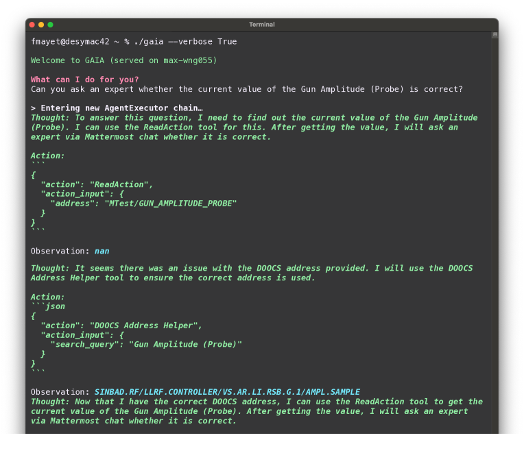

# GAIA：一款为智能化加速器运营提供助力的全能AI助手。

发布时间：2024年05月02日

`RAG` `粒子加速器操作` `自动化控制系统`

> GAIA: A General AI Assistant for Intelligent Accelerator Operations

# 摘要

> 大型设施如粒子加速器，往往由资深操作团队掌控。这些操作员不仅精通加速器的物理原理，还对构成该设备的技术支持了如指掌。面对设备复杂性，各子系统均由领域专家维护，以便操作员随时咨询。本研究采用推理与行动（ReAct）提示法，将开放式大型语言模型（LLM）与高级机器控制系统框架及其他辅助工具（如电子日志簿或机器设计文档）相融合。这一整合实现了一个多专家检索增强生成（RAG）系统，它不仅辅助操作员执行知识检索任务，必要时还能直接与机器交互，甚至编写高级控制系统脚本。这种将专家智慧与机器互动相结合的方式，极大简化了机器操作流程，无论是对新手还是资深操作员，都显著提升了工作效率。

> Large-scale machines like particle accelerators are usually run by a team of experienced operators. In case of a particle accelerator, these operators possess suitable background knowledge on both accelerator physics and the technology comprising the machine. Due to the complexity of the machine, particular subsystems of the machine are taken care of by experts, who the operators can turn to. In this work the reasoning and action (ReAct) prompting paradigm is used to couple an open-weights large language model (LLM) with a high-level machine control system framework and other tools, e.g. the electronic logbook or machine design documentation. By doing so, a multi-expert retrieval augmented generation (RAG) system is implemented, which assists operators in knowledge retrieval tasks, interacts with the machine directly if needed, or writes high level control system scripts. This consolidation of expert knowledge and machine interaction can simplify and speed up machine operation tasks for both new and experienced human operators.

[Arxiv](https://arxiv.org/abs/2405.01359)