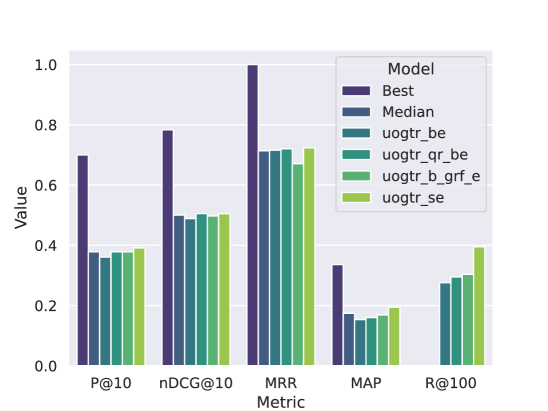

# 格拉斯哥大学的特里尔团队在2023年TREC DL竞赛中展示了他们在生成式相关反馈和自适应重排序技术方面的成果，这些技术在信息检索任务中实现了显著的收敛效果。

发布时间：2024年05月02日

`LLM应用` `信息检索`

> Generative Relevance Feedback and Convergence of Adaptive Re-Ranking: University of Glasgow Terrier Team at TREC DL 2023

# 摘要

> 本文记录了我们在2023年TREC深度学习赛道的参与经历。我们提交的方案采用了大型语言模型提供的生成式相关性反馈，涉及零样本和伪相关性两种反馈模式，应用于BM25和SPlade两种稀疏检索技术。接着，我们通过BM25语料库图的自适应重新排序，利用monoELECTRA交叉编码器进行评分，以增强检索效果。我们探究了这些生成式方法在初步检索阶段对不同查询类型的有效性，并在重新排序阶段寻找自适应重新排序的最佳操作点，以确定第一阶段对整体检索流程性能的影响界限。尽管生成式查询重构带来了一定的性能提升，但我们在P@10和nDCG@10指标上表现最佳的方案是结合了自适应重新排序和生成式伪相关性反馈的uogtr_b_grf_e_gb。

> This paper describes our participation in the TREC 2023 Deep Learning Track. We submitted runs that apply generative relevance feedback from a large language model in both a zero-shot and pseudo-relevance feedback setting over two sparse retrieval approaches, namely BM25 and SPLADE. We couple this first stage with adaptive re-ranking over a BM25 corpus graph scored using a monoELECTRA cross-encoder. We investigate the efficacy of these generative approaches for different query types in first-stage retrieval. In re-ranking, we investigate operating points of adaptive re-ranking with different first stages to find the point in graph traversal where the first stage no longer has an effect on the performance of the overall retrieval pipeline. We find some performance gains from the application of generative query reformulation. However, our strongest run in terms of P@10 and nDCG@10 applied both adaptive re-ranking and generative pseudo-relevance feedback, namely uogtr_b_grf_e_gb.

[Arxiv](https://arxiv.org/abs/2405.01122)