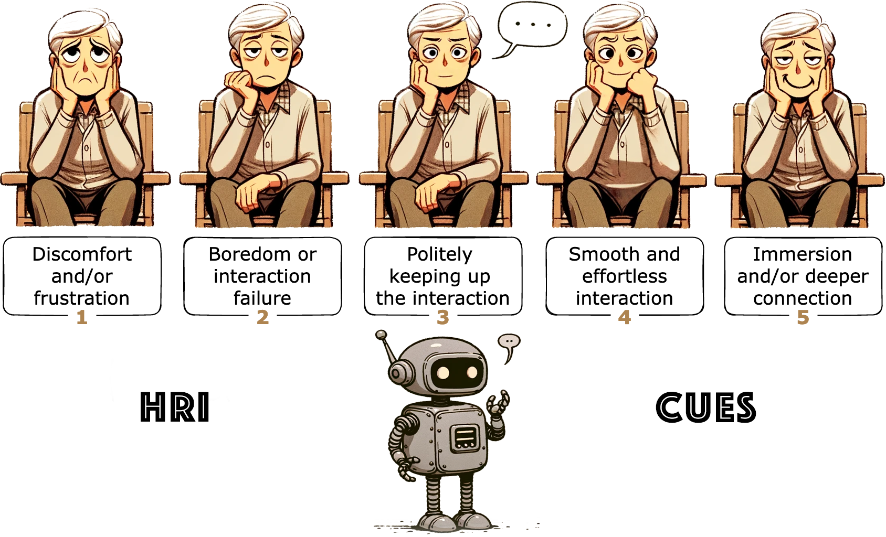
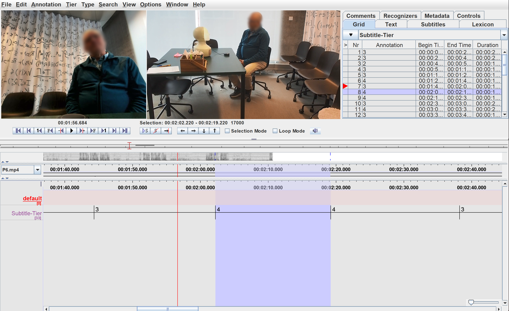
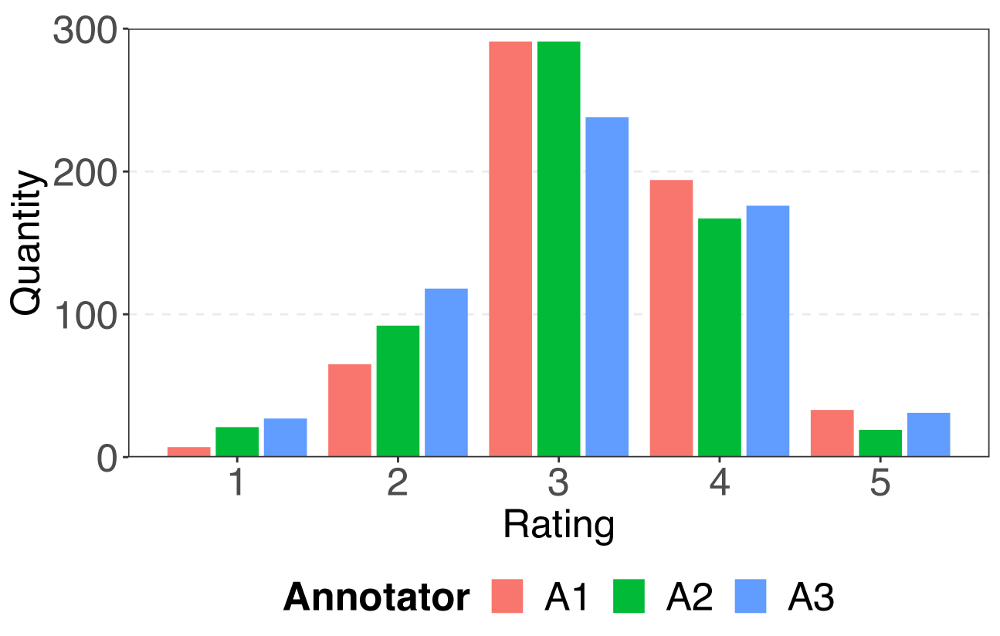
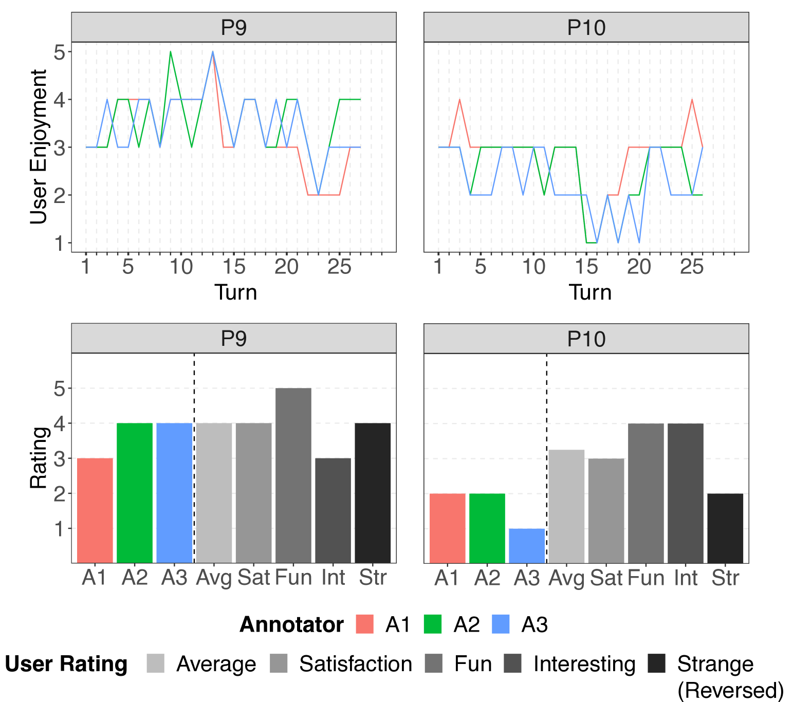
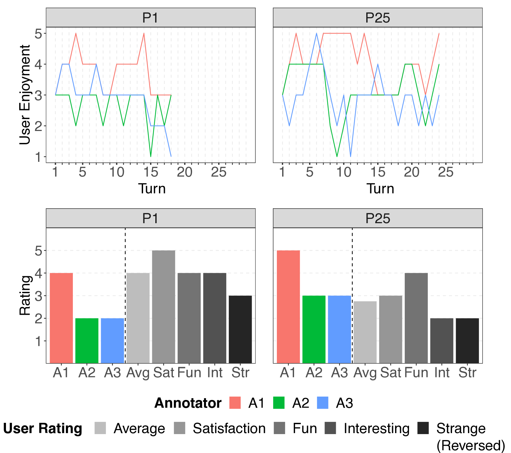
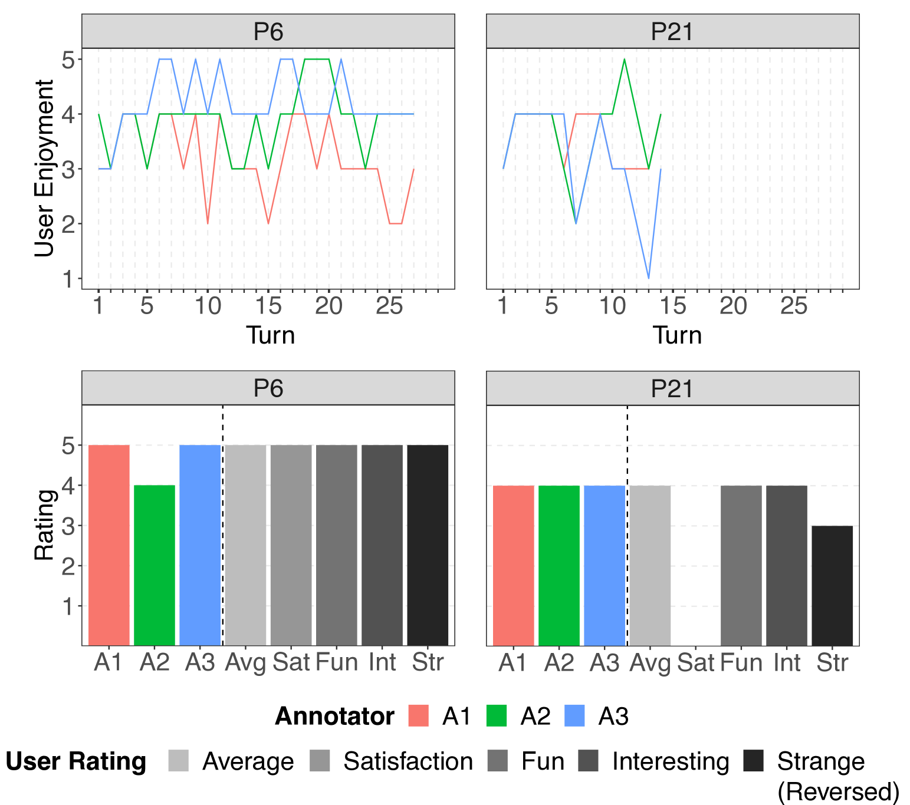
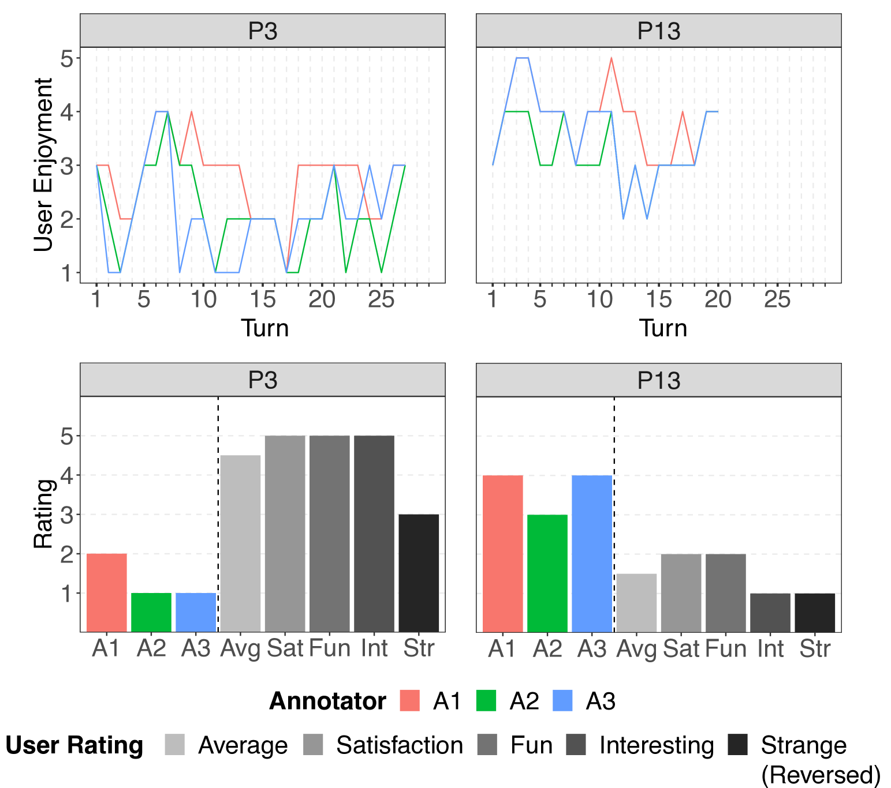
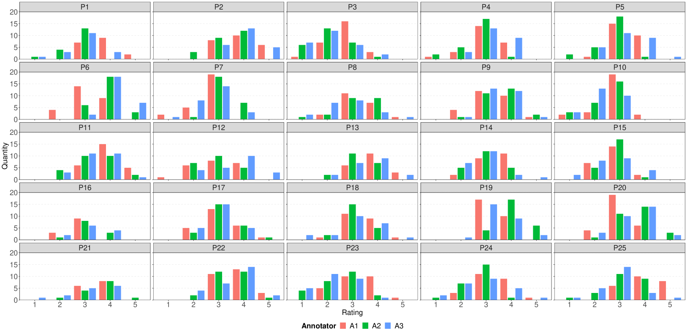
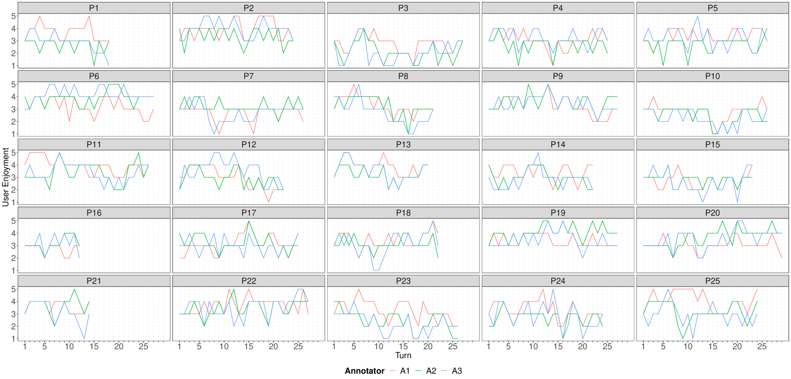
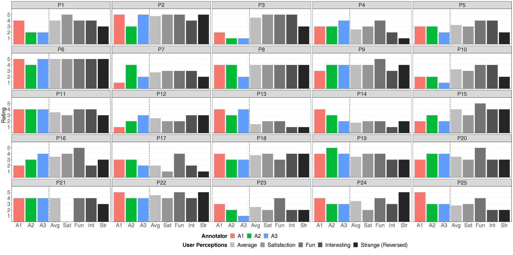

# 人机互动对话用户愉悦度量表（HRI CUES）

发布时间：2024年05月02日

`Agent` `人机交互` `社交机器人`

> Human-Robot Interaction Conversational User Enjoyment Scale (HRI CUES)

# 摘要

> 在人机互动（HRI）领域，洞察用户的乐趣至关重要，这直接关系到互动的品质、用户的接受程度以及对机器人的长期投入，特别是在与社交机器人的交流中。然而，现有的评估手段主要依赖于问卷自评，这并不足以全面捕捉互动的动态变化。本项工作提出了一种创新的评估工具——人机交互对话用户乐趣量表（HRI CUES），它能够从第三方视角在机器人对话过程中评估用户的乐趣。这个量表是经过三位专家严谨评估和深入讨论后开发的，为每一次对话交流和整体互动提供了一个系统的评估框架。它不仅旨在补充用户的自我评估，还有望实现在实时HRI中自动检测用户的乐趣。通过25位老年参与者与伴侣机器人的开放式对话进行了量表的验证，这些对话由一个大型语言模型支持，共计174分钟的数据显示出量表与实际感受的中等到良好一致性。研究还深入探讨了在机器人互动中评估用户乐趣的复杂性和挑战，并为如何将这一量表应用于其他领域提供了指导性建议。

> Understanding user enjoyment is crucial in human-robot interaction (HRI), as it can impact interaction quality and influence user acceptance and long-term engagement with robots, particularly in the context of conversations with social robots. However, current assessment methods rely solely on self-reported questionnaires, failing to capture interaction dynamics. This work introduces the Human-Robot Interaction Conversational User Enjoyment Scale (HRI CUES), a novel scale for assessing user enjoyment from an external perspective during conversations with a robot. Developed through rigorous evaluations and discussions of three annotators with relevant expertise, the scale provides a structured framework for assessing enjoyment in each conversation exchange (turn) alongside overall interaction levels. It aims to complement self-reported enjoyment from users and holds the potential for autonomously identifying user enjoyment in real-time HRI. The scale was validated on 25 older adults' open-domain dialogue with a companion robot that was powered by a large language model for conversations, corresponding to 174 minutes of data, showing moderate to good alignment. Additionally, the study offers insights into understanding the nuances and challenges of assessing user enjoyment in robot interactions, and provides guidelines on applying the scale to other domains.

[Arxiv](https://arxiv.org/abs/2405.01354)