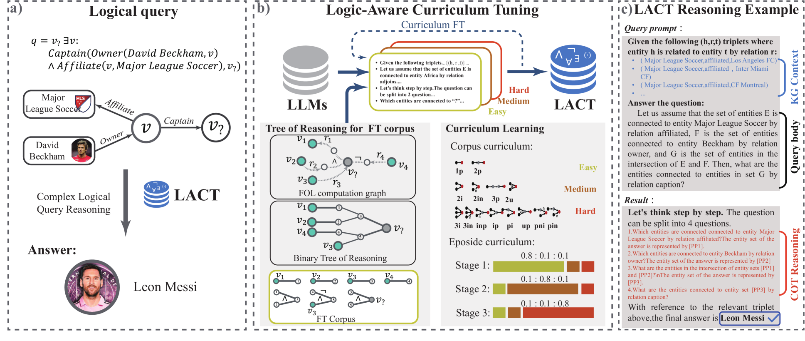
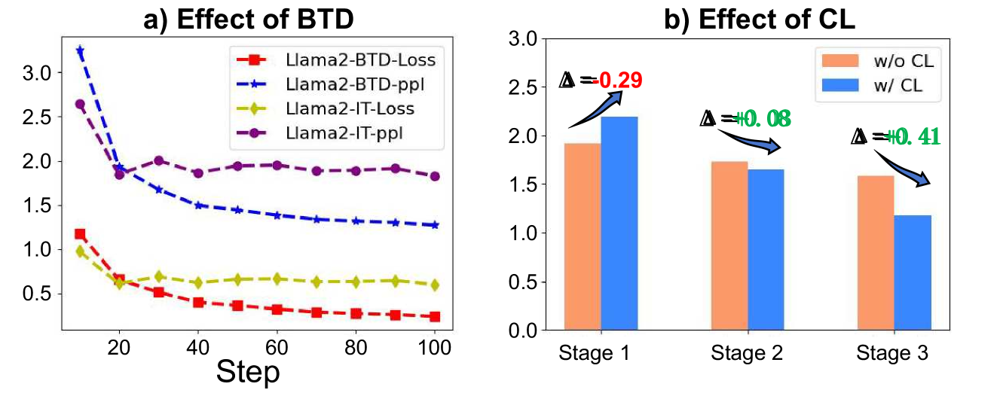
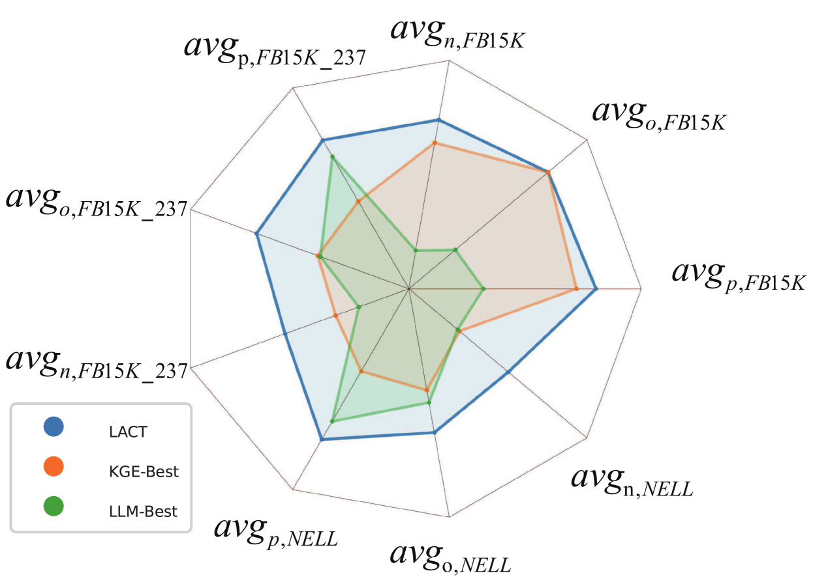
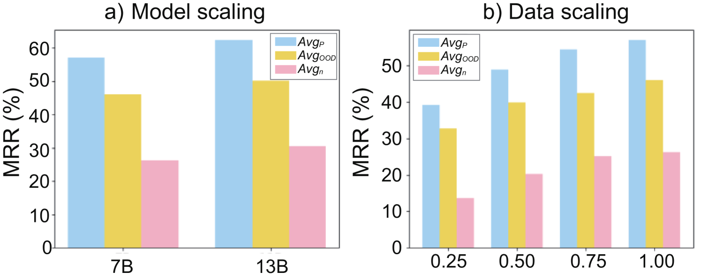
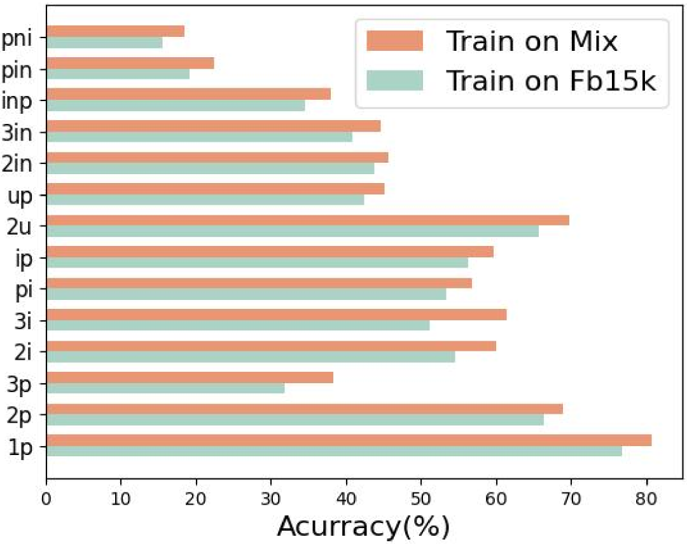
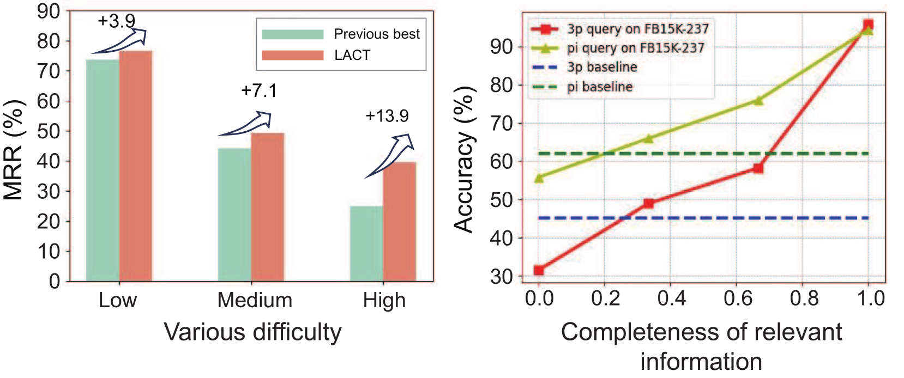
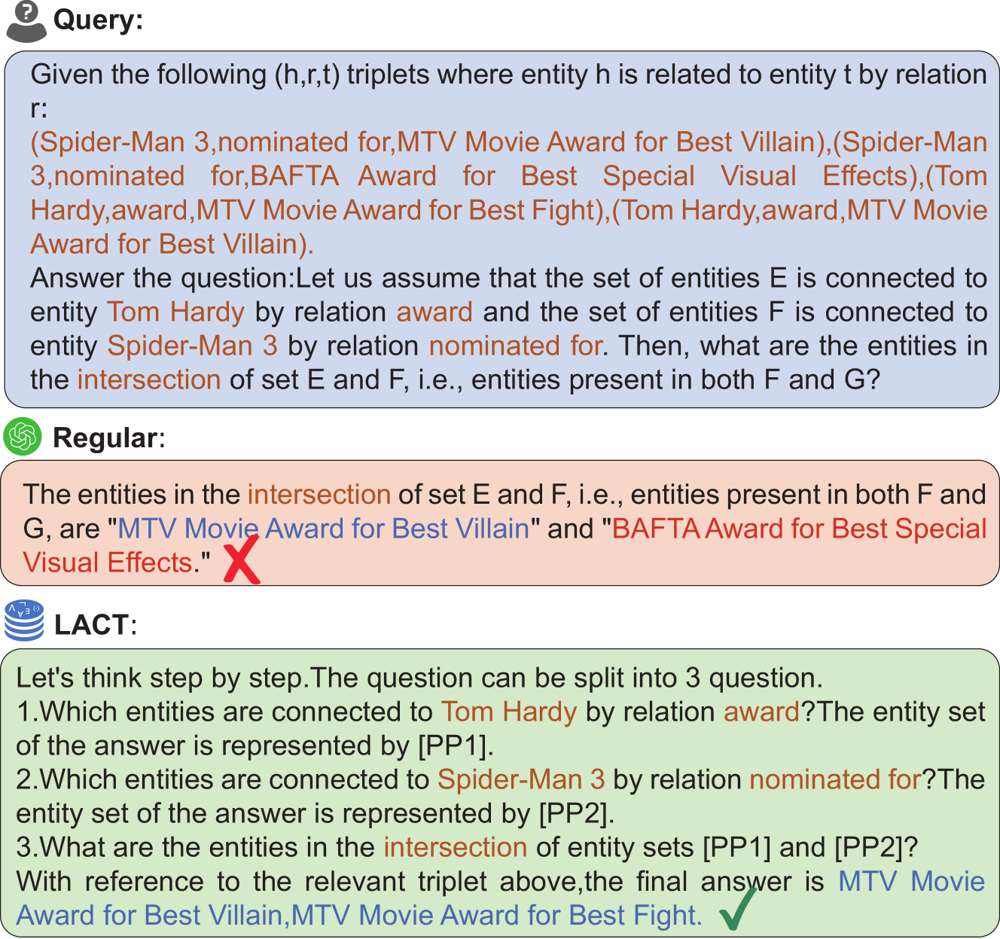
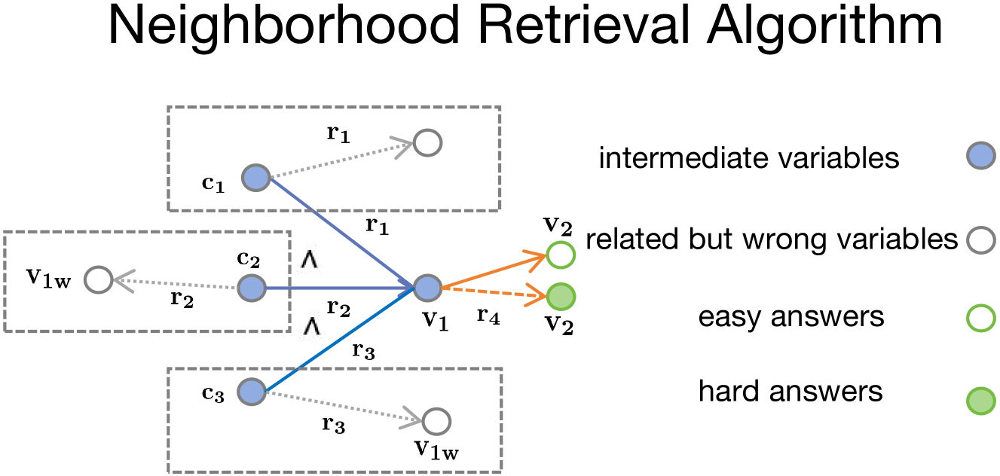
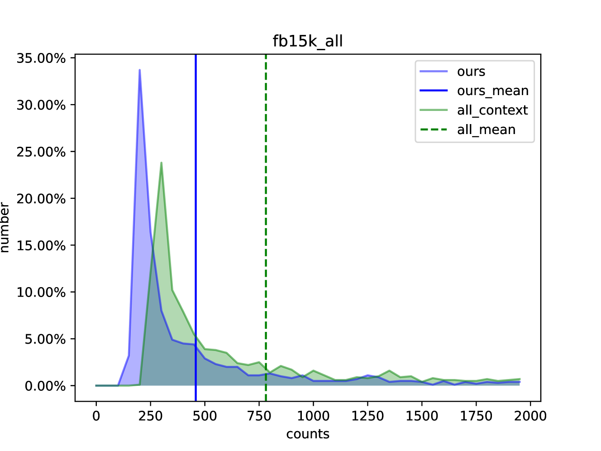
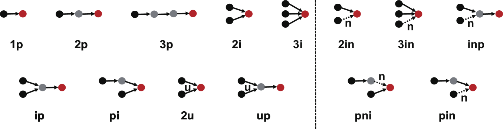

# 本文探讨了如何通过逻辑感知的课程调整方法，提升在知识图谱上进行复杂推理的性能。

发布时间：2024年05月02日

`分类：LLM应用` `知识图谱` `逻辑推理`

> Improving Complex Reasoning over Knowledge Graph with Logic-Aware Curriculum Tuning

# 摘要

> 处理不完全知识图谱上的复杂逻辑查询颇具挑战，过往研究多致力于通过神经网络学习实体/关系的嵌入及模拟一阶逻辑运算符。这些研究因无法有效共享世界知识以增强逻辑推理而受限，导致性能不尽人意。本论文提出了一种依托大型语言模型（LLMs）的复杂逻辑推理框架——LACT，内含基于课程的逻辑感知指令调整机制。我们采用二叉树分解技术增强一阶逻辑查询，以提升LLMs的推理能力。同时，为应对不同复杂查询间的难度差异，我们设计了一个简洁而高效的逻辑感知课程学习框架。实验结果表明，LACT在多个广泛使用的数据集上取得了显著的性能提升（平均MRR得分提高5.5%），刷新了最先进水平。相关代码和模型将不久后在GitHub和huggingface上线。

> Answering complex logical queries over incomplete knowledge graphs (KGs) is challenging. Most previous works have focused on learning entity/relation embeddings and simulating first-order logic operators with various neural networks. However, they are bottlenecked by the inability to share world knowledge to improve logical reasoning, thus resulting in suboptimal performance. In this paper, we propose a complex logical reasoning schema over knowledge graphs upon large language models (LLMs), containing a curriculum-based logical-aware instruction tuning framework, named LACT. Specifically, we augment the arbitrary first-order logical queries via binary tree decomposition, to stimulate the reasoning capability of LLMs. To address the difficulty gap among different types of complex queries, we design a simple and flexible logic-aware curriculum learning framework. Experiments across widely used datasets demonstrate that LACT has substantial improvements~(brings an average +5.5% MRR score) over advanced methods, achieving the new state-of-the-art. Our code and model will be released at GitHub and huggingface soon.

[Arxiv](https://arxiv.org/abs/2405.01649)