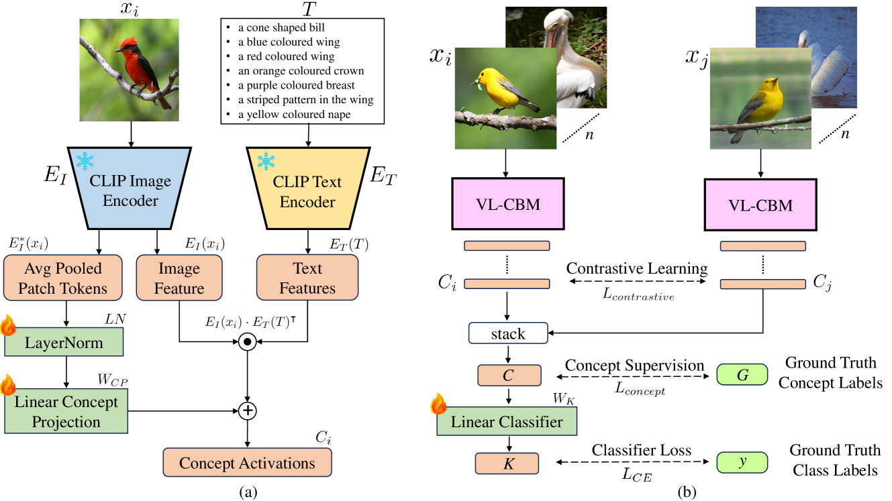

# 提升视觉-语言概念瓶颈模型中的概念一致性

发布时间：2024年05月02日

`分类：LLM应用` `计算机视觉`

> Improving Concept Alignment in Vision-Language Concept Bottleneck Models

# 摘要

> 概念瓶颈模型（CBM）通过将输入图像转换为易于人类理解的高级概念空间来进行类别预测。最新研究通过激发大型语言模型（LLM）产生文本概念，并借助视觉语言模型（VLM）获取这些概念的评分来自动化构建CBM。尽管如此，为了提高模型的可信度，我们更倾向于采用人类专家而非LLM生成的概念来定义CBM。本研究深入探讨了在细粒度鸟类分类和动物分类等特定领域内，VLM对于专家定义概念的评分准确性。研究发现，即便是表现出色的CLIP等固定VLM在将概念与视觉输入正确关联方面也存在挑战。为此，我们提出了一种创新的对比半监督（CSS）学习方法，该方法利用少量标记化的概念实例来优化CLIP模型中的概念匹配，激活真实的视觉概念。在三大基准数据集上的广泛测试显示，这种方法显著提升了概念和分类的准确性，同时大幅减少了对人工标注概念标签的需求。此外，为了进一步提升分类效果，我们还开发了一种新的类级干预流程，专门针对细粒度分类问题，通过识别并干预混淆类别的概念空间来降低错误率。

> Concept Bottleneck Models (CBM) map the input image to a high-level human-understandable concept space and then make class predictions based on these concepts. Recent approaches automate the construction of CBM by prompting Large Language Models (LLM) to generate text concepts and then use Vision Language Models (VLM) to obtain concept scores to train a CBM. However, it is desired to build CBMs with concepts defined by human experts instead of LLM generated concepts to make them more trustworthy. In this work, we take a closer inspection on the faithfulness of VLM concept scores for such expert-defined concepts in domains like fine-grain bird species classification and animal classification. Our investigations reveal that frozen VLMs, like CLIP, struggle to correctly associate a concept to the corresponding visual input despite achieving a high classification performance. To address this, we propose a novel Contrastive Semi-Supervised (CSS) learning method which uses a few labeled concept examples to improve concept alignment (activate truthful visual concepts) in CLIP model. Extensive experiments on three benchmark datasets show that our approach substantially increases the concept accuracy and classification accuracy, yet requires only a fraction of the human-annotated concept labels. To further improve the classification performance, we also introduce a new class-level intervention procedure for fine-grain classification problems that identifies the confounding classes and intervenes their concept space to reduce errors.

[Arxiv](https://arxiv.org/abs/2405.01825)