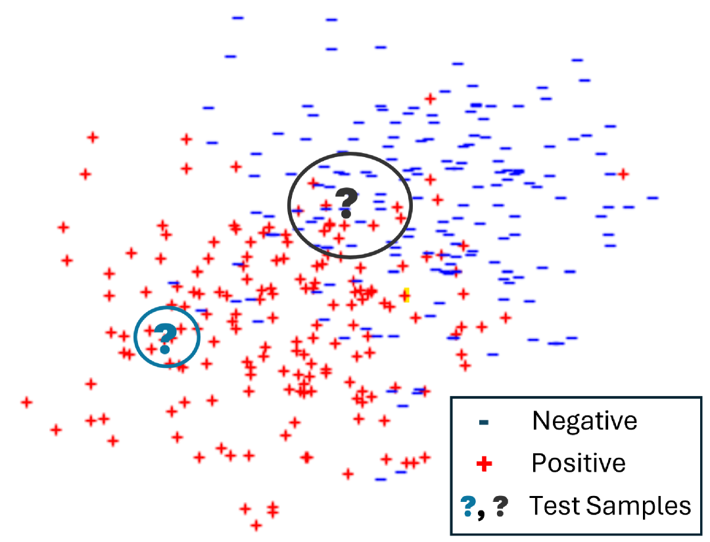

# 《上下文学习》：我如何学会不再担忧并拥抱“应用信息检索”的世界

发布时间：2024年05月02日

`LLM应用` `信息检索`

> "In-Context Learning" or: How I learned to stop worrying and love "Applied Information Retrieval"

# 摘要

> 随着大型语言模型（LLMs）能力的提升，上下文学习（ICL）已成为自然语言处理（NLP）的新趋势。与传统的微调方法不同，ICL通过将少量标注示例添加到提示指令中，来引导模型的解码生成过程，而不是对模型参数进行特定任务的微调。这种方法在理念上与非参数方法如$k$-NN相似，预测结果依赖于局部拓扑结构，即一组相似的实例及其标签（称为少量示例）。在ICL中，测试实例与信息检索（IR）中的查询相似，而从训练集中检索的类似示例则相当于从IR集合中检索的文档集。虽然可以使用标准的无监督排名模型来检索这些少量示例，但通过针对下游任务重新定义相关性的概念，可以提升示例的有效性。换句话说，如果将一个示例包含在提示指令中能够导致正确预测，那么这个示例就被认为是相关的。基于这种任务特定的相关性概念，可以训练一个有监督的排名模型，如双编码器或交叉编码器，以学习如何最优地选择少量示例。我们认为，神经排名器的最新进展可能为选择最佳示例以提高ICL预测效果提供了新的应用场景。

> With the increasing ability of large language models (LLMs), in-context learning (ICL) has evolved as a new paradigm for natural language processing (NLP), where instead of fine-tuning the parameters of an LLM specific to a downstream task with labeled examples, a small number of such examples is appended to a prompt instruction for controlling the decoder's generation process. ICL, thus, is conceptually similar to a non-parametric approach, such as $k$-NN, where the prediction for each instance essentially depends on the local topology, i.e., on a localised set of similar instances and their labels (called few-shot examples). This suggests that a test instance in ICL is analogous to a query in IR, and similar examples in ICL retrieved from a training set relate to a set of documents retrieved from a collection in IR. While standard unsupervised ranking models can be used to retrieve these few-shot examples from a training set, the effectiveness of the examples can potentially be improved by re-defining the notion of relevance specific to its utility for the downstream task, i.e., considering an example to be relevant if including it in the prompt instruction leads to a correct prediction. With this task-specific notion of relevance, it is possible to train a supervised ranking model (e.g., a bi-encoder or cross-encoder), which potentially learns to optimally select the few-shot examples. We believe that the recent advances in neural rankers can potentially find a use case for this task of optimally choosing examples for more effective downstream ICL predictions.

[Arxiv](https://arxiv.org/abs/2405.01116)