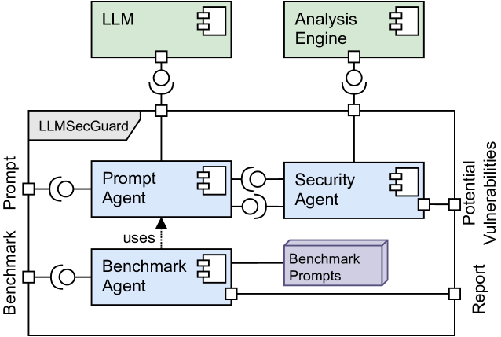
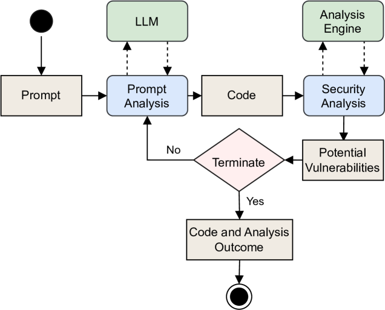

# 大型语言模型的安全守护者：代码防护

发布时间：2024年05月02日

`LLM应用` `软件开发`

> LLM Security Guard for Code

# 摘要

> 众多开发者借助大型语言模型（LLMs）推进软件开发。尽管如此，这些模型在安全领域的应用能力尚显不足。我们推出了LLMSecGuard，一个开源的框架，它通过结合静态代码分析工具与LLMs的力量，增强了代码的安全性。LLMSecGuard的目的是为开发者提供比LLMs原始生成的代码更为安全的解决方案。此外，它还对LLMs进行性能评估，以洞察这些模型安全特性的演进趋势。

> Many developers rely on Large Language Models (LLMs) to facilitate software development. Nevertheless, these models have exhibited limited capabilities in the security domain. We introduce LLMSecGuard, an open-source framework that offers enhanced code security through the synergy between static code analyzers and LLMs. LLMSecGuard aims to equip practitioners with code solutions that are more secure than the code initially generated by LLMs. It also benchmarks LLMs, providing valuable insights into the evolving security properties of these models.

[Arxiv](https://arxiv.org/abs/2405.01103)