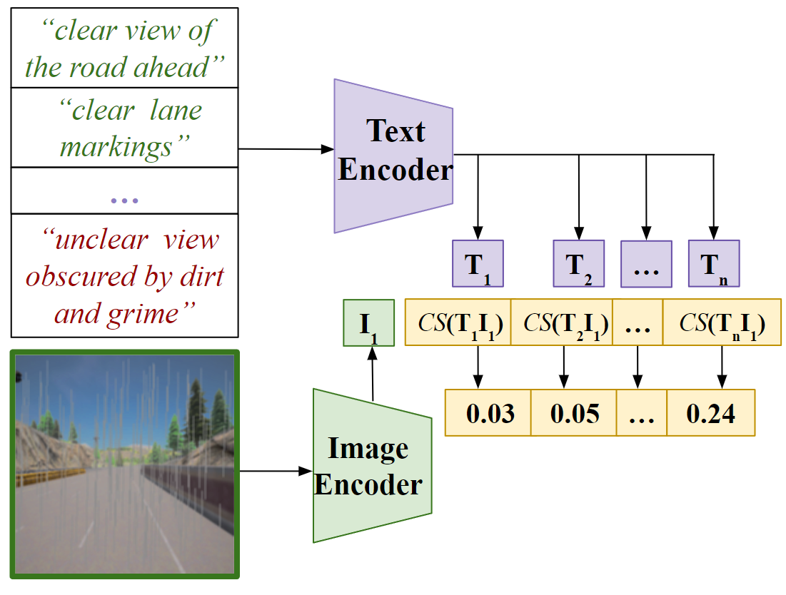
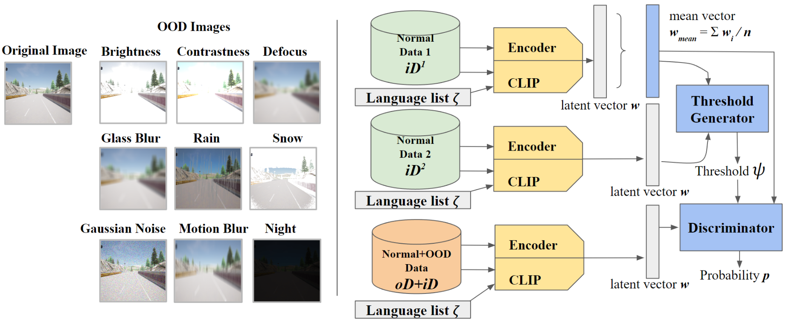

# 为了在自动驾驶领域识别那些超出常规分布的异常情况，我们采用了一种语言增强的潜在表示方法。

发布时间：2024年05月02日

`分类：Agent` `自动驾驶` `异常检测`

> Language-Enhanced Latent Representations for Out-of-Distribution Detection in Autonomous Driving

# 摘要

> 在自动驾驶领域，识别系统未曾预料到的输入信号是至关重要的，这就需要进行分布外（OOD）检测。传统方法通常依赖于固定配置的编码器模型，这限制了它们与人类交互的能力。随着大型基础模型的发展，结合多模态输入，我们可以利用人类语言作为潜在的表示形式，实现基于语言的OOD检测。本文提出了一种新方法，利用多模态模型CLIP对图像和文本进行编码，通过计算余弦相似性来增强潜在编码的透明度和可控性，以用于视觉异常检测。与传统的仅能生成用户难以理解的潜在表示的预训练编码器相比，我们的方法在现实驾驶数据集上的实验结果表明，基于语言的潜在表示在性能上更胜一筹，且与传统的视觉编码器表示相结合时，能进一步提升检测效果。

> Out-of-distribution (OOD) detection is essential in autonomous driving, to determine when learning-based components encounter unexpected inputs. Traditional detectors typically use encoder models with fixed settings, thus lacking effective human interaction capabilities. With the rise of large foundation models, multimodal inputs offer the possibility of taking human language as a latent representation, thus enabling language-defined OOD detection. In this paper, we use the cosine similarity of image and text representations encoded by the multimodal model CLIP as a new representation to improve the transparency and controllability of latent encodings used for visual anomaly detection. We compare our approach with existing pre-trained encoders that can only produce latent representations that are meaningless from the user's standpoint. Our experiments on realistic driving data show that the language-based latent representation performs better than the traditional representation of the vision encoder and helps improve the detection performance when combined with standard representations.

[Arxiv](https://arxiv.org/abs/2405.01691)