# 大型语言模型作为评估工具，存在不一致性和偏见问题。

发布时间：2024年05月02日

`LLM应用` `评估工具`

> Large Language Models are Inconsistent and Biased Evaluators

# 摘要

> 大型语言模型（LLM）的零样本功能为多样化任务提供了灵活且无需参照标准的度量工具，使得LLM评估器在自然语言处理（NLP）领域变得普及。尽管如此，对于这些评估器的鲁棒性研究尚不充分，过往研究多聚焦于如何使LLM评分与人类专家评分高度相关。本文通过SummEval数据集的深入分析，揭示了LLM评估器存在偏见：它们倾向于偏好那些困惑度低的文本（1），评分分布呈现偏斜（2），并且在多属性评估中易受锚定效应影响（3）。此外，LLM评估器的一致性较差，对文本质量的微小变化过于敏感，而这种变化对人类理解并不显著。文章还提供了调整LLM评估器设置的方法，以缓解这些问题。在RoSE数据集上的实验结果显示，这些方法能够提升评估器的性能，超越了现有的最先进水平。

> The zero-shot capability of Large Language Models (LLMs) has enabled highly flexible, reference-free metrics for various tasks, making LLM evaluators common tools in NLP. However, the robustness of these LLM evaluators remains relatively understudied; existing work mainly pursued optimal performance in terms of correlating LLM scores with human expert scores. In this paper, we conduct a series of analyses using the SummEval dataset and confirm that LLMs are biased evaluators as they: (1) exhibit familiarity bias-a preference for text with lower perplexity, (2) show skewed and biased distributions of ratings, and (3) experience anchoring effects for multi-attribute judgments. We also found that LLMs are inconsistent evaluators, showing low "inter-sample" agreement and sensitivity to prompt differences that are insignificant to human understanding of text quality. Furthermore, we share recipes for configuring LLM evaluators to mitigate these limitations. Experimental results on the RoSE dataset demonstrate improvements over the state-of-the-art LLM evaluators.

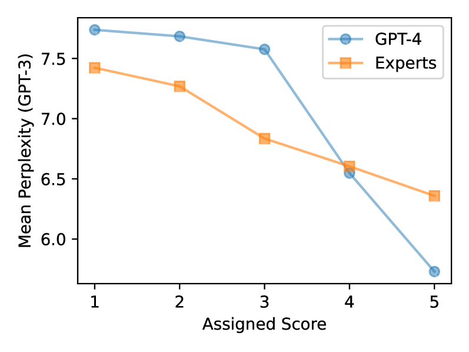

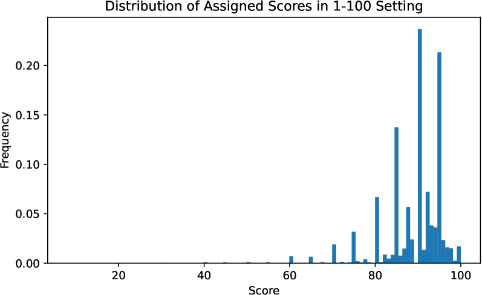

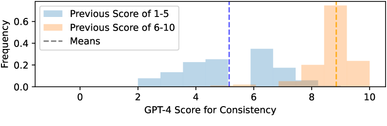

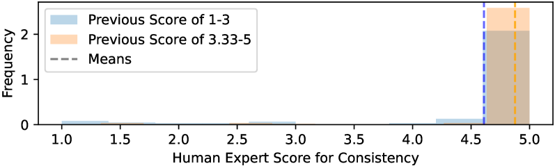

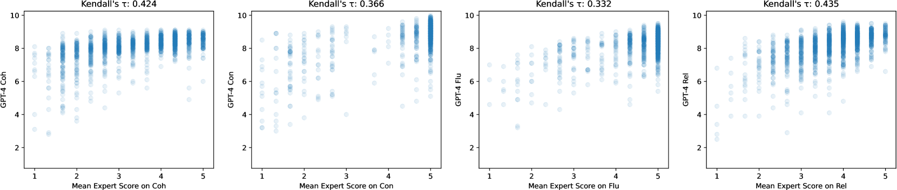

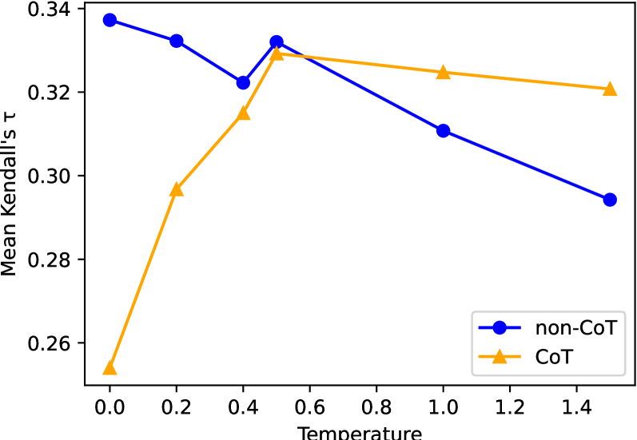

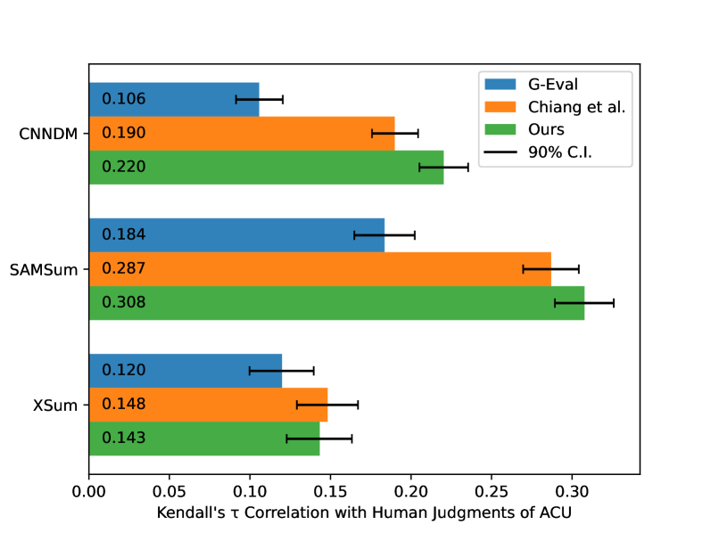

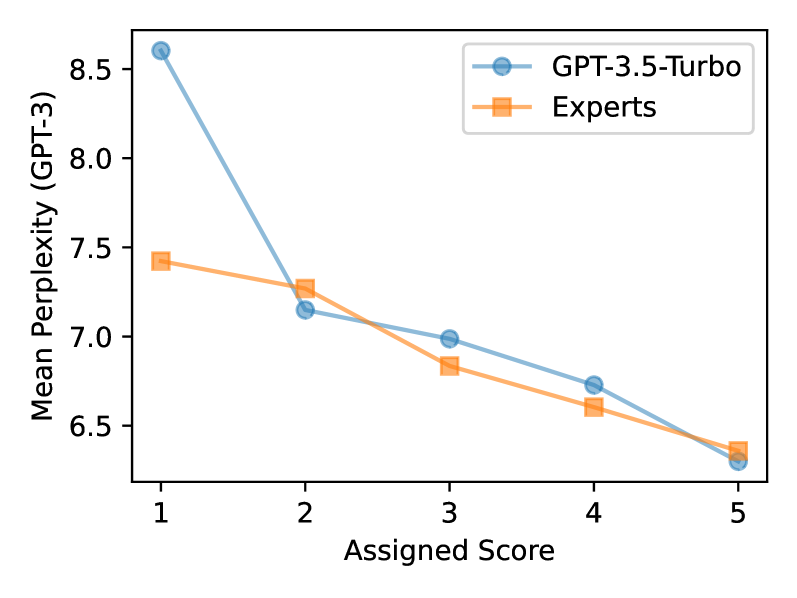

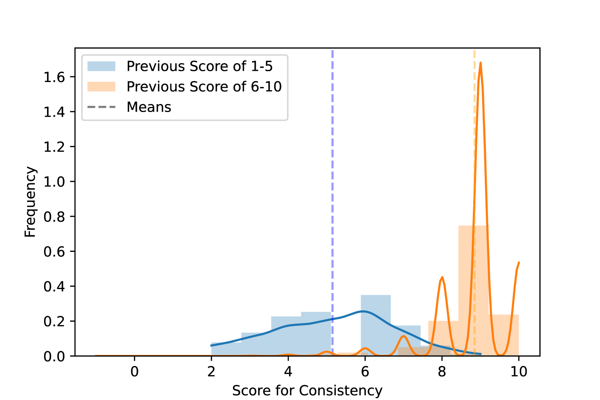

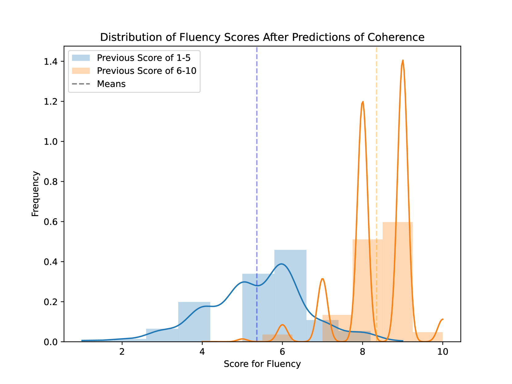

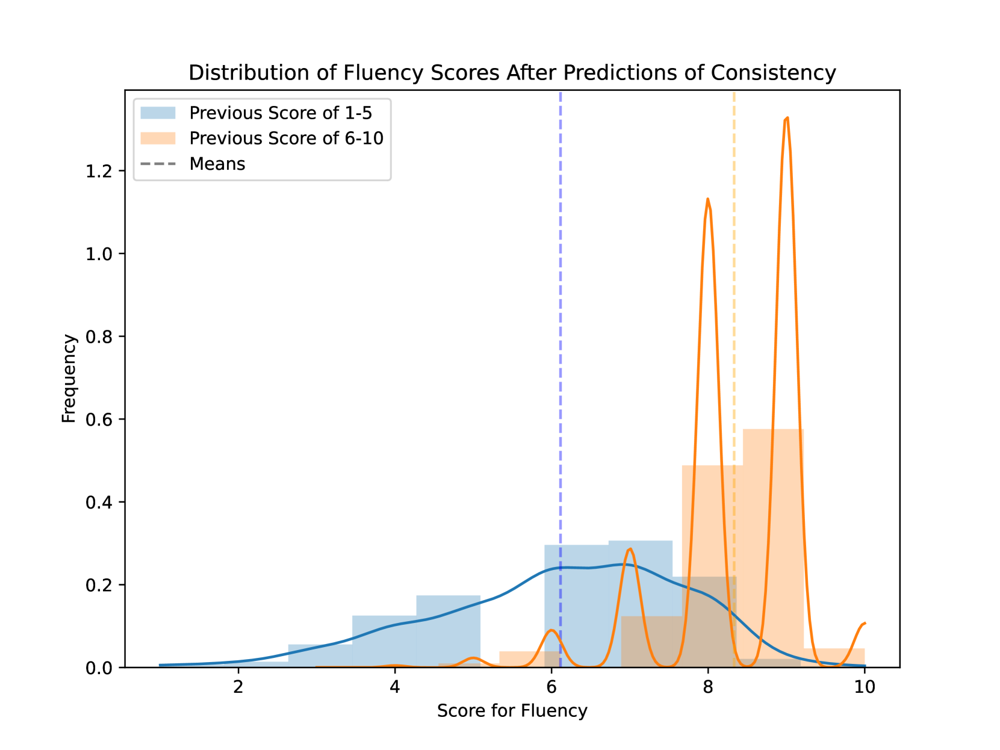

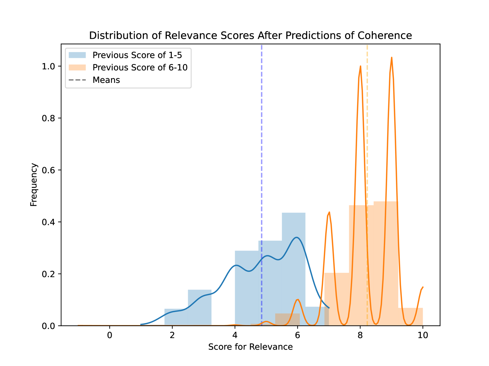

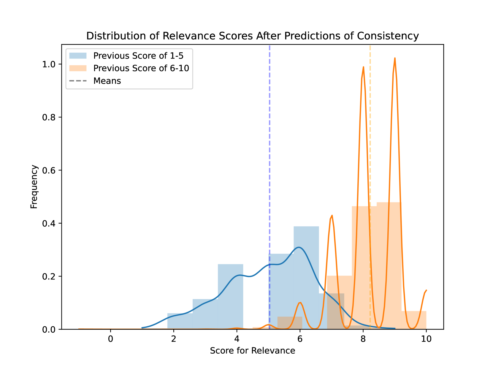

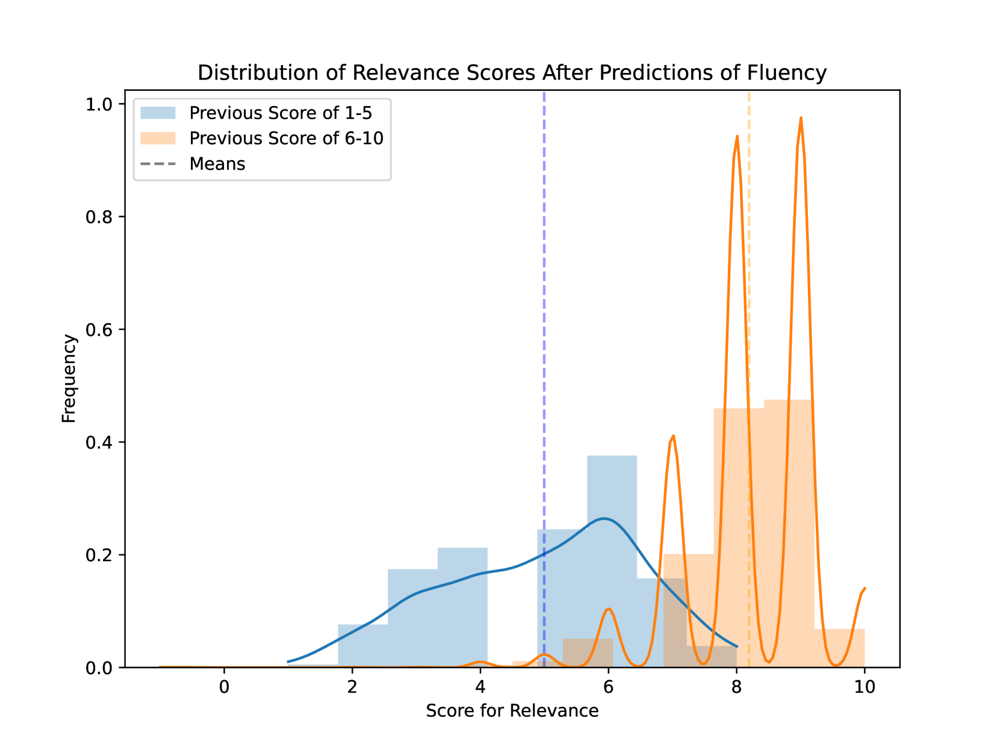

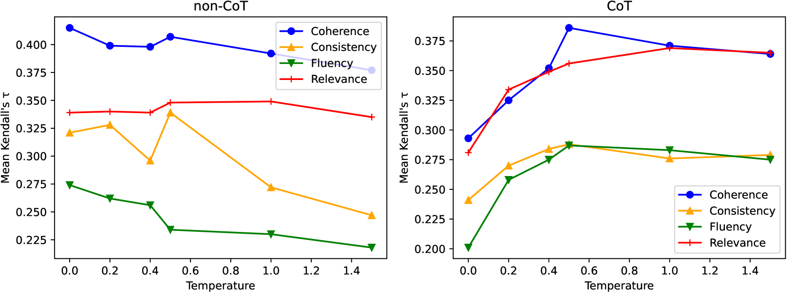

[Arxiv](https://arxiv.org/abs/2405.01724)