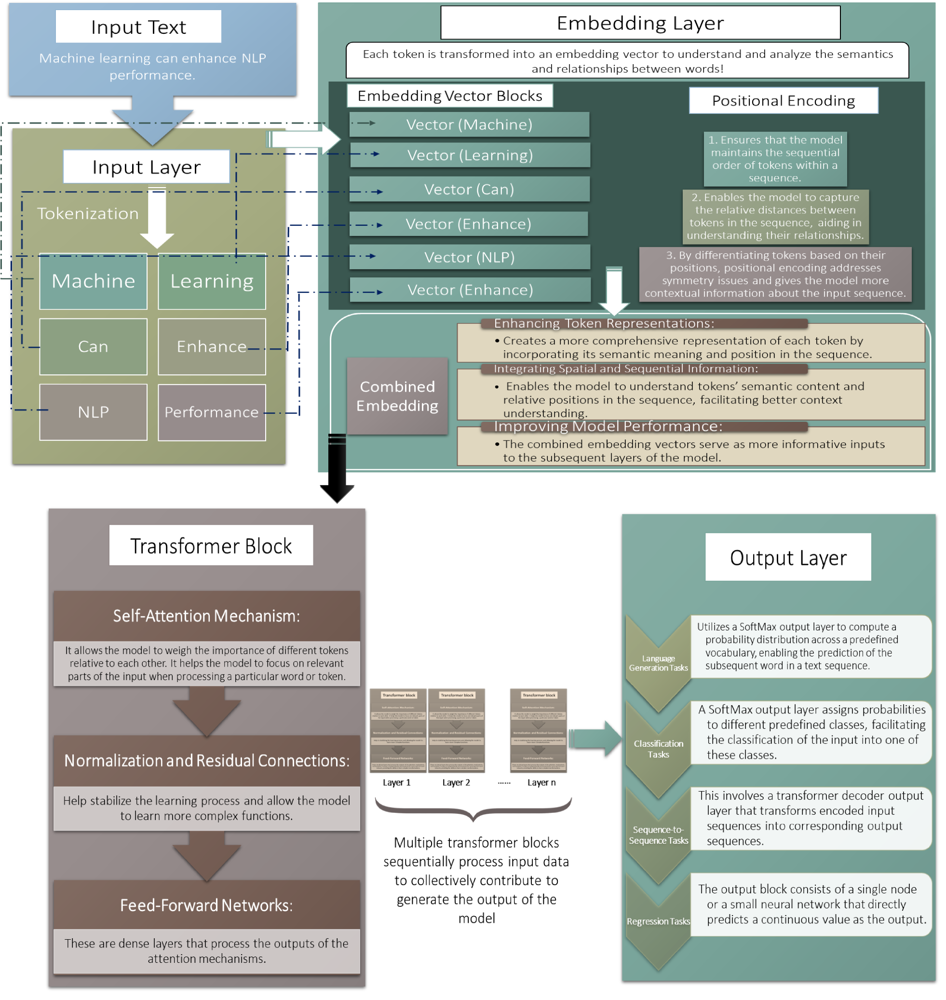

# 无人机领域的大型语言模型：现状与未来展望。

发布时间：2024年05月02日

`分类：Agent` `无人机` `人工智能`

> Large Language Models for UAVs: Current State and Pathways to the Future

# 摘要

> 无人机（UAVs）正以其革新性技术在多个行业中崭露头角，为军事及民用领域的复杂问题提供多样化的解决方案。它们日益增强的功能为进一步的技术进步奠定了基础，尤其是通过融合先进的计算技术，如人工智能（AI）和机器学习（ML）算法。这些技术的发展极大地推动了人类生活的各个方面，开启了一个高效与便捷并存的新时代。作为AI核心的大型语言模型（LLMs）在实际应用中展现出了卓越的学习和适应能力，预示着一种向人类专业水平看齐的智能进化。本文深入探讨了将UAVs与LLMs结合的巨大潜力，以加速自主系统的发展。我们全面审视了LLM架构，并评估了它们与UAV整合的契合度。同时，我们概述了基于LLM的UAV架构的最新发展，并探索了LLM在UAV框架中嵌入的新机遇。特别地，我们着眼于利用LLMs优化UAV应用中的数据分析和决策流程，尤其是在提升光谱感知和数据共享方面。此外，我们还探讨了LLM整合如何拓展UAV应用的边界，实现自动化数据处理、优化决策制定，并在紧急情况下如灾难响应和网络恢复中提高响应速度。最后，我们指出了未来研究的关键方向，这些研究对于促进LLMs与UAVs的有效融合至关重要。

> Unmanned Aerial Vehicles (UAVs) have emerged as a transformative technology across diverse sectors, offering adaptable solutions to complex challenges in both military and civilian domains. Their expanding capabilities present a platform for further advancement by integrating cutting-edge computational tools like Artificial Intelligence (AI) and Machine Learning (ML) algorithms. These advancements have significantly impacted various facets of human life, fostering an era of unparalleled efficiency and convenience. Large Language Models (LLMs), a key component of AI, exhibit remarkable learning and adaptation capabilities within deployed environments, demonstrating an evolving form of intelligence with the potential to approach human-level proficiency. This work explores the significant potential of integrating UAVs and LLMs to propel the development of autonomous systems. We comprehensively review LLM architectures, evaluating their suitability for UAV integration. Additionally, we summarize the state-of-the-art LLM-based UAV architectures and identify novel opportunities for LLM embedding within UAV frameworks. Notably, we focus on leveraging LLMs to refine data analysis and decision-making processes, specifically for enhanced spectral sensing and sharing in UAV applications. Furthermore, we investigate how LLM integration expands the scope of existing UAV applications, enabling autonomous data processing, improved decision-making, and faster response times in emergency scenarios like disaster response and network restoration. Finally, we highlight crucial areas for future research that are critical for facilitating the effective integration of LLMs and UAVs.

[Arxiv](https://arxiv.org/abs/2405.01745)