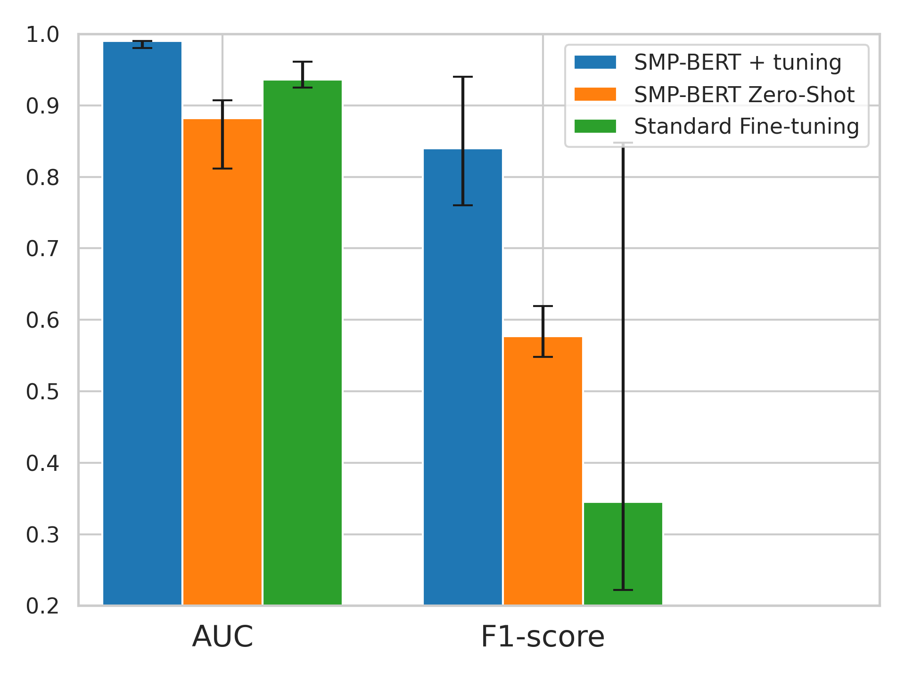

# 通过提示学习技术，我们能够从克罗恩病的放射学报告中高效提取结构化信息，即便在资源匮乏的语言环境中也表现出色。

发布时间：2024年05月02日

`LLM应用`

> Leveraging Prompt-Learning for Structured Information Extraction from Crohn's Disease Radiology Reports in a Low-Resource Language

# 摘要

> 将放射学报告的自由文本通过自然语言处理技术自动转换为结构化数据，对于广泛分析疾病至关重要。尽管这种方法在英语等通用语言的任务中效果显著，但对于使用较少的语言，大型语言模型（LLMs）往往表现不佳，并可能侵犯患者隐私。现实世界中，医学数据集的不平衡特性使得微调本地NLP模型变得困难，尤其是罕见病例的数据差异显著。我们提出了SMP-BERT，这是一种创新的提示学习法，它利用报告的结构化特点来解决这些难题。在涉及希伯来语克罗恩病放射学报告的广泛研究中（涵盖超过8000名患者和10000份报告），SMP-BERT在性能上显著超越了传统微调方法，尤其是在识别罕见病症方面（AUC：0.99对比0.94，F1：0.84对比0.34）。SMP-BERT为资源匮乏的语言提供了更精确的AI诊断能力。

> Automatic conversion of free-text radiology reports into structured data using Natural Language Processing (NLP) techniques is crucial for analyzing diseases on a large scale. While effective for tasks in widely spoken languages like English, generative large language models (LLMs) typically underperform with less common languages and can pose potential risks to patient privacy. Fine-tuning local NLP models is hindered by the skewed nature of real-world medical datasets, where rare findings represent a significant data imbalance. We introduce SMP-BERT, a novel prompt learning method that leverages the structured nature of reports to overcome these challenges. In our studies involving a substantial collection of Crohn's disease radiology reports in Hebrew (over 8,000 patients and 10,000 reports), SMP-BERT greatly surpassed traditional fine-tuning methods in performance, notably in detecting infrequent conditions (AUC: 0.99 vs 0.94, F1: 0.84 vs 0.34). SMP-BERT empowers more accurate AI diagnostics available for low-resource languages.

[Arxiv](https://arxiv.org/abs/2405.01682)