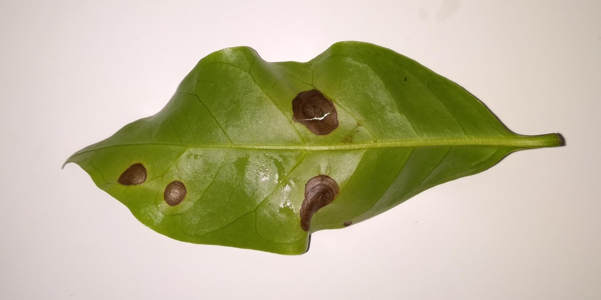
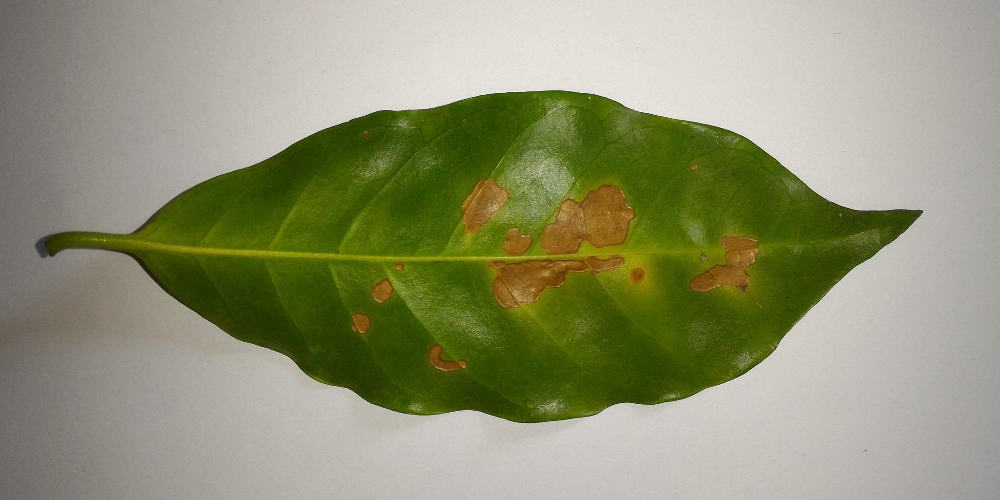
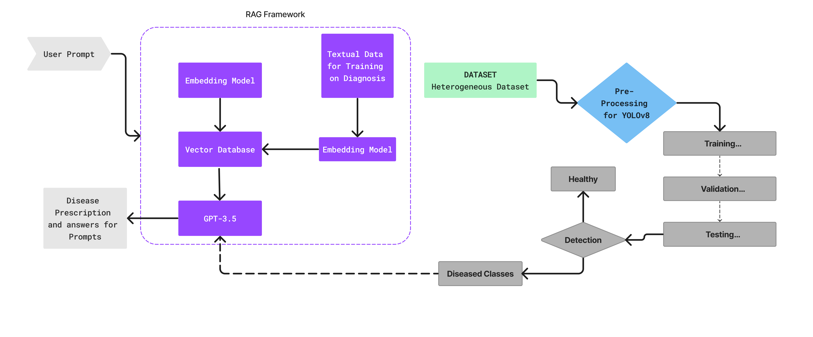

# 利用 RAG（Retrieval-Augmented Generation）技术提高精确度，有效应对大型语言模型在咖啡叶病害治理中的难题。

发布时间：2024年05月02日

`分类：RAG` `精准农业` `病虫害识别`

> Overcoming LLM Challenges using RAG-Driven Precision in Coffee Leaf Disease Remediation

# 摘要

> 本研究推出了一款创新的 AI 精准农业系统，采用 YOLOv8 技术进行病虫害识别，结合 RAG 技术实现智能诊断。该系统旨在应对卡纳塔克邦咖啡产业面临的病虫害挑战，通过融合先进的目标检测与语言模型技术，克服了大型语言模型（LLMs）的内在限制。我们的研究方法不仅解决了 LLMs 的幻觉问题，还提出了动态的病虫害识别与治理策略。系统通过实时监测、协作数据集扩充和组织参与，确保了在多样化农业场景中的适应性。该系统的影响不仅限于自动化水平的提升，更致力于保障食品供给、维护生计、推广环保农业。它通过精确识别病虫害，助力农业的可持续发展，减少对农药的依赖。展望未来，我们计划持续优化 RAG 集成的目标检测系统，注重系统的扩展性、可靠性与用户友好性。本研究力图为农业领域的积极变革提供指引，与全球推动可持续和科技提升型食品生产的大趋势相呼应。

> This research introduces an innovative AI-driven precision agriculture system, leveraging YOLOv8 for disease identification and Retrieval Augmented Generation (RAG) for context-aware diagnosis. Focused on addressing the challenges of diseases affecting the coffee production sector in Karnataka, The system integrates sophisticated object detection techniques with language models to address the inherent constraints associated with Large Language Models (LLMs). Our methodology not only tackles the issue of hallucinations in LLMs, but also introduces dynamic disease identification and remediation strategies. Real-time monitoring, collaborative dataset expansion, and organizational involvement ensure the system's adaptability in diverse agricultural settings. The effect of the suggested system extends beyond automation, aiming to secure food supplies, protect livelihoods, and promote eco-friendly farming practices. By facilitating precise disease identification, the system contributes to sustainable and environmentally conscious agriculture, reducing reliance on pesticides. Looking to the future, the project envisions continuous development in RAG-integrated object detection systems, emphasizing scalability, reliability, and usability. This research strives to be a beacon for positive change in agriculture, aligning with global efforts toward sustainable and technologically enhanced food production.

[Arxiv](https://arxiv.org/abs/2405.01310)