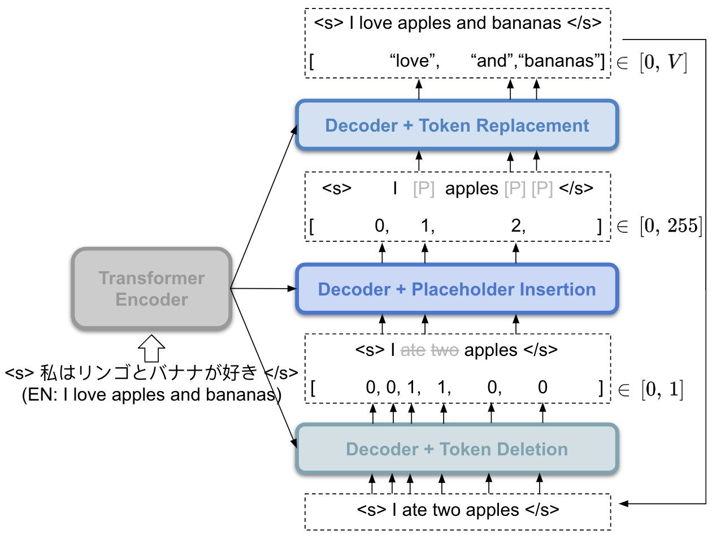

# 强化学习在基于编辑的非自回归神经机器翻译中的应用

发布时间：2024年05月02日

`分类：LLM应用

这篇论文主要研究了非自回归（NAR）语言模型在神经机器翻译（NMT）领域的应用，通过应用强化学习（RL）来提升模型性能。这属于LLM应用的范畴，因为它涉及到了如何改进和应用现有的大型语言模型（LLM）来解决特定的问题。` `机器翻译`

> Reinforcement Learning for Edit-Based Non-Autoregressive Neural Machine Translation

# 摘要

> 非自回归（NAR）语言模型在神经机器翻译（NMT）领域以其低延迟特性著称。但与自回归模型相比，NAR模型在性能上仍有差距，这主要是因为解码空间庞大，且捕捉目标词汇间依赖关系存在难度。此外，为NAR模型准备合适的训练数据并非易事，往往会加剧模型的暴露偏差问题。为了解决这些难题，我们对一个典型的基于编辑的NAR模型——Levenshtein Transformer——应用了强化学习（RL），发现通过RL结合自生成数据可以有效提升模型性能。我们对比了两种RL策略：逐步奖励最大化与情景奖励最大化，分析了它们的优劣，并进行了实证检验。同时，我们还探讨了温度参数设置对模型性能的影响，强调了适当温度设置在NAR模型训练中的关键作用。

> Non-autoregressive (NAR) language models are known for their low latency in neural machine translation (NMT). However, a performance gap exists between NAR and autoregressive models due to the large decoding space and difficulty in capturing dependency between target words accurately. Compounding this, preparing appropriate training data for NAR models is a non-trivial task, often exacerbating exposure bias. To address these challenges, we apply reinforcement learning (RL) to Levenshtein Transformer, a representative edit-based NAR model, demonstrating that RL with self-generated data can enhance the performance of edit-based NAR models. We explore two RL approaches: stepwise reward maximization and episodic reward maximization. We discuss the respective pros and cons of these two approaches and empirically verify them. Moreover, we experimentally investigate the impact of temperature setting on performance, confirming the importance of proper temperature setting for NAR models' training.

[Arxiv](https://arxiv.org/abs/2405.01280)