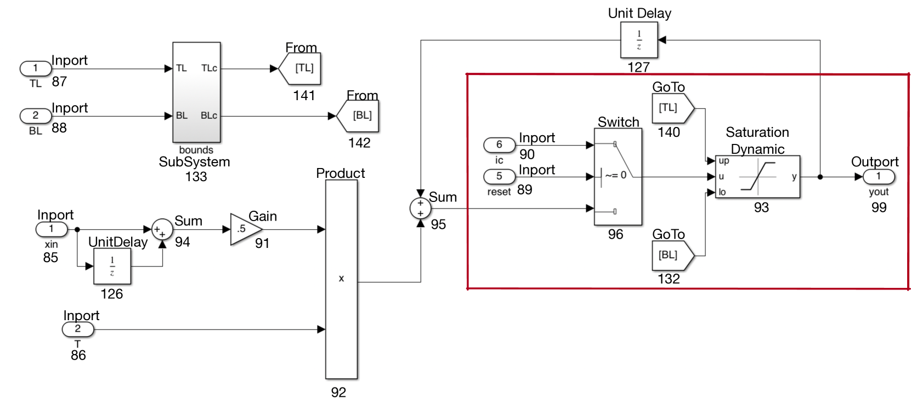
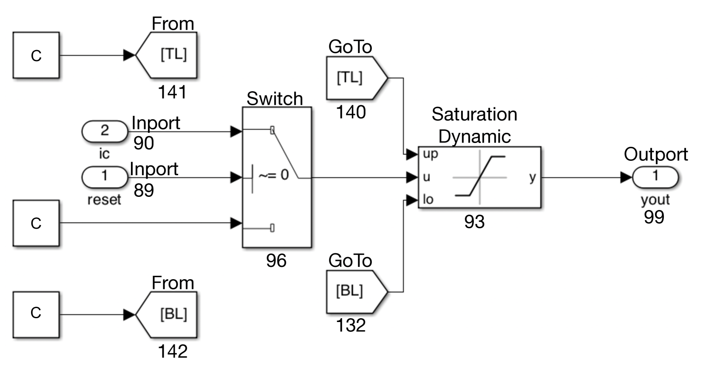
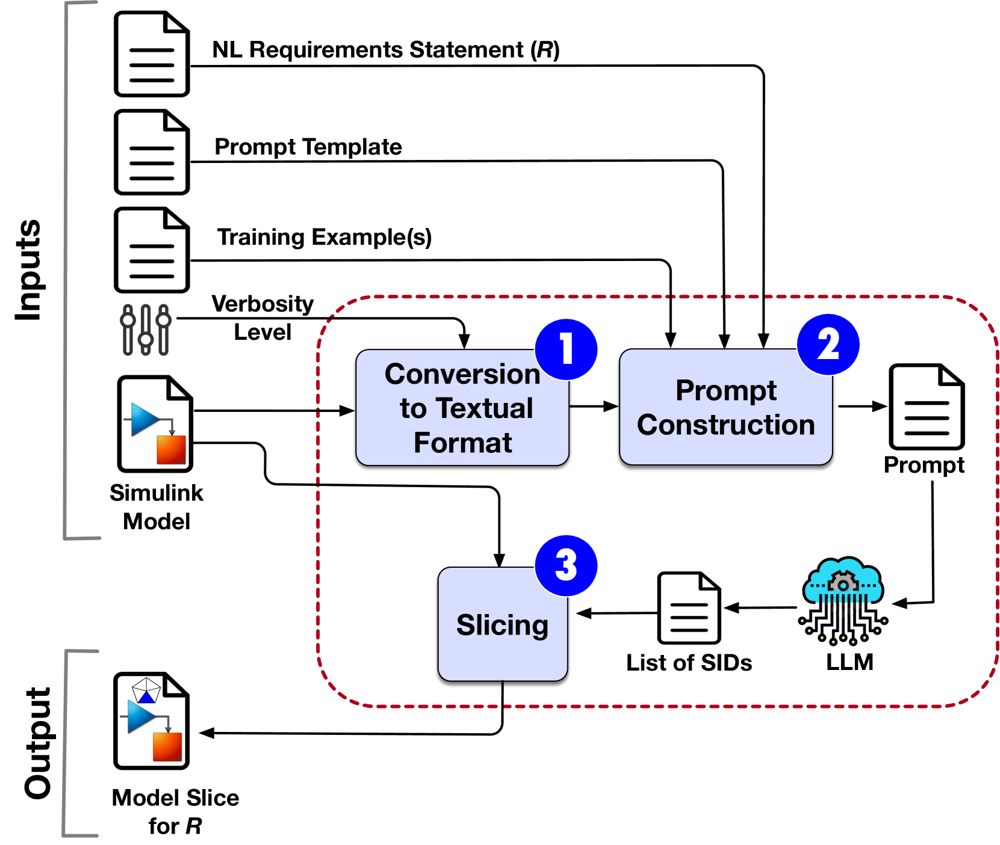
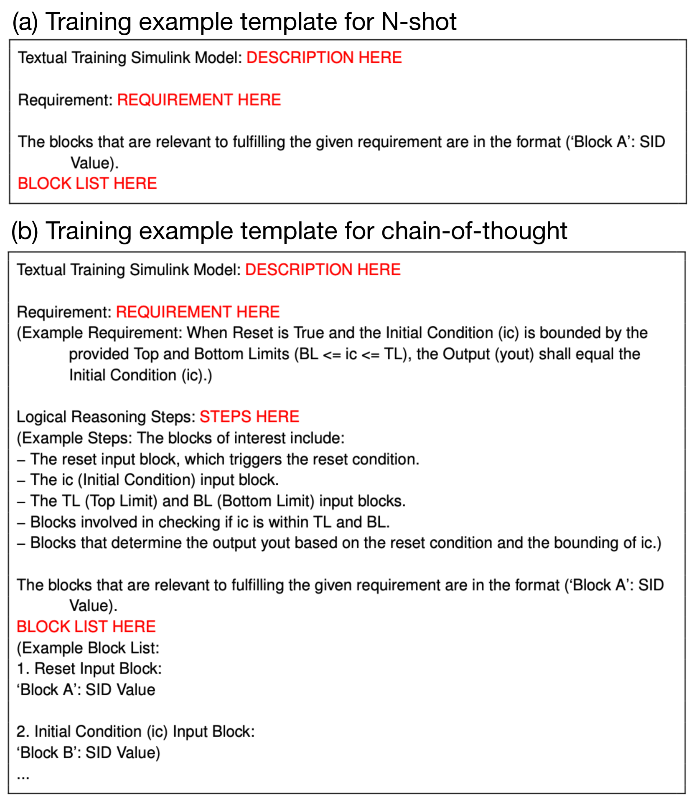

# 运用大型语言模型 (LLMs) 实施对 Simulink 模型的基于需求的切片操作。

发布时间：2024年05月02日

`LLM应用` `软件工程` `自动化设计`

> Requirements-driven Slicing of Simulink Models Using LLMs

# 摘要

> 模型切片技术能精准定位大型模型中满足特定需求的关键部分，广泛应用于设计审查和变更影响分析，以降低工作量。本文介绍了一种新颖方法，利用大型语言模型（LLMs）从Simulink图形模型中抽取关键切片。该方法先将Simulink模型转换成文本形式，再通过LLM筛选出满足特定需求的关键Simulink模块，并据此构建精确的模型切片。研究还发现，保留Simulink模块语法和语义的文本表示，忽略视觉渲染信息，能产生更精确的切片。同时，思维链和零样本提示策略在生成精确模型切片方面效果最佳。

> Model slicing is a useful technique for identifying a subset of a larger model that is relevant to fulfilling a given requirement. Notable applications of slicing include reducing inspection effort when checking design adequacy to meet requirements of interest and when conducting change impact analysis. In this paper, we present a method based on large language models (LLMs) for extracting model slices from graphical Simulink models. Our approach converts a Simulink model into a textual representation, uses an LLM to identify the necessary Simulink blocks for satisfying a specific requirement, and constructs a sound model slice that incorporates the blocks identified by the LLM. We explore how different levels of granularity (verbosity) in transforming Simulink models into textual representations, as well as the strategy used to prompt the LLM, impact the accuracy of the generated slices. Our preliminary findings suggest that prompts created by textual representations that retain the syntax and semantics of Simulink blocks while omitting visual rendering information of Simulink models yield the most accurate slices. Furthermore, the chain-of-thought and zero-shot prompting strategies result in the largest number of accurate model slices produced by our approach.

[Arxiv](https://arxiv.org/abs/2405.01695)