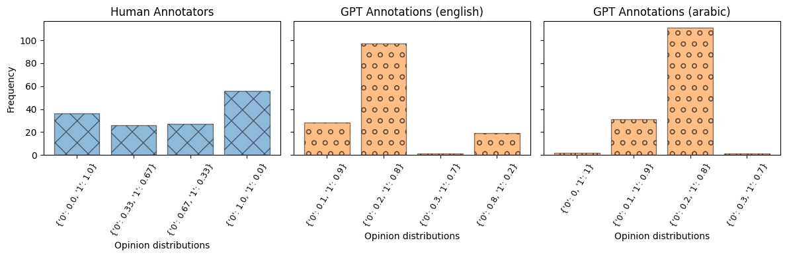
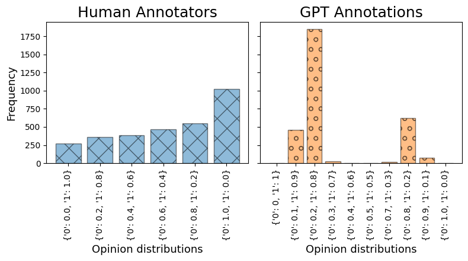
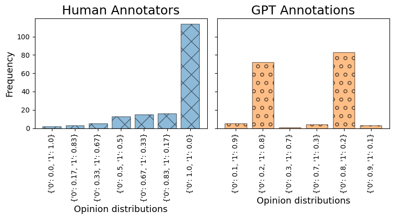
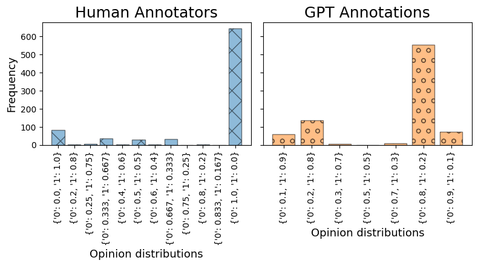
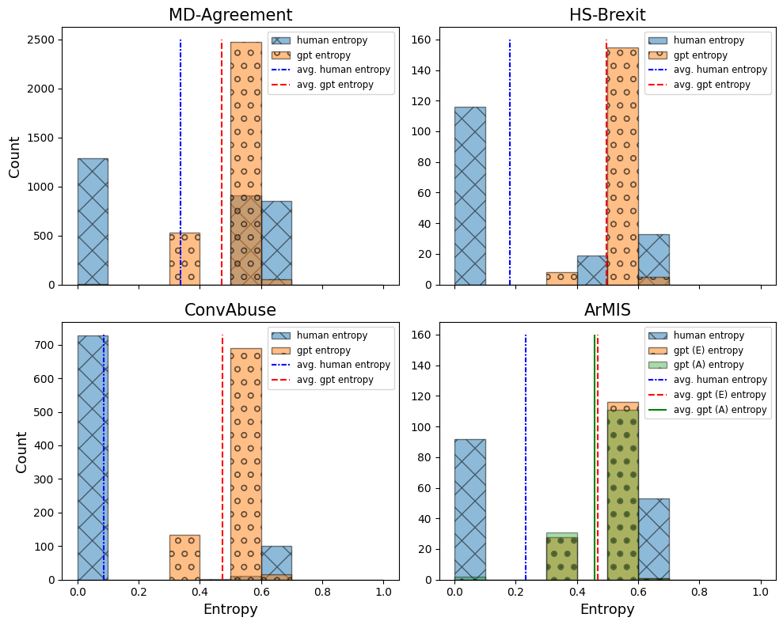

# 探究大型语言模型作为注释工具的效能：一篇关于直接表征方法的对比概览与实证研究分析

发布时间：2024年05月02日

`LLM应用` `数据标注`

> The Effectiveness of LLMs as Annotators: A Comparative Overview and Empirical Analysis of Direct Representation

# 摘要

> 大型语言模型（LLMs）在多种自然语言处理任务和应用领域中展现出强大的辅助作用。近期研究着重探讨了它们在数据标注上的应用潜力。本文综述了十二项研究，深入探讨了LLMs在数据标注方面的潜力。尽管这些模型在节省成本和时间上显示出了潜力，但它们也存在一些显著的限制，包括代表性问题、偏见、对提示变化的敏感性以及对英语的偏好。基于这些研究的洞察，我们进行了实证分析，比较了人类与GPT生成的意见分布，在四个主观数据集上的一致性。与以往关注代表性的研究不同，我们的方法直接从GPT中获取意见分布。我们的分析支持了那些在评估数据标注任务时考虑多元视角的研究，并强调了这一方向上进一步研究的必要性。

> Large Language Models (LLMs) have emerged as powerful support tools across various natural language tasks and a range of application domains. Recent studies focus on exploring their capabilities for data annotation. This paper provides a comparative overview of twelve studies investigating the potential of LLMs in labelling data. While the models demonstrate promising cost and time-saving benefits, there exist considerable limitations, such as representativeness, bias, sensitivity to prompt variations and English language preference. Leveraging insights from these studies, our empirical analysis further examines the alignment between human and GPT-generated opinion distributions across four subjective datasets. In contrast to the studies examining representation, our methodology directly obtains the opinion distribution from GPT. Our analysis thereby supports the minority of studies that are considering diverse perspectives when evaluating data annotation tasks and highlights the need for further research in this direction.

[Arxiv](https://arxiv.org/abs/2405.01299)