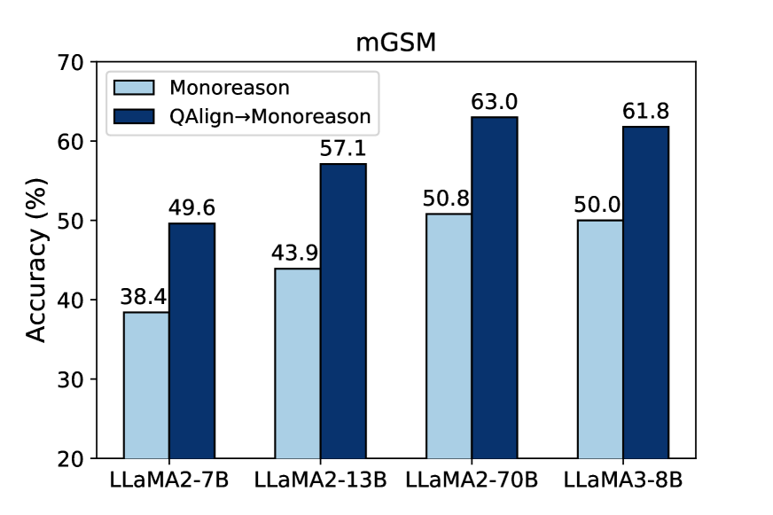
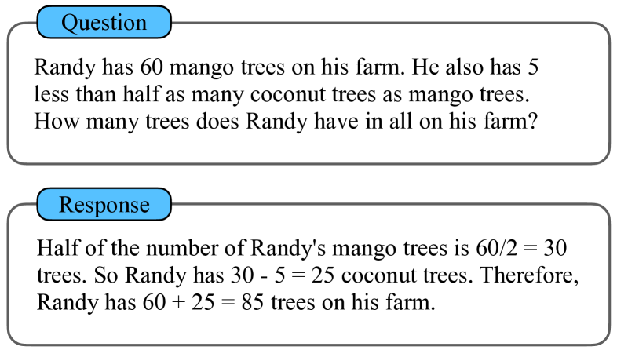
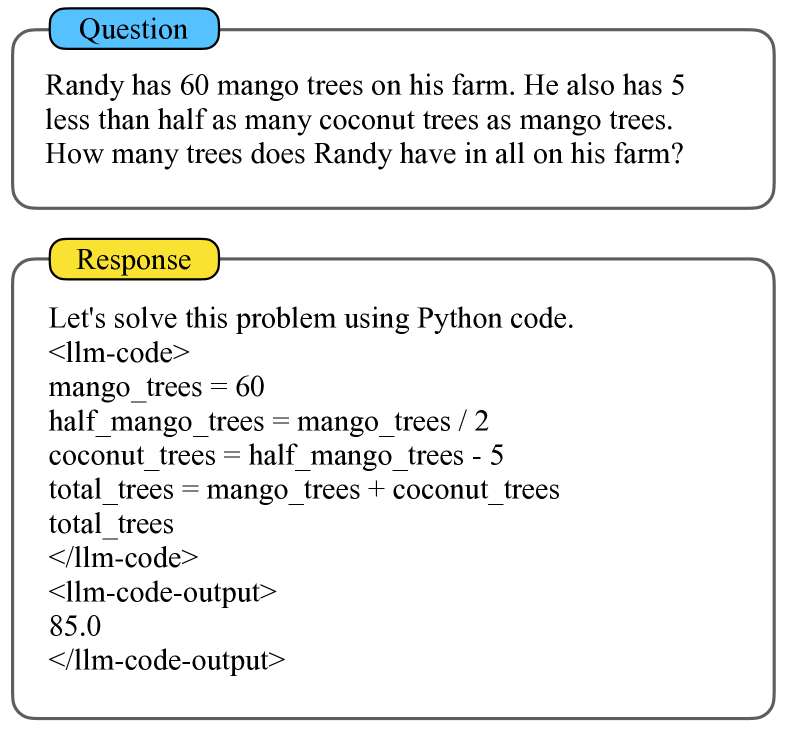
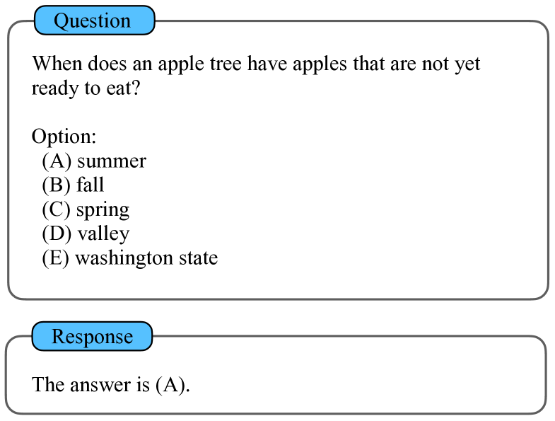
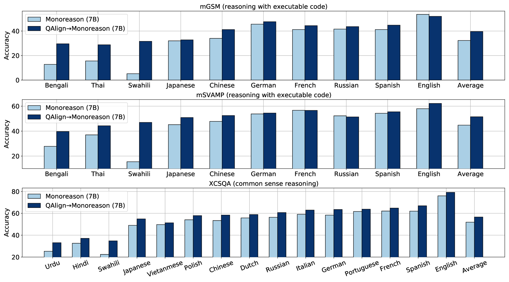
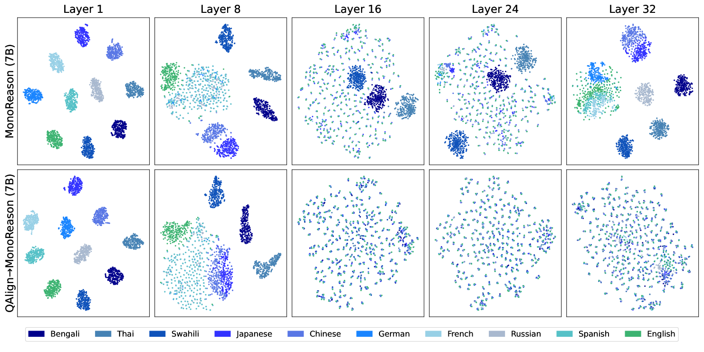
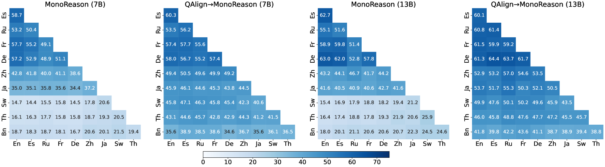
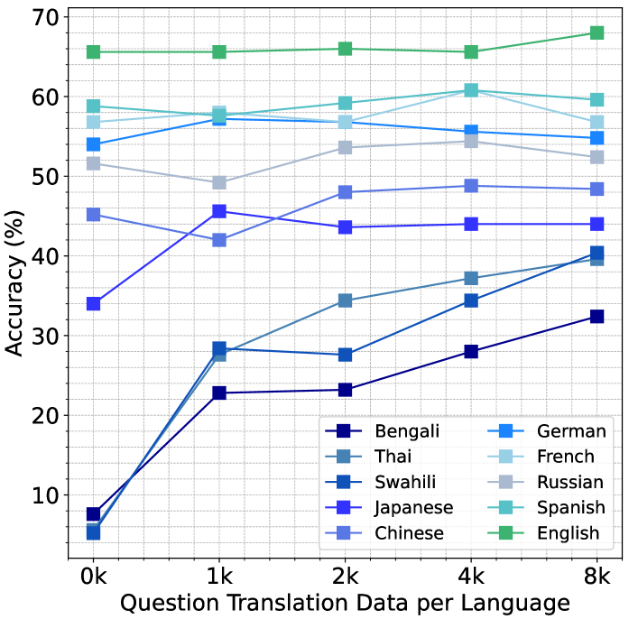

# 通过问题翻译训练提升多语言推理能力：拓展研究视野，深化理解深度。

发布时间：2024年05月02日

`LLM应用` `机器翻译`

> The Power of Question Translation Training in Multilingual Reasoning: Broadened Scope and Deepened Insights

# 摘要

> 缩小大型语言模型在英语与其他语言性能上的巨大差距是一项艰巨任务。尽管早期研究尝试通过翻译训练数据来缩小这一差距，但新近提出的问题对齐方法通过利用模型的英语专长，以最小的成本和错误风险提升多语言性能。本文深入探讨了该方法的广泛应用潜力，通过分析其在执行代码推理和常识推理方面的效果。我们还研究了如何通过代理调优技术高效地将此方法应用于超大型语言模型。在多语言推理基准测试 mGSM、mSVAMP 和 xCSQA 上的实验结果显示，问题对齐方法能够显著提升不同推理场景、模型系列和规模下的多语言性能。例如，在 LLaMA2 模型上应用该方法，即便是在 70B 模型规模下，也能在 mGSM 上实现平均准确度提升 12.2%。为了深入理解其成功的背后机制，我们对表示空间、思维链和翻译数据规模进行了分析，揭示了问题翻译训练如何加强大型语言模型内的语言一致性，并塑造了它们的工作模式。

> Bridging the significant gap between large language model's English and non-English performance presents a great challenge. While some previous studies attempt to mitigate this gap with translated training data, the recently proposed question alignment approach leverages the model's English expertise to improve multilingual performance with minimum usage of expensive, error-prone translation. In this paper, we explore how broadly this method can be applied by examining its effects in reasoning with executable code and reasoning with common sense. We also explore how to apply this approach efficiently to extremely large language models using proxy-tuning. Experiment results on multilingual reasoning benchmarks mGSM, mSVAMP and xCSQA demonstrate that the question alignment approach can be used to boost multilingual performance across diverse reasoning scenarios, model families, and sizes. For instance, when applied to the LLaMA2 models, our method brings an average accuracy improvements of 12.2% on mGSM even with the 70B model. To understand the mechanism of its success, we analyze representation space, chain-of-thought and translation data scales, which reveals how question translation training strengthens language alignment within LLMs and shapes their working patterns.

[Arxiv](https://arxiv.org/abs/2405.01345)