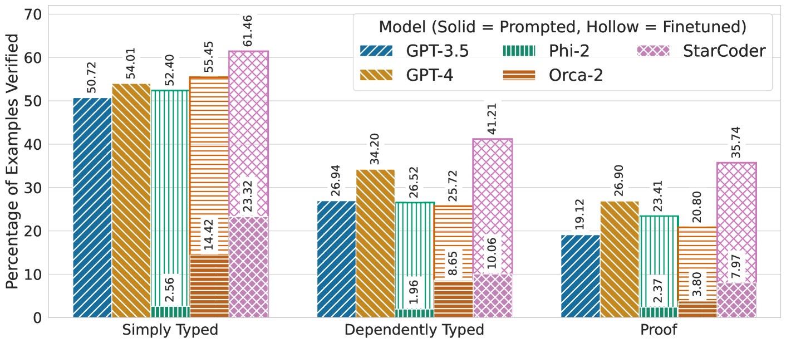

# 探索神经合成技术，助力 SMT 支持的面向证明编程发展

发布时间：2024年05月02日

`分类：LLM应用` `人工智能`

> Towards Neural Synthesis for SMT-Assisted Proof-Oriented Programming

# 摘要

> 面向证明的编程将计算逻辑与程序正确性的证明融为一体，尽管利用了如 F* 语言中的可满足性模态理论（SMT）求解器来自动化证明过程，但人工编程与证明的工作量依然不小。为了推动利用人工智能自动化构建面向证明的程序的研究，我们汇集了一个包含60万行开源F*程序和证明的数据库，涵盖了从Windows、Linux到Python、Firefox等多个生产系统中使用的软件。该数据库包含约3.2万个顶级F*定义，每个定义都代表着一个基于类型的程序和证明合成问题——即在给定F*类型形式规范的情况下生成定义。我们还提供了一个程序片段检查工具，用以查询F*并验证候选解决方案的正确性。我们认为这是迄今为止最大的结合了可复现程序片段检查器的SMT辅助程序证明集合。依托此数据库，我们探究了利用人工智能在F*中合成程序及其证明的可能性，并取得了令人鼓舞的成果。我们的主要发现是，经过微调的小型语言模型（例如Phi-2或StarCoder）在性能上与大型语言模型（如GPT-4）相媲美，且计算成本更低。我们还识别了多种基于类型的检索增强技术，并发现这些技术能显著提升性能。通过深入的错误分析和案例研究，我们揭示了模型和技术的潜在优势与局限，并为未来的优化方向提供了建议。

> Proof-oriented programs mix computational content with proofs of program correctness. However, the human effort involved in programming and proving is still substantial, despite the use of Satisfiability Modulo Theories (SMT) solvers to automate proofs in languages such as F*.
  Seeking to spur research on using AI to automate the construction of proof-oriented programs, we curate a dataset of 600K lines of open-source F* programs and proofs, including software used in production systems ranging from Windows and Linux, to Python and Firefox. Our dataset includes around 32K top-level F* definitions, each representing a type-directed program and proof synthesis problem -- producing a definition given a formal specification expressed as an F* type. We provide a program-fragment checker that queries F* to check the correctness of candidate solutions. We believe this is the largest corpus of SMT-assisted program proofs coupled with a reproducible program-fragment checker.
  Grounded in this dataset, we investigate the use of AI to synthesize programs and their proofs in F*, with promising results. Our main finding in that the performance of fine-tuned smaller language models (such as Phi-2 or StarCoder) compare favorably with large language models (such as GPT-4), at a much lower computational cost. We also identify various type-based retrieval augmentation techniques and find that they boost performance significantly. With detailed error analysis and case studies, we identify potential strengths and weaknesses of models and techniques and suggest directions for future improvements.

[Arxiv](https://arxiv.org/abs/2405.01787)