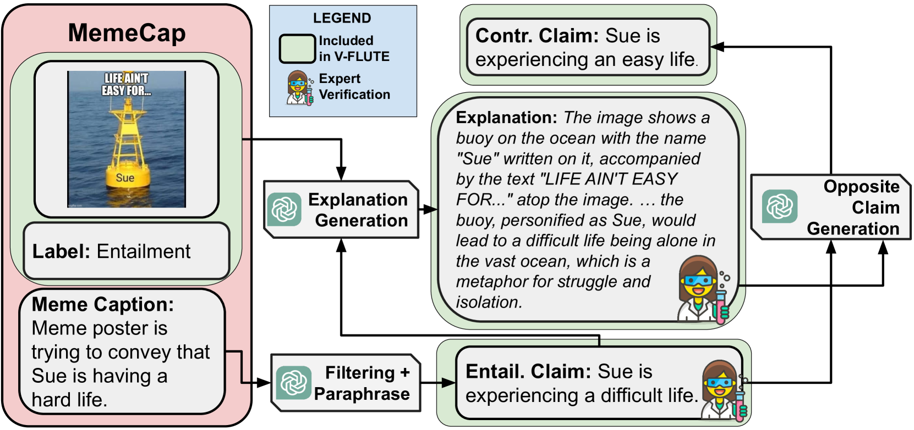

# V-FLUTE：图文结合，洞悉视觉比喻语言的深层含义

发布时间：2024年05月02日

`分类：LLM应用` `视觉问答` `人工智能`

> V-FLUTE: Visual Figurative Language Understanding with Textual Explanations

# 摘要

> 大型视觉-语言模型（VLMs）在视觉问答和视觉推理等任务中表现出了卓越的推理能力，这些任务要求对图像和文本进行精细的理解。但是，当涉及到含有隐喻或幽默等比喻性内容的图像和标题时，这些模型的理解能力尚未得到充分探索，因为这些内容的含义往往是隐晦的。为了解决这一问题，我们设计了一项新任务并创建了一个高水准的数据集：视觉比喻语言理解与文本解释（V-FLUTE）。在这个任务中，模型需要判断一张图片（前提）是否能够推导出一个陈述（假设），并用文字来解释其预测结果。我们采用了人机协作的方式，构建了包含6,027个<图像，陈述，标签，解释>样本的V-FLUTE数据集，覆盖了五种不同的多模态比喻现象：隐喻、比喻、成语、讽刺和幽默。这些比喻现象可能出现在图片中、标题中，或者两者兼有。此外，我们还进行了自动化和人工评估，以检验当前VLMs在理解这些比喻现象方面的能力。

> Large Vision-Language models (VLMs) have demonstrated strong reasoning capabilities in tasks requiring a fine-grained understanding of literal images and text, such as visual question-answering or visual entailment. However, there has been little exploration of these models' capabilities when presented with images and captions containing figurative phenomena such as metaphors or humor, the meaning of which is often implicit. To close this gap, we propose a new task and a high-quality dataset: Visual Figurative Language Understanding with Textual Explanations (V-FLUTE). We frame the visual figurative language understanding problem as an explainable visual entailment task, where the model has to predict whether the image (premise) entails a claim (hypothesis) and justify the predicted label with a textual explanation. Using a human-AI collaboration framework, we build a high-quality dataset, V-FLUTE, that contains 6,027 <image, claim, label, explanation> instances spanning five diverse multimodal figurative phenomena: metaphors, similes, idioms, sarcasm, and humor. The figurative phenomena can be present either in the image, the caption, or both. We further conduct both automatic and human evaluations to assess current VLMs' capabilities in understanding figurative phenomena.

[Arxiv](https://arxiv.org/abs/2405.01474)