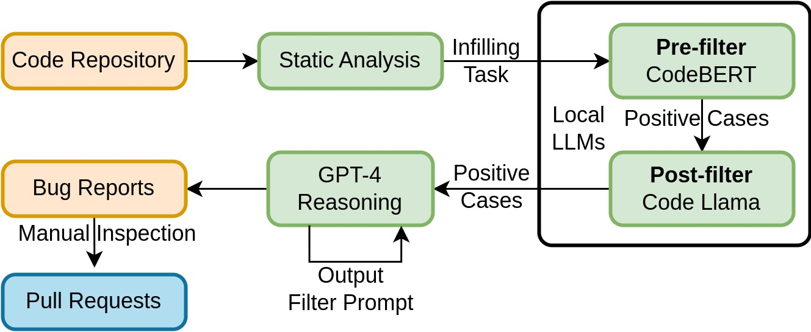

# WitheredLeaf：利用大型语言模型挖掘实体不一致性缺陷

发布时间：2024年05月02日

`LLM应用` `软件工程` `代码分析`

> WitheredLeaf: Finding Entity-Inconsistency Bugs with LLMs

# 摘要

> 源于语义缺陷的实体不一致错误（EIBs）通常涉及对程序实体的误用，这些实体在语法上看似正确，实则错误，比如变量标识符和函数名，这往往牵涉到安全问题。与明显的语法漏洞相比，EIBs更为隐蔽，可能长时间未被察觉。传统的检测手段，例如静态分析和动态测试，因EIBs的多变和依赖上下文的特性而往往力不从心。但是，随着大型语言模型（LLMs）如GPT-4的发展，利用这些模型的语义理解能力进行自动EIB检测变得日益可行。本研究首先对LLMs在识别EIBs方面的能力进行了系统性评估，发现GPT-4虽有潜力，但其召回率和精确度有限，限制了其在实际应用中的效能。关键问题在于模型常常过分关注不包含EIBs的无关代码片段。为此，我们提出了一个创新的级联EIB检测系统WitheredLeaf，它利用更小型、专门针对代码的语言模型来排除大多数非目标案例，从而有效提升了检测的精确度和召回率。我们在154个星数超过1000的Python和C GitHub仓库上对WitheredLeaf进行了评估，发现了123个新漏洞，其中45%可以被利用来干扰程序的正常运作。在提交的69个修复提案中，有27个已经被成功采纳并合并。

> Originating from semantic bugs, Entity-Inconsistency Bugs (EIBs) involve misuse of syntactically valid yet incorrect program entities, such as variable identifiers and function names, which often have security implications. Unlike straightforward syntactic vulnerabilities, EIBs are subtle and can remain undetected for years. Traditional detection methods, such as static analysis and dynamic testing, often fall short due to the versatile and context-dependent nature of EIBs. However, with advancements in Large Language Models (LLMs) like GPT-4, we believe LLM-powered automatic EIB detection becomes increasingly feasible through these models' semantics understanding abilities. This research first undertakes a systematic measurement of LLMs' capabilities in detecting EIBs, revealing that GPT-4, while promising, shows limited recall and precision that hinder its practical application. The primary problem lies in the model's tendency to focus on irrelevant code snippets devoid of EIBs. To address this, we introduce a novel, cascaded EIB detection system named WitheredLeaf, which leverages smaller, code-specific language models to filter out most negative cases and mitigate the problem, thereby significantly enhancing the overall precision and recall. We evaluated WitheredLeaf on 154 Python and C GitHub repositories, each with over 1,000 stars, identifying 123 new flaws, 45% of which can be exploited to disrupt the program's normal operations. Out of 69 submitted fixes, 27 have been successfully merged.

[Arxiv](https://arxiv.org/abs/2405.01668)