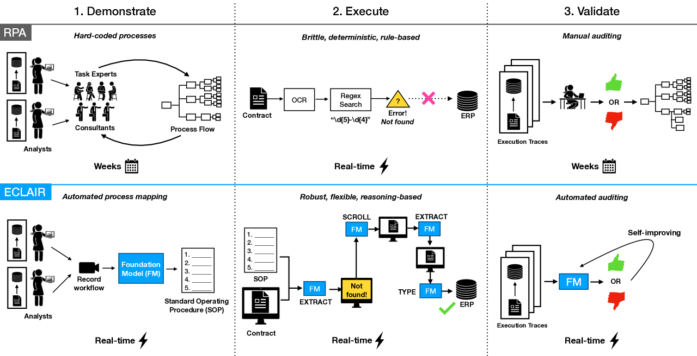
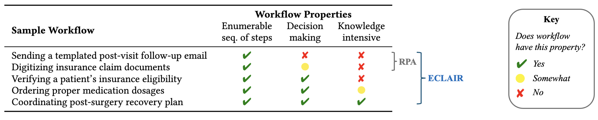

# 借助基础模型，企业自动化得以实现。本研究旨在探索基础模型在企业自动化中的应用，并分析其对提升效率和创新能力的影响。

发布时间：2024年05月03日

`Agent

这篇论文介绍了一个名为ECLAIR的系统，它利用多模态基础模型（如GPT-4）的推理与规划能力来实现企业工作流程的自动化。这个系统能够在很少的人工干预下工作，并且初步实验表明它在理解工作流程方面具有高准确性，同时设置简便，不需要复杂的技术背景。这个系统可以被视为一个智能代理（Agent），因为它能够自主地执行任务和流程，因此将其分类为Agent。` `企业自动化` `数据管理`

> Automating the Enterprise with Foundation Models

# 摘要

> 自动化企业工作流程有望每年提升4万亿美元的生产力，然而，尽管数据管理领域对此探索已久，实现完全自动化的愿景仍未成真。现有的自动化方案，如流程挖掘和机器人流程自动化（RPA），虽有成效，但高昂的设置成本、不稳定的执行准确性以及繁琐的维护工作，限制了其广泛应用。多模态基础模型（如GPT-4）凭借其强大的推理与规划能力，为工作流程自动化带来了新希望。我们提出的ECLAIR系统，能在极少人工干预下实现企业工作流程自动化。初步实验显示，多模态FMs不仅在理解工作流程上达到了93%的准确性，而且设置简便，无需复杂技术背景，实现了40%的端到端完成率。我们正探索人机协作、验证机制和自我改进等挑战，并寻求数据管理技术的解决方案。相关代码已公开：https://github.com/HazyResearch/eclair-agents。

> Automating enterprise workflows could unlock $4 trillion/year in productivity gains. Despite being of interest to the data management community for decades, the ultimate vision of end-to-end workflow automation has remained elusive. Current solutions rely on process mining and robotic process automation (RPA), in which a bot is hard-coded to follow a set of predefined rules for completing a workflow. Through case studies of a hospital and large B2B enterprise, we find that the adoption of RPA has been inhibited by high set-up costs (12-18 months), unreliable execution (60% initial accuracy), and burdensome maintenance (requiring multiple FTEs). Multimodal foundation models (FMs) such as GPT-4 offer a promising new approach for end-to-end workflow automation given their generalized reasoning and planning abilities. To study these capabilities we propose ECLAIR, a system to automate enterprise workflows with minimal human supervision. We conduct initial experiments showing that multimodal FMs can address the limitations of traditional RPA with (1) near-human-level understanding of workflows (93% accuracy on a workflow understanding task) and (2) instant set-up with minimal technical barrier (based solely on a natural language description of a workflow, ECLAIR achieves end-to-end completion rates of 40%). We identify human-AI collaboration, validation, and self-improvement as open challenges, and suggest ways they can be solved with data management techniques. Code is available at: https://github.com/HazyResearch/eclair-agents

[Arxiv](https://arxiv.org/abs/2405.03710)