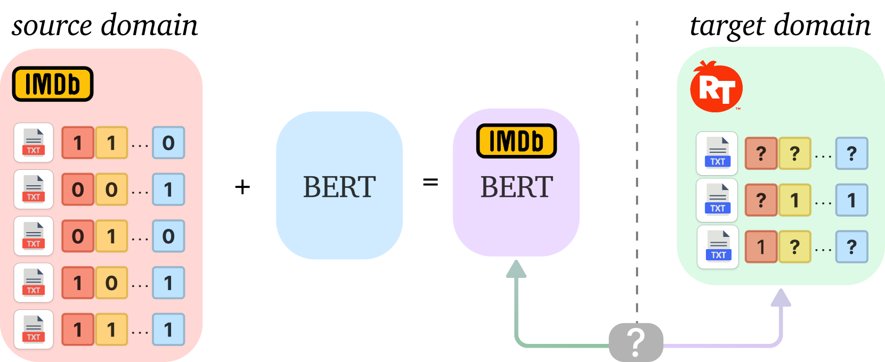
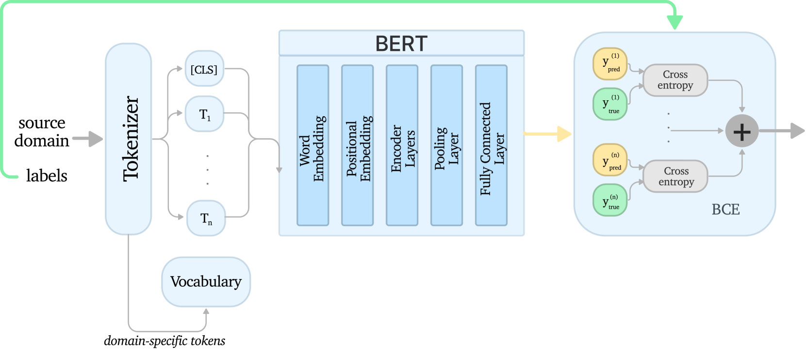
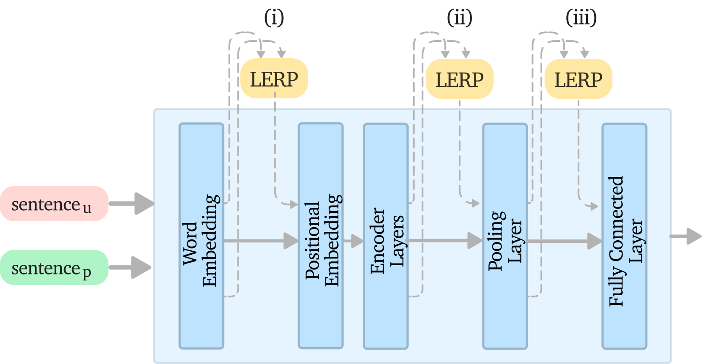
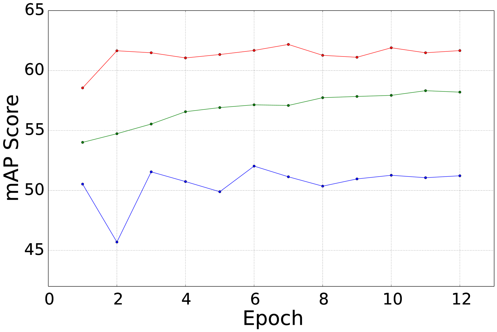
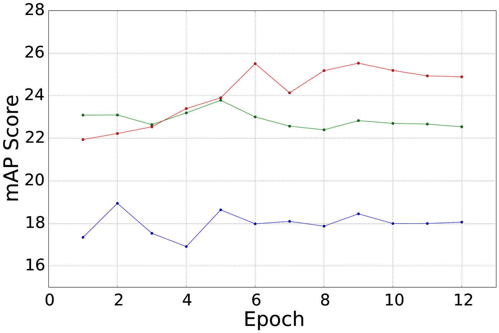
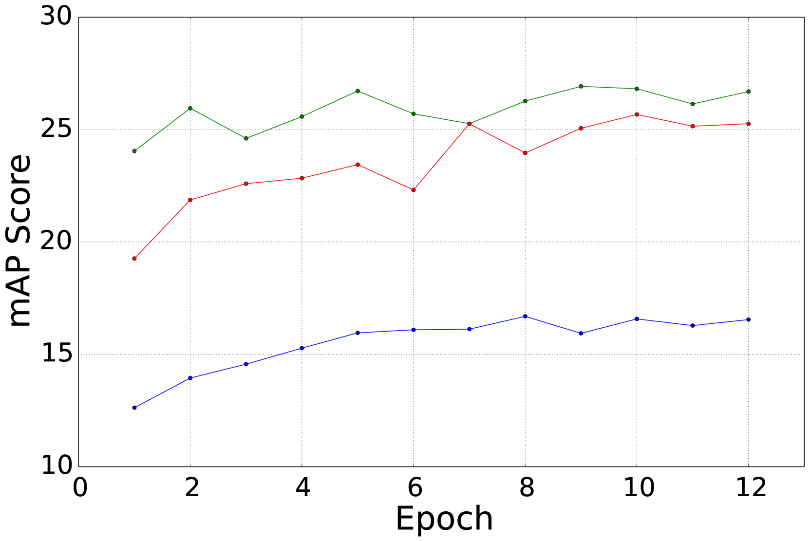

# DALLMi：为基于大型语言模型的多标签分类任务量身定制的领域适应技术。

发布时间：2024年05月03日

`LLM应用` `文本分类`

> DALLMi: Domain Adaption for LLM-based Multi-label Classifier

# 摘要

> 大型语言模型（LLMs）正日益成为对不同领域文本进行多标签分类的关键技术。然而，面对领域转换，如电影评论分类器从IMDb迁移到Rotten Tomatoes，基于LLM的多标签分类器的适应性训练面临挑战，这主要是因为目标领域的标签集不全和高昂的训练成本。目前，大多数领域适应技术要么应用于图像多标签分类，要么应用于文本二元分类。本文提出了DALLMi，一种创新的半监督领域适应方法，专为基于LLMs的文本数据模型设计，尤其是针对BERT模型。DALLMi的创新之处在于其变体损失和MixUp正则化技术，这两者共同利用有限的正标记数据和大量未标记文本，以及它们在BERT词嵌入中的插值。此外，DALLMi还引入了一种标签平衡抽样策略，以解决标记与未标记数据之间的不平衡问题。我们在三个不同的目标领域标签可用性场景下，对DALLMi进行了评估，并与部分监督和无监督方法进行了比较。评估结果显示，DALLMi在mAP上分别比无监督和部分监督方法提高了19.9%和52.2%。

> Large language models (LLMs) increasingly serve as the backbone for classifying text associated with distinct domains and simultaneously several labels (classes). When encountering domain shifts, e.g., classifier of movie reviews from IMDb to Rotten Tomatoes, adapting such an LLM-based multi-label classifier is challenging due to incomplete label sets at the target domain and daunting training overhead. The existing domain adaptation methods address either image multi-label classifiers or text binary classifiers. In this paper, we design DALLMi, Domain Adaptation Large Language Model interpolator, a first-of-its-kind semi-supervised domain adaptation method for text data models based on LLMs, specifically BERT. The core of DALLMi is the novel variation loss and MixUp regularization, which jointly leverage the limited positively labeled and large quantity of unlabeled text and, importantly, their interpolation from the BERT word embeddings. DALLMi also introduces a label-balanced sampling strategy to overcome the imbalance between labeled and unlabeled data. We evaluate DALLMi against the partial-supervised and unsupervised approach on three datasets under different scenarios of label availability for the target domain. Our results show that DALLMi achieves higher mAP than unsupervised and partially-supervised approaches by 19.9% and 52.2%, respectively.

[Arxiv](https://arxiv.org/abs/2405.01883)