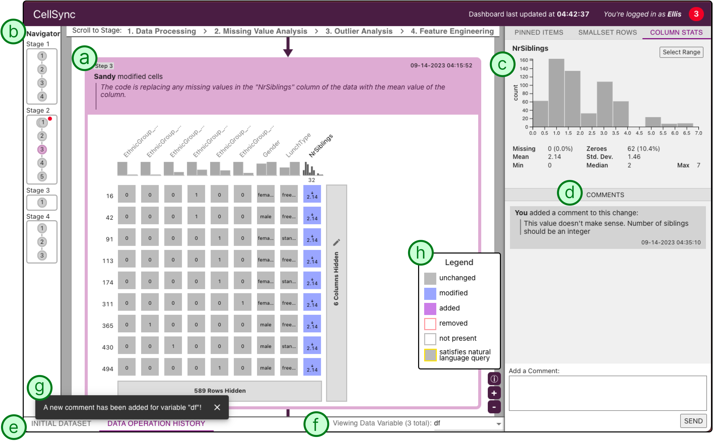
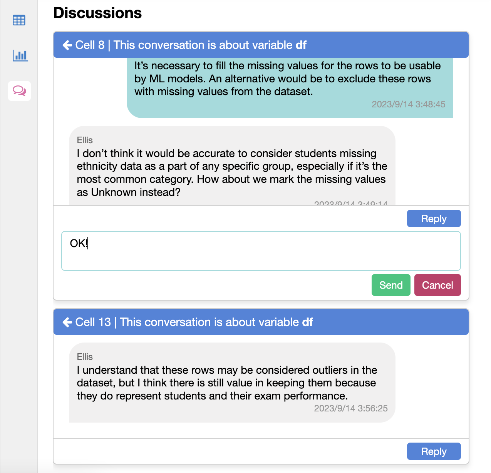
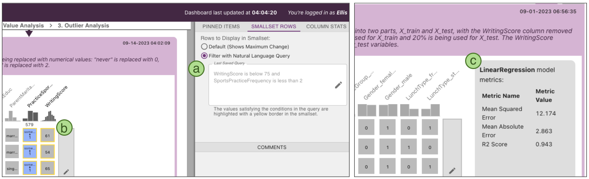

# 通过运用大型语言模型，我们能够提升数据科学流程中领域专家的参与度和包容性。

发布时间：2024年05月03日

`分类：LLM应用` `数据科学` `协作框架`

> Leveraging Large Language Models to Enhance Domain Expert Inclusion in Data Science Workflows

# 摘要

> 领域专家对于引导数据科学家优化机器学习模型并确保其在实际应用中的相关性至关重要。但目前，由于专业背景差异、文档实践的抽象性以及对底层实现细节的访问和可见性不足，这种跨专业合作面临诸多挑战。为了解决这些问题，我们推出了 CellSync——一个协作框架，它包括：（1）一个 Jupyter Notebook 插件，实时监测数据集和模型性能指标的变化；（2）一个由大型语言模型支持的可视化仪表板，使得变化对非技术专家也易于理解。CellSync 提供的单元级数据可视化和代码摘要功能，让领域专家能够直观地分析数据和模型操作对不同数据段的影响。其内置的聊天功能则促进了以数据为中心的交流和对数据科学家的精确反馈。我们初步的评估结果表明，CellSync 不仅提高了工作的透明度，还激发了关于数据操作意图和后果的关键讨论。

> Domain experts can play a crucial role in guiding data scientists to optimize machine learning models while ensuring contextual relevance for downstream use. However, in current workflows, such collaboration is challenging due to differing expertise, abstract documentation practices, and lack of access and visibility into low-level implementation artifacts. To address these challenges and enable domain expert participation, we introduce CellSync, a collaboration framework comprising (1) a Jupyter Notebook extension that continuously tracks changes to dataframes and model metrics and (2) a Large Language Model powered visualization dashboard that makes those changes interpretable to domain experts. Through CellSync's cell-level dataset visualization with code summaries, domain experts can interactively examine how individual data and modeling operations impact different data segments. The chat features enable data-centric conversations and targeted feedback to data scientists. Our preliminary evaluation shows that CellSync provides transparency and promotes critical discussions about the intents and implications of data operations.

[Arxiv](https://arxiv.org/abs/2405.02260)