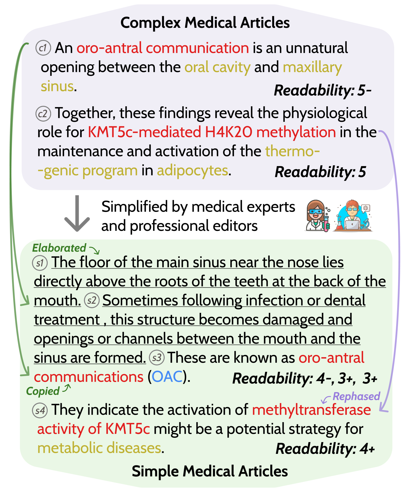
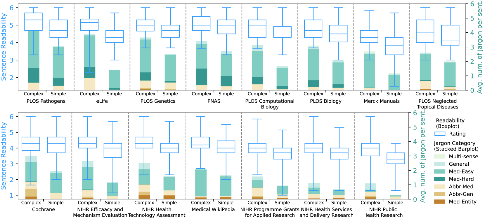
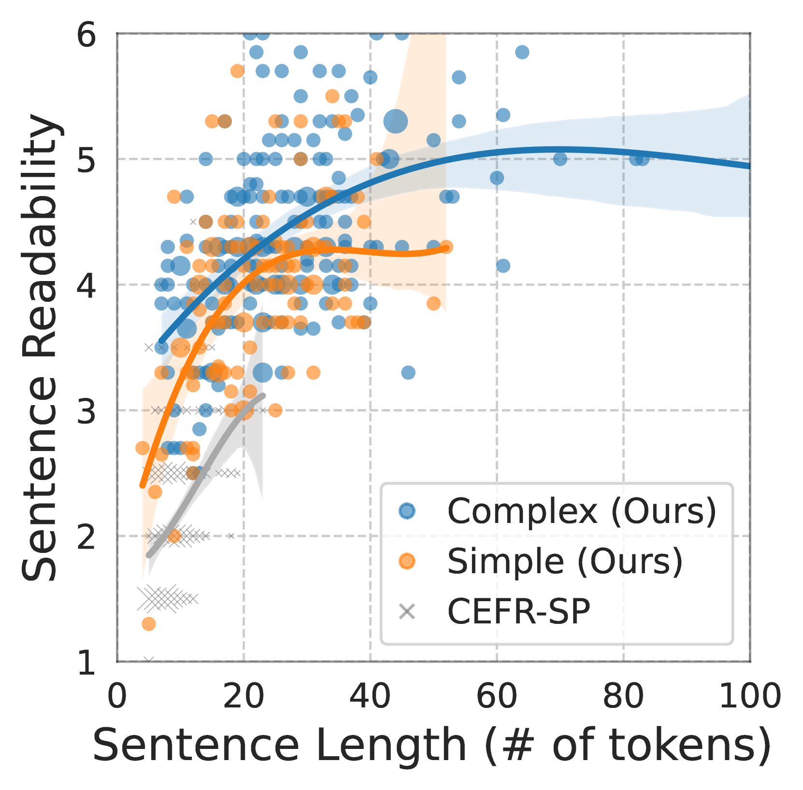
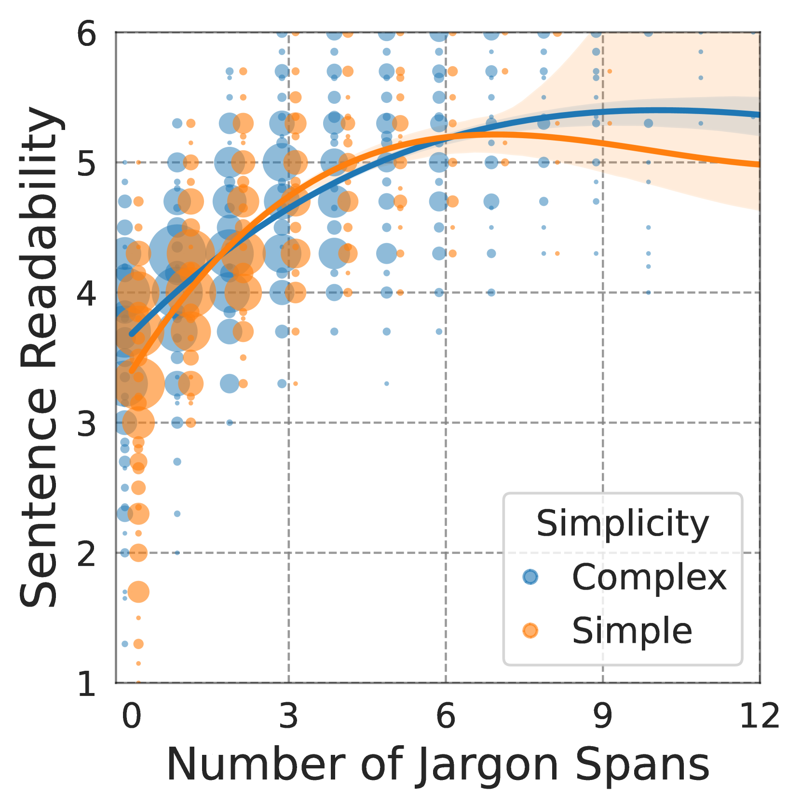
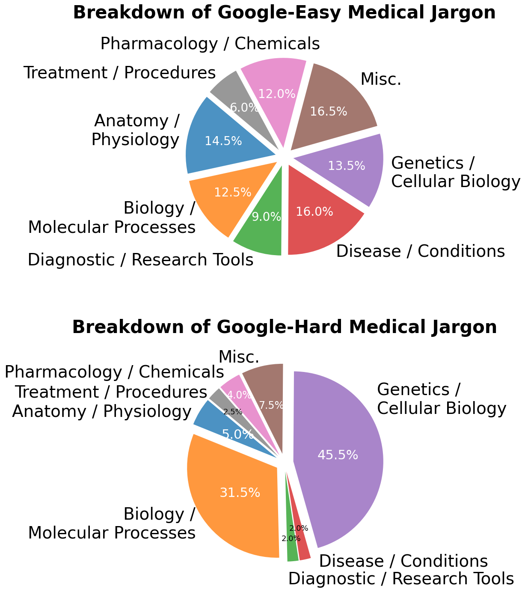
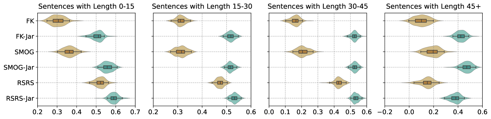

# MedReadMe：深入探究医学领域内句子细粒度可读性的系统性研究

发布时间：2024年05月03日

`LLM应用`

> MedReadMe: A Systematic Study for Fine-grained Sentence Readability in Medical Domain

# 摘要

> 医学文本阅读难度极高，准确评估其可读性对于提高普及性至关重要。本文提出了一项系统性研究，旨在对医学领域的文本进行细致的可读性分析，包括句子和短语两个层面。我们创建了一个新的数据集 MedReadMe，包含4,520句医学文本的可读性评分和复杂性标注，特别引入了“谷歌简易”与“谷歌困难”两个新颖分类。本研究对650个语言特征进行了量化分析，并实现了复杂词汇和行话的自动识别。借助高质量的标注数据，我们对医学领域的几个先进句子级可读性度量进行了基准测试和改进，涵盖了无监督、监督以及基于提示的方法，并利用最新的大型语言模型（LLMs）。我们的细粒度复杂短语标注显示，向现有可读性公式中添加一个特征——术语短语的数量，可以显著提升其与人类判断的一致性。我们将公开发布这一数据集和相关代码。

> Medical texts are notoriously challenging to read. Properly measuring their readability is the first step towards making them more accessible. In this paper, we present a systematic study on fine-grained readability measurements in the medical domain at both sentence-level and span-level. We introduce a new dataset MedReadMe, which consists of manually annotated readability ratings and fine-grained complex span annotation for 4,520 sentences, featuring two novel "Google-Easy" and "Google-Hard" categories. It supports our quantitative analysis, which covers 650 linguistic features and automatic complex word and jargon identification. Enabled by our high-quality annotation, we benchmark and improve several state-of-the-art sentence-level readability metrics for the medical domain specifically, which include unsupervised, supervised, and prompting-based methods using recently developed large language models (LLMs). Informed by our fine-grained complex span annotation, we find that adding a single feature, capturing the number of jargon spans, into existing readability formulas can significantly improve their correlation with human judgments. We will publicly release the dataset and code.

[Arxiv](https://arxiv.org/abs/2405.02144)