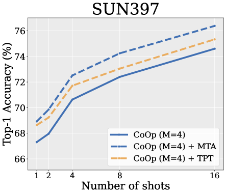

# 探讨视觉-语言模型在测试阶段的零样本泛化能力：提示学习是否真的不可或缺？

发布时间：2024年05月03日

`分类：LLM应用

这篇论文讨论了大型视觉-语言模型（如CLIP）的测试时增强技术，特别是软提示调整。它提出了一种名为测试时增强均值漂移（MTA）的方法，用于提高零样本泛化能力。这种方法不依赖于复杂的训练步骤，而是通过整合内聚性得分来评估每个增强视图的质量。论文的重点是提高模型性能和计算效率，这属于LLM应用的范畴。` `计算机视觉` `机器学习`

> On the test-time zero-shot generalization of vision-language models: Do we really need prompt learning?

# 摘要

> CLIP 等大型视觉-语言模型的发展推动了对高效适应技术的研究，尤其是软提示调整。测试时增强，通过使用单个图像的多个增强视图来提升零样本泛化能力，正迅速成为研究热点，这也促使研究者更多地关注测试时的提示调整。与此相对，我们提出了一种稳健的测试时增强均值漂移（MTA）方法，它无需复杂的训练步骤即可超越基于提示的方法。MTA 不依赖于以往测试时增强技术中使用的临时规则（如置信度阈值）来筛选增强视图，而是将每个视图的质量评估变量——内聚性得分——直接整合到其优化过程中。这种方法既高效又无需训练或调整超参数。我们在 15 个数据集上进行了广泛的基准测试，证明了 MTA 在性能和计算效率上的优势。MTA 作为一个易于部署的即插即用模块，无论是在零样本模型还是最先进的少样本方法上，都能带来系统性和一致性的改进。

> The development of large vision-language models, notably CLIP, has catalyzed research into effective adaptation techniques, with a particular focus on soft prompt tuning. Conjointly, test-time augmentation, which utilizes multiple augmented views of a single image to enhance zero-shot generalization, is emerging as a significant area of interest. This has predominantly directed research efforts toward test-time prompt tuning. In contrast, we introduce a robust MeanShift for Test-time Augmentation (MTA), which surpasses prompt-based methods without requiring this intensive training procedure. This positions MTA as an ideal solution for both standalone and API-based applications. Additionally, our method does not rely on ad hoc rules (e.g., confidence threshold) used in some previous test-time augmentation techniques to filter the augmented views. Instead, MTA incorporates a quality assessment variable for each view directly into its optimization process, termed as the inlierness score. This score is jointly optimized with a density mode seeking process, leading to an efficient training- and hyperparameter-free approach. We extensively benchmark our method on 15 datasets and demonstrate MTA's superiority and computational efficiency. Deployed easily as plug-and-play module on top of zero-shot models and state-of-the-art few-shot methods, MTA shows systematic and consistent improvements.

[Arxiv](https://arxiv.org/abs/2405.02266)