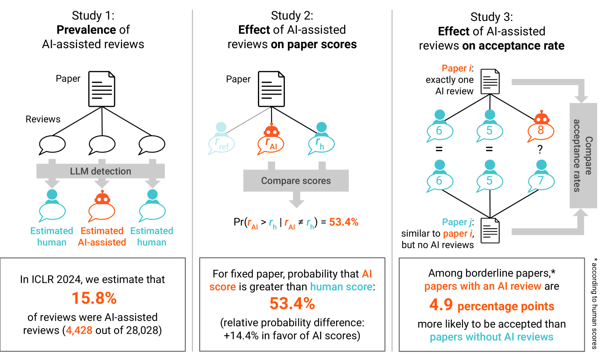
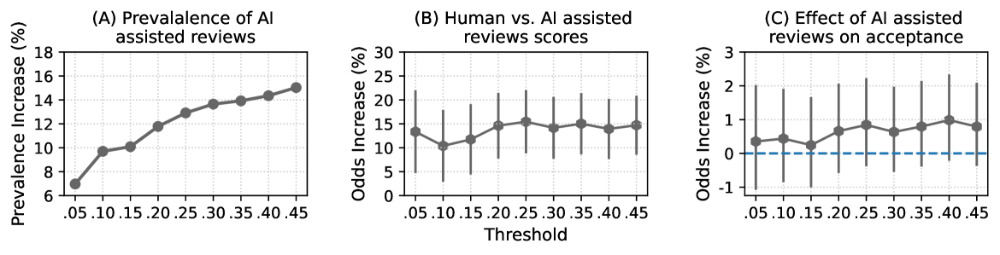

# AI评审的幸运抽奖：当人工智能辅助的同行评审变得普遍时，它显著提升了论文的评分和被接受的概率。

发布时间：2024年05月03日

`分类：LLM应用

这篇论文研究了大型语言模型（LLMs）在AI辅助的同行评审中的应用，以及这种应用对同行评审系统的有效性和公正性的影响。论文通过对2024年国际学习表示会议（ICLR）的AI辅助同行评审的普及度和影响进行准实验性研究，发现AI辅助评审对论文评分和接受率有显著影响。这篇论文关注的是LLM在实际应用中的问题和影响，因此可以归类为LLM应用。` `学术出版` `人工智能`

> The AI Review Lottery: Widespread AI-Assisted Peer Reviews Boost Paper Scores and Acceptance Rates

# 摘要

> 期刊和会议对AI辅助的同行评审可能损害同行评审系统的有效性和公正性表示担忧，尤其是在大型语言模型（LLMs）的辅助下。本研究通过对2024年国际学习表示会议（ICLR）的AI辅助同行评审的普及度和影响进行准实验性研究，回应了这一关切。我们的研究结果分为三部分：首先，利用GPTZero LLM检测工具，我们估计至少有15.8%的ICLR 2024评审报告是借助AI完成的。其次，我们分析了AI辅助评审对论文评分的影响，发现在评分不同的评审对中，AI辅助评审的评分高出人类评审的比例为53.4%（p = 0.002），概率差异为+14.4%，表明AI辅助评审更具优势。最后，我们评估了AI辅助评审对论文接受率的影响，发现在接受门槛附近的论文中，接受AI辅助评审的论文比未接受的论文接受率高出4.9个百分点（p = 0.024）。总体而言，我们的研究揭示了AI辅助评审对同行评审流程的实质性影响，并对未来趋势的可能影响进行了深入讨论。

> Journals and conferences worry that peer reviews assisted by artificial intelligence (AI), in particular, large language models (LLMs), may negatively influence the validity and fairness of the peer-review system, a cornerstone of modern science. In this work, we address this concern with a quasi-experimental study of the prevalence and impact of AI-assisted peer reviews in the context of the 2024 International Conference on Learning Representations (ICLR), a large and prestigious machine-learning conference. Our contributions are threefold. Firstly, we obtain a lower bound for the prevalence of AI-assisted reviews at ICLR 2024 using the GPTZero LLM detector, estimating that at least $15.8\%$ of reviews were written with AI assistance. Secondly, we estimate the impact of AI-assisted reviews on submission scores. Considering pairs of reviews with different scores assigned to the same paper, we find that in $53.4\%$ of pairs the AI-assisted review scores higher than the human review ($p = 0.002$; relative difference in probability of scoring higher: $+14.4\%$ in favor of AI-assisted reviews). Thirdly, we assess the impact of receiving an AI-assisted peer review on submission acceptance. In a matched study, submissions near the acceptance threshold that received an AI-assisted peer review were $4.9$ percentage points ($p = 0.024$) more likely to be accepted than submissions that did not. Overall, we show that AI-assisted reviews are consequential to the peer-review process and offer a discussion on future implications of current trends

[Arxiv](https://arxiv.org/abs/2405.02150)