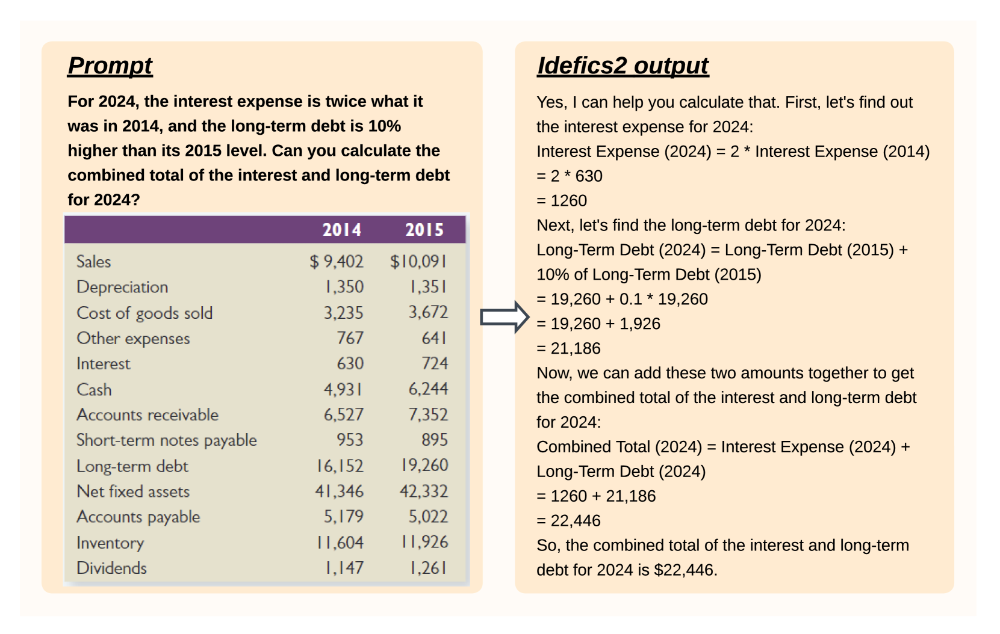
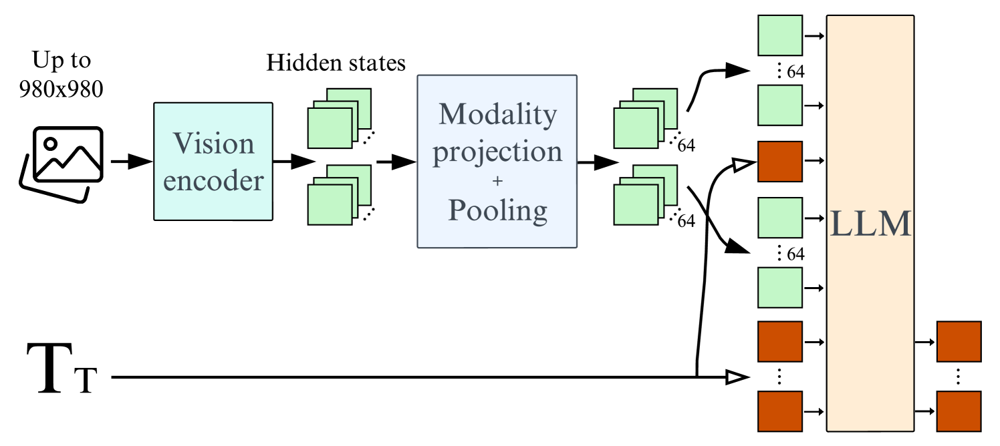
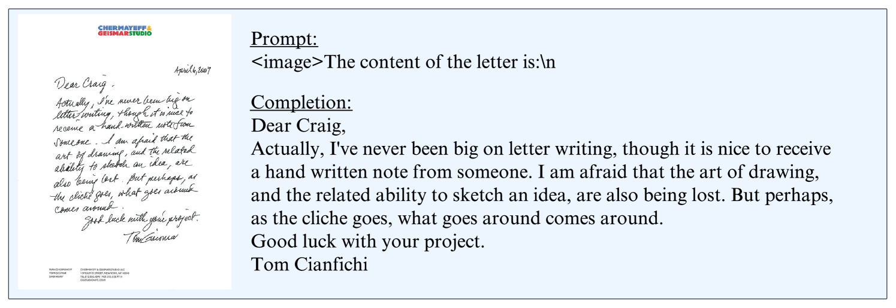
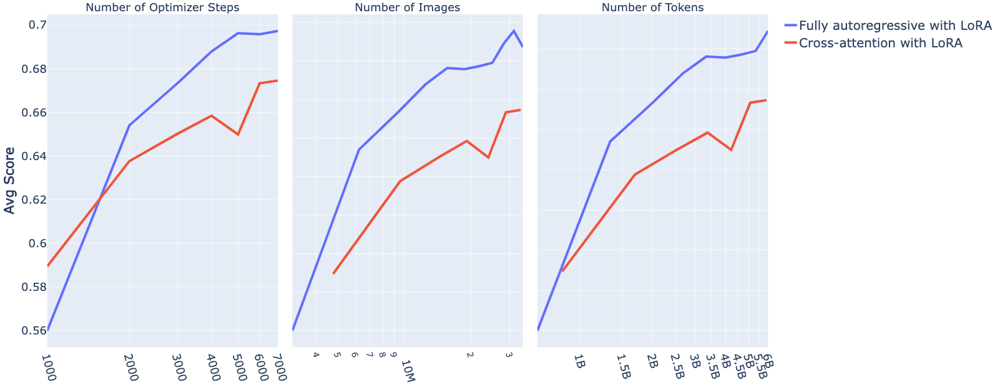
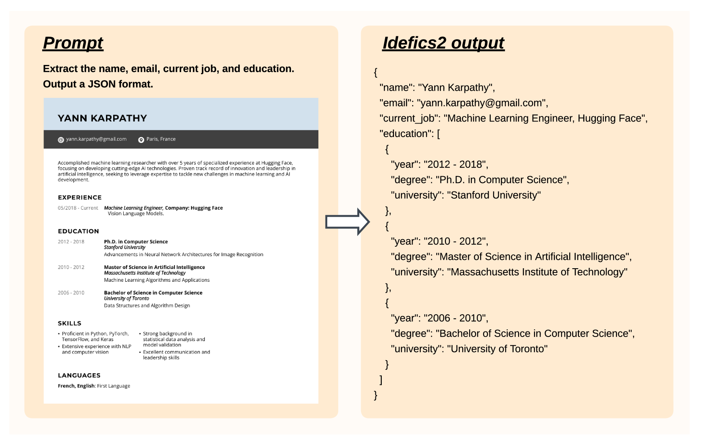
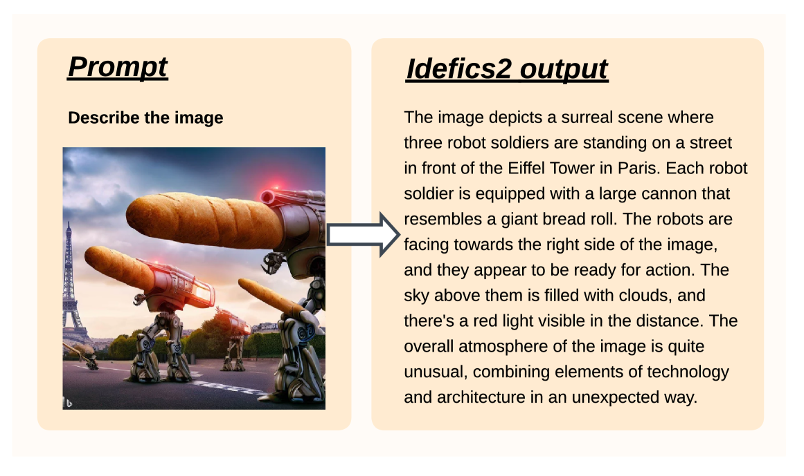
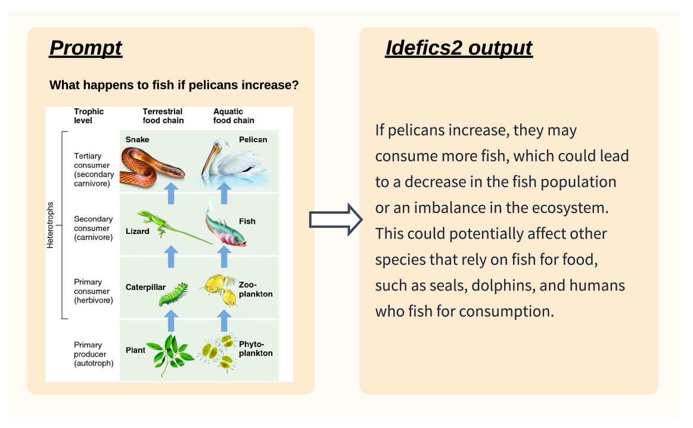

# 构建视觉-语言模型时，关键因素有哪些？

发布时间：2024年05月03日

`分类：LLM应用` `视觉计算` `人工智能`

> What matters when building vision-language models?

# 摘要

> 随着大型语言模型和视觉变换器的进步，视觉-语言模型（VLMs）的研究兴趣不断攀升。尽管相关文献众多，我们发现在VLMs设计上的关键决策往往缺乏充分的理由。我们认为这种缺乏依据的决策阻碍了领域进步，因为它让人们难以识别哪些选择真正提升了模型性能。为了应对这一挑战，我们进行了深入的实验研究，涉及预训练模型、架构选择、数据收集和训练方法等多个方面。我们的研究成果包括开发了Idefics2——一个参数量达80亿的高效基础VLM。Idefics2在多模态基准测试中的表现在同类规模模型中领先，并且常常能与参数量为其四倍的模型相媲美。我们还公开了该模型的三个版本（基础版、指导版和聊天版）及其训练所用的数据集。

> The growing interest in vision-language models (VLMs) has been driven by improvements in large language models and vision transformers. Despite the abundance of literature on this subject, we observe that critical decisions regarding the design of VLMs are often not justified. We argue that these unsupported decisions impede progress in the field by making it difficult to identify which choices improve model performance. To address this issue, we conduct extensive experiments around pre-trained models, architecture choice, data, and training methods. Our consolidation of findings includes the development of Idefics2, an efficient foundational VLM of 8 billion parameters. Idefics2 achieves state-of-the-art performance within its size category across various multimodal benchmarks, and is often on par with models four times its size. We release the model (base, instructed, and chat) along with the datasets created for its training.

[Arxiv](https://arxiv.org/abs/2405.02246)