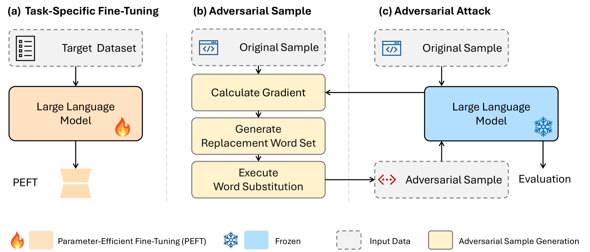

# 探究大型语言模型的对抗性防御能力：实证分析。

发布时间：2024年05月04日

`LLM应用` `人工智能安全`

> Assessing Adversarial Robustness of Large Language Models: An Empirical Study

# 摘要

> 大型语言模型（LLMs）引领了自然语言处理的革新，但其在对抗性攻击面前的坚固性仍是一个亟待解决的问题。本研究提出了一种创新的白盒攻击策略，揭露了包括Llama、OPT和T5在内的主流开源LLMs的脆弱之处。通过考察模型大小、结构和微调技术对其抵御对抗性扰动的能力的影响，我们进行了深入分析。此外，我们在五项多样化的文本分类任务上进行了全面的评估，为LLM的鲁棒性设立了新的行业标准。本研究的洞察为LLM在现实世界中安全、可靠的应用提供了宝贵的参考，同时也为构建值得信赖的人工智能系统贡献了力量。

> Large Language Models (LLMs) have revolutionized natural language processing, but their robustness against adversarial attacks remains a critical concern. We presents a novel white-box style attack approach that exposes vulnerabilities in leading open-source LLMs, including Llama, OPT, and T5. We assess the impact of model size, structure, and fine-tuning strategies on their resistance to adversarial perturbations. Our comprehensive evaluation across five diverse text classification tasks establishes a new benchmark for LLM robustness. The findings of this study have far-reaching implications for the reliable deployment of LLMs in real-world applications and contribute to the advancement of trustworthy AI systems.

[Arxiv](https://arxiv.org/abs/2405.02764)