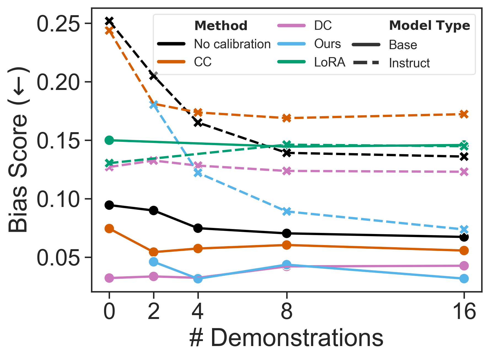

# 超越单纯的性能指标，本文致力于量化并缓解大型语言模型（LLMs）中的标签偏见问题。

发布时间：2024年05月04日

`LLM应用` `人工智能` `偏见检测`

> Beyond Performance: Quantifying and Mitigating Label Bias in LLMs

# 摘要

> 大型语言模型（LLMs）凭借上下文提示的灵活性，展现出了对各类任务的出色适应力。但最新研究发现，这些模型也存在标签偏见问题，即倾向于预测某些特定答案。尽管如此，如何在大规模范围内可靠地检测和衡量这种偏见，仍然是一个较少被触及的领域。本研究评估了多种量化模型预测中标签偏见的方法，并在279个分类任务和十种大型语言模型上进行了深入分析。研究发现，无论是在尝试去偏见之前还是之后，模型中都存在显著的标签偏见，并突显了结果导向的评估指标的重要性，这在以往的研究中并未被充分应用。此外，我们提出了一种新的标签偏见校准方法，专为少量示例提示设计，它在提升性能和减少标签偏见方面超越了现有的校准策略。研究结果表明，大型语言模型预测中的标签偏见问题，仍是其可靠性的一个主要障碍。

> Large language models (LLMs) have shown remarkable adaptability to diverse tasks, by leveraging context prompts containing instructions, or minimal input-output examples. However, recent work revealed they also exhibit label bias -- an undesirable preference toward predicting certain answers over others. Still, detecting and measuring this bias reliably and at scale has remained relatively unexplored. In this study, we evaluate different approaches to quantifying label bias in a model's predictions, conducting a comprehensive investigation across 279 classification tasks and ten LLMs. Our investigation reveals substantial label bias in models both before and after debiasing attempts, as well as highlights the importance of outcomes-based evaluation metrics, which were not previously used in this regard. We further propose a novel label bias calibration method tailored for few-shot prompting, which outperforms recent calibration approaches for both improving performance and mitigating label bias. Our results emphasize that label bias in the predictions of LLMs remains a barrier to their reliability.

[Arxiv](https://arxiv.org/abs/2405.02743)