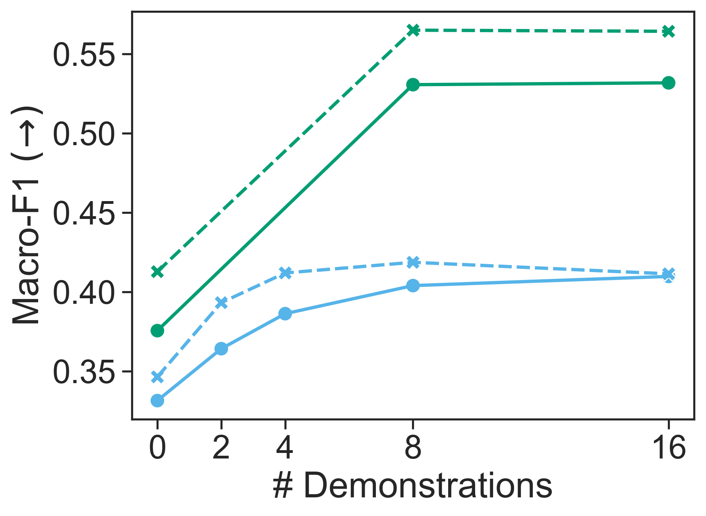

# 超越单纯的性能指标，本文致力于量化并缓解大型语言模型（LLM）中的标签偏见问题。

发布时间：2024年05月04日

`LLM应用` `人工智能` `机器学习`

> Beyond Performance: Quantifying and Mitigating Label Bias in LLMs

# 摘要

> 大型语言模型（LLMs）展现出了对多种任务的卓越适应能力，这得益于它们能够利用包含指令或最少输入输出示例的上下文提示。然而，最新研究指出，这些模型同样存在标签偏见问题——即对某些答案的非理性偏好。尽管如此，如何在大规模范围内可靠地检测和衡量这种偏见，仍然是一个较少被触及的领域。本研究评估了多种量化模型预测中标签偏见的方法，并在279个分类任务和十种LLMs上进行了深入调查。研究发现，无论是在尝试去偏见之前还是之后，模型中都存在显著的标签偏见，并突显了结果导向评估指标的重要性，这在以往的研究中并未被广泛采用。此外，我们提出了一种新颖的标签偏见校准方法，专为少量样本提示设计，它在提升性能和降低标签偏见方面超越了现有的校准技术。研究结果强调，LLMs预测中的标签偏见问题仍然是其可靠性的一个重大障碍。

> Large language models (LLMs) have shown remarkable adaptability to diverse tasks, by leveraging context prompts containing instructions, or minimal input-output examples. However, recent work revealed they also exhibit label bias -- an undesirable preference toward predicting certain answers over others. Still, detecting and measuring this bias reliably and at scale has remained relatively unexplored. In this study, we evaluate different approaches to quantifying label bias in a model's predictions, conducting a comprehensive investigation across 279 classification tasks and ten LLMs. Our investigation reveals substantial label bias in models both before and after debiasing attempts, as well as highlights the importance of outcomes-based evaluation metrics, which were not previously used in this regard. We further propose a novel label bias calibration method tailored for few-shot prompting, which outperforms recent calibration approaches for both improving performance and mitigating label bias. Our results emphasize that label bias in the predictions of LLMs remains a barrier to their reliability.

[Arxiv](https://arxiv.org/abs/2405.02743)