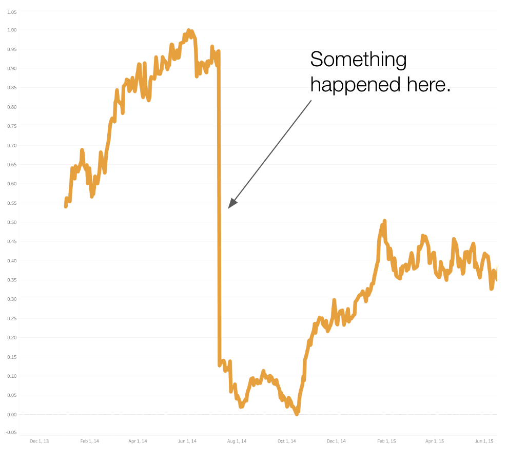
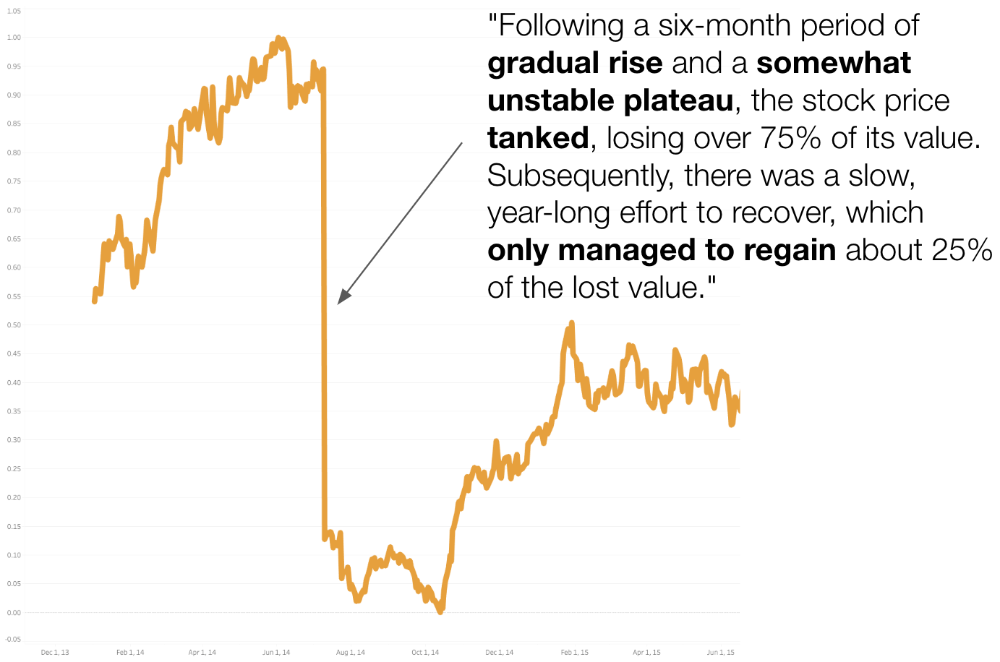

# 能否通过微妙的语言获得更可行的洞察？本文深入探讨了生成性人工智能在构建分析性叙述结构中的关键角色。

发布时间：2024年05月04日

`LLM应用` `数据分析`

> Can Nuanced Language Lead to More Actionable Insights? Exploring the Role of Generative AI in Analytical Narrative Structure

# 摘要

> 精准描述数据趋势的语言对于制作有助于读者把握要点的摘要至关重要。然而，这些通常由模板生成的摘要语言过于基础，往往只涉及简单的统计信息（如极值和趋势），缺乏深入的上下文和丰富的表达来提供实用的洞察。近期在大型语言模型（LLMs）的研究中，已经展现出在描述信息时捕捉语言细微差别的潜力。本文聚焦于探讨LLMs如何在描述趋势时，通过分析叙述的三个关键维度——语义、修辞和语用——来提供更具操作性的见解。在之前研究的基础上，我们进一步分析了LLMs如何利用量化语义来丰富分析叙述的语义层面，以直观的方式描述趋势的形状。这些语义描述有助于以一种引导实用结果的方式传达洞察，例如行动号召、说服、预警和情境感知。最终，我们探讨了这些生成的叙述与数据感知形状的契合度对修辞效果的影响，使用户能够基于这些数据洞察做出明智的决策并采取有效的行动。

> Relevant language describing trends in data can be useful for generating summaries to help with readers' takeaways. However, the language employed in these often template-generated summaries tends to be simple, ranging from describing simple statistical information (e.g., extrema and trends) without additional context and richer language to provide actionable insights. Recent advances in Large Language Models (LLMs) have shown promising capabilities in capturing subtle nuances in language when describing information. This workshop paper specifically explores how LLMs can provide more actionable insights when describing trends by focusing on three dimensions of analytical narrative structure: semantic, rhetorical, and pragmatic. Building on prior research that examines visual and linguistic signatures for univariate line charts, we examine how LLMs can further leverage the semantic dimension of analytical narratives using quantified semantics to describe shapes in trends as people intuitively view them. These semantic descriptions help convey insights in a way that leads to a pragmatic outcome, i.e., a call to action, persuasion, warning vs. alert, and situational awareness. Finally, we identify rhetorical implications for how well these generated narratives align with the perceived shape of the data, thereby empowering users to make informed decisions and take meaningful actions based on these data insights.

[Arxiv](https://arxiv.org/abs/2405.02763)