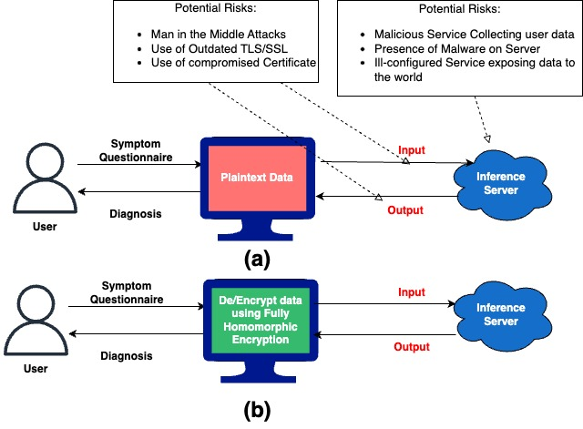
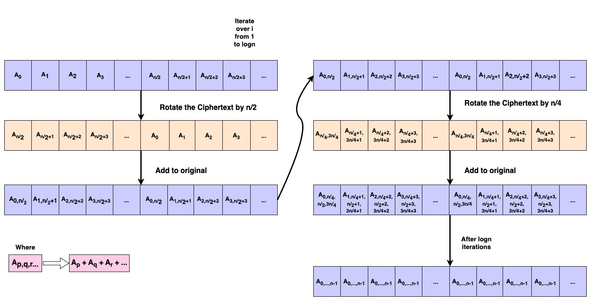
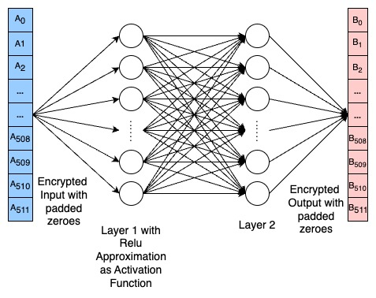
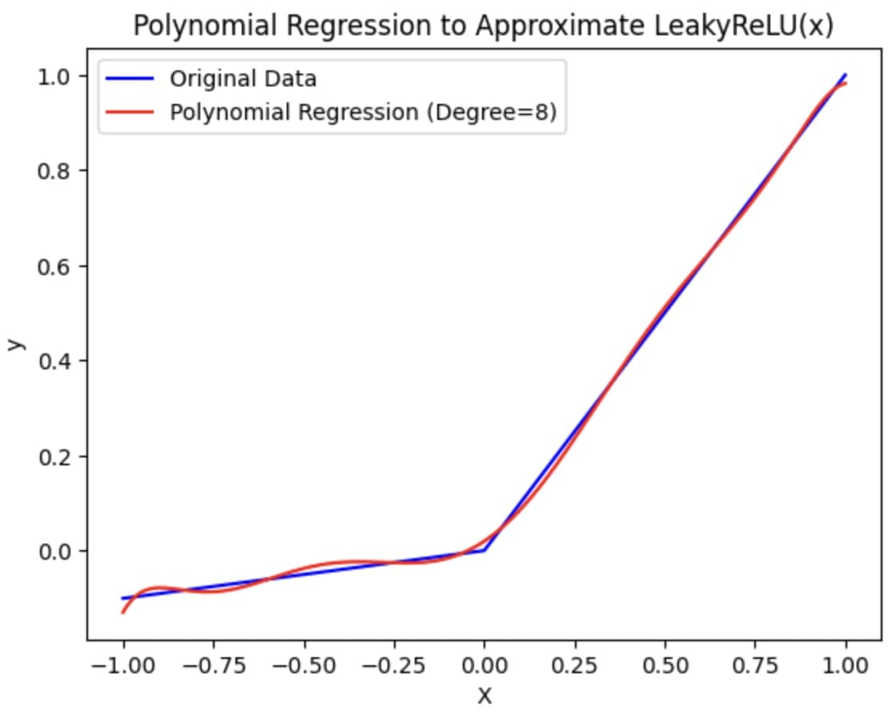

# 采用全同态加密技术，打造安全可靠的疾病分类系统。

发布时间：2024年05月04日

`LLM应用` `数据安全`

> Confidential and Protected Disease Classifier using Fully Homomorphic Encryption

# 摘要

> 大型语言模型（LLMs）的广泛应用，使得人们开始依赖会话式AI来获取多领域的初步信息，包括健康咨询和疾病诊断。用户倾向于在咨询医生前，先在ChatGPT或Bard等平台上探索可能的病因。这些平台通过简化诊断流程，减轻医疗工作者的工作负担，并节省用户的时间与金钱，提供了显著的优势。然而，在线分享个人医疗信息也带来了风险，如遭遇恶意平台或攻击者的监听。为保护用户隐私，我们提出了一个创新框架，将全同态加密（FHE）与深度学习相结合，打造一个安全私密的诊断系统。该系统模拟与医生的问答互动，采用FHE技术处理加密数据输入。针对FHE的计算限制，我们对深度神经网络和激活函数进行了适配，并开发了一种更快速的算法来计算密文元素的总和。经过一系列严格的实验，我们证实了该方法的有效性，确保了在几乎不损失性能的前提下，实现了高标准的安全性和隐私保护。

> With the rapid surge in the prevalence of Large Language Models (LLMs), individuals are increasingly turning to conversational AI for initial insights across various domains, including health-related inquiries such as disease diagnosis. Many users seek potential causes on platforms like ChatGPT or Bard before consulting a medical professional for their ailment. These platforms offer valuable benefits by streamlining the diagnosis process, alleviating the significant workload of healthcare practitioners, and saving users both time and money by avoiding unnecessary doctor visits. However, Despite the convenience of such platforms, sharing personal medical data online poses risks, including the presence of malicious platforms or potential eavesdropping by attackers. To address privacy concerns, we propose a novel framework combining FHE and Deep Learning for a secure and private diagnosis system. Operating on a question-and-answer-based model akin to an interaction with a medical practitioner, this end-to-end secure system employs Fully Homomorphic Encryption (FHE) to handle encrypted input data. Given FHE's computational constraints, we adapt deep neural networks and activation functions to the encryted domain. Further, we also propose a faster algorithm to compute summation of ciphertext elements. Through rigorous experiments, we demonstrate the efficacy of our approach. The proposed framework achieves strict security and privacy with minimal loss in performance.

[Arxiv](https://arxiv.org/abs/2405.02790)