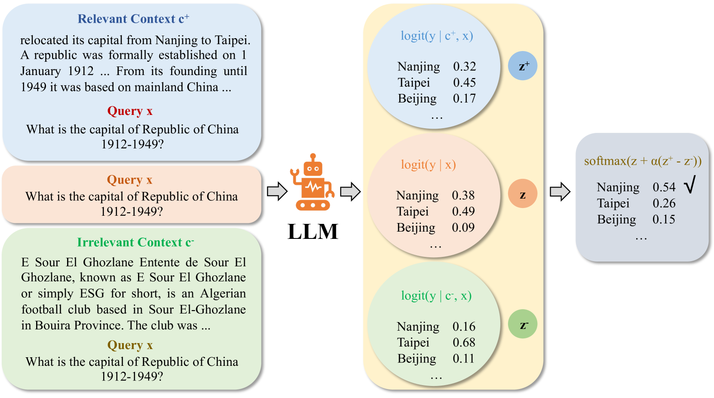
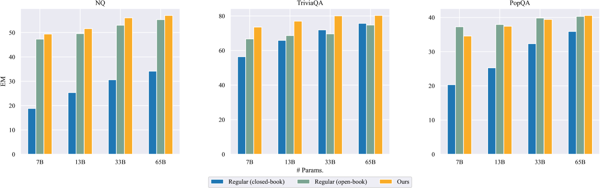
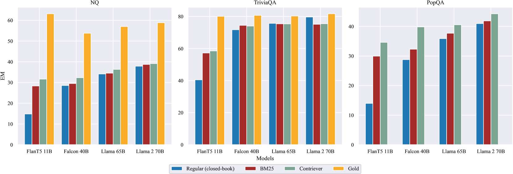
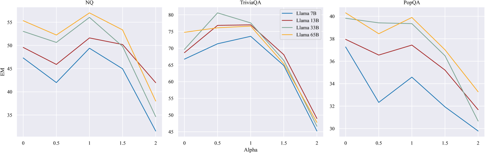
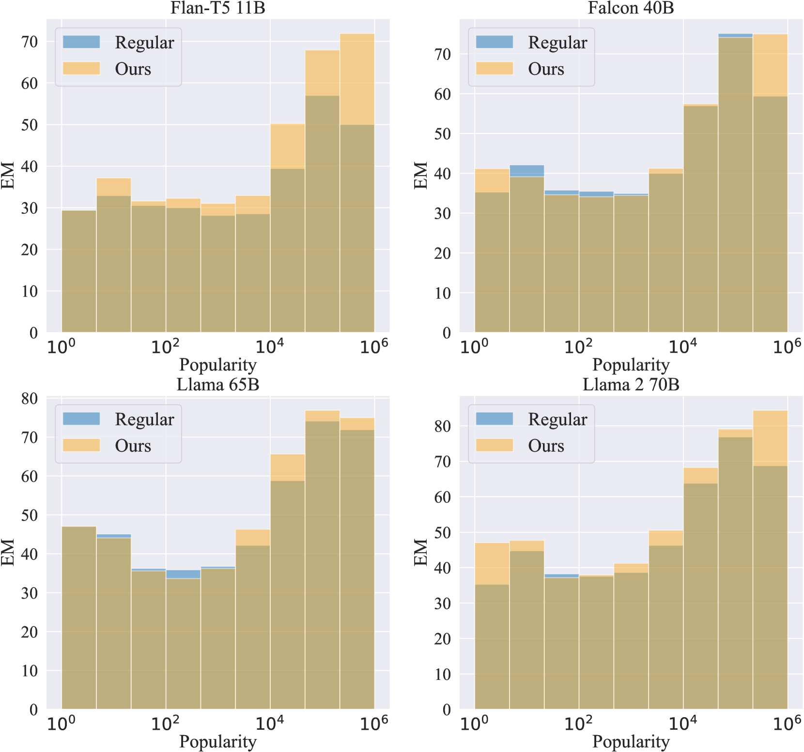
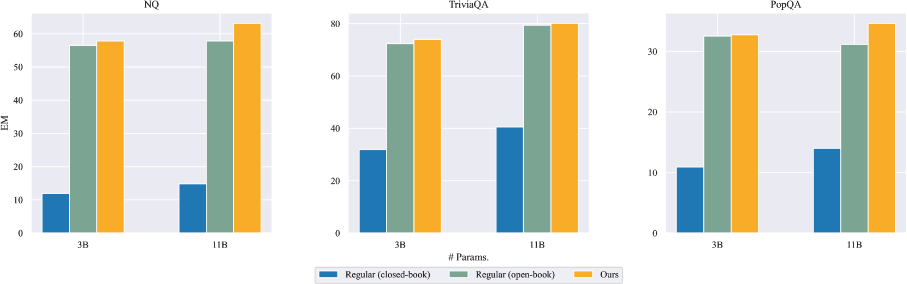
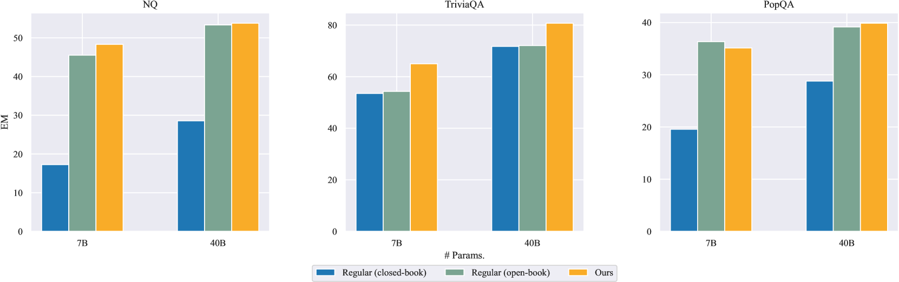
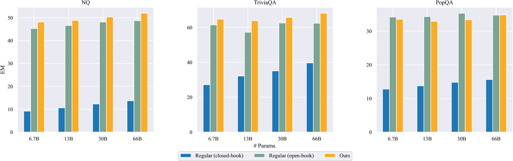
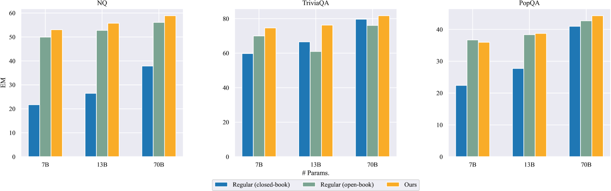

# 通过对比解码技术，提升大型语言模型对上下文的理解能力。

发布时间：2024年05月04日

`LLM应用` `文本生成` `开放域问答`

> Enhancing Contextual Understanding in Large Language Models through Contrastive Decoding

# 摘要

> 大型语言模型（LLMs）在文本生成时常常忽视了输入上下文的整合，过于依赖模型参数中的预训练知识，这可能导致生成的文本出现事实性错误或与上下文不符。LLMs 主要依赖两种知识：一是预训练阶段获得的参数化先验知识，二是输入提示中的非参数化上下文知识。本研究旨在探究 LLMs 在生成过程中如何高效地融合这些知识，尤其是在开放域问答场景中。为此，我们提出了一种创新方法，通过结合对比解码和引入对抗性无关段落作为负样本，增强生成时的上下文锚定。特别指出，该方法在推理阶段即可运行，无需额外训练。我们通过一系列全面的实验验证了其实用性和高效性，并与现有技术相比，展现了其优越性。相关代码已在 https://github.com/amazon-science/ContextualUnderstanding-ContrastiveDecoding 上公开。

> Large language models (LLMs) tend to inadequately integrate input context during text generation, relying excessively on encoded prior knowledge in model parameters, potentially resulting in generated text with factual inconsistencies or contextually unfaithful content. LLMs utilize two primary knowledge sources: 1) prior (parametric) knowledge from pretraining, and 2) contextual (non-parametric) knowledge from input prompts. The study addresses the open question of how LLMs effectively balance these knowledge sources during the generation process, specifically in the context of open-domain question answering. To address this issue, we introduce a novel approach integrating contrastive decoding with adversarial irrelevant passages as negative samples to enhance robust context grounding during generation. Notably, our method operates at inference time without requiring further training. We conduct comprehensive experiments to demonstrate its applicability and effectiveness, providing empirical evidence showcasing its superiority over existing methodologies. Our code is publicly available at: https://github.com/amazon-science/ContextualUnderstanding-ContrastiveDecoding.

[Arxiv](https://arxiv.org/abs/2405.02750)