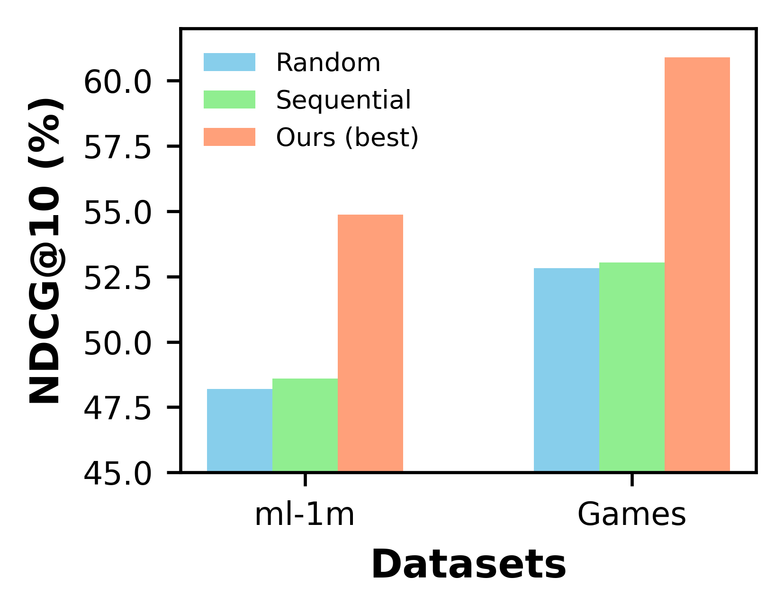
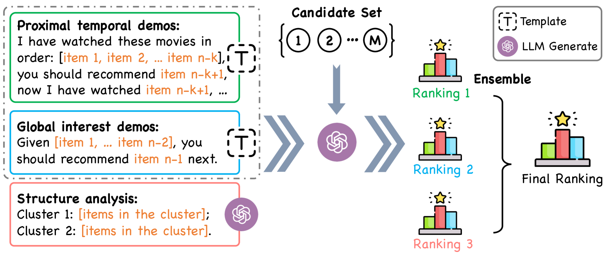
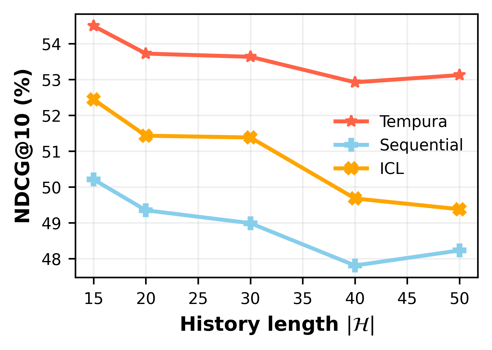
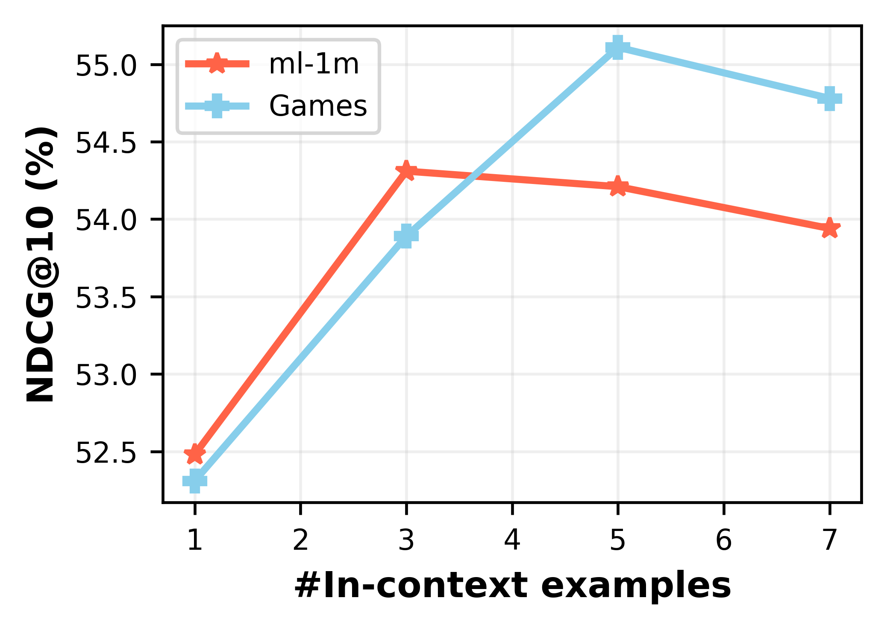

# 为了提升序列推荐的效果，我们需要增强大型语言模型的时间意识。

发布时间：2024年05月04日

`LLM应用` `推荐系统` `时间序列分析`

> Improve Temporal Awareness of LLMs for Sequential Recommendation

# 摘要

> 大型语言模型（LLMs）在处理各类通用任务时展现了卓越的零样本学习能力。但研究发现，LLMs在识别和使用时间信息方面表现不足，这使得它们在处理如序列推荐这样的顺序数据理解任务时力不从心。本文提出了一种基于人类认知过程的系统化提示框架，以增强LLMs的时间感知能力。我们设计了三种提示策略，专门用于挖掘历史交互中的时间信息，以优化基于LLM的序列推荐系统。同时，我们采用聚合策略，模拟发散性思维，整合LLM的排名结果。在MovieLens-1M和Amazon Review数据集上的测试显示，我们的方法显著提升了LLMs在序列推荐任务中的零样本性能。

> Large language models (LLMs) have demonstrated impressive zero-shot abilities in solving a wide range of general-purpose tasks. However, it is empirically found that LLMs fall short in recognizing and utilizing temporal information, rendering poor performance in tasks that require an understanding of sequential data, such as sequential recommendation. In this paper, we aim to improve temporal awareness of LLMs by designing a principled prompting framework inspired by human cognitive processes. Specifically, we propose three prompting strategies to exploit temporal information within historical interactions for LLM-based sequential recommendation. Besides, we emulate divergent thinking by aggregating LLM ranking results derived from these strategies. Evaluations on MovieLens-1M and Amazon Review datasets indicate that our proposed method significantly enhances the zero-shot capabilities of LLMs in sequential recommendation tasks.

[Arxiv](https://arxiv.org/abs/2405.02778)