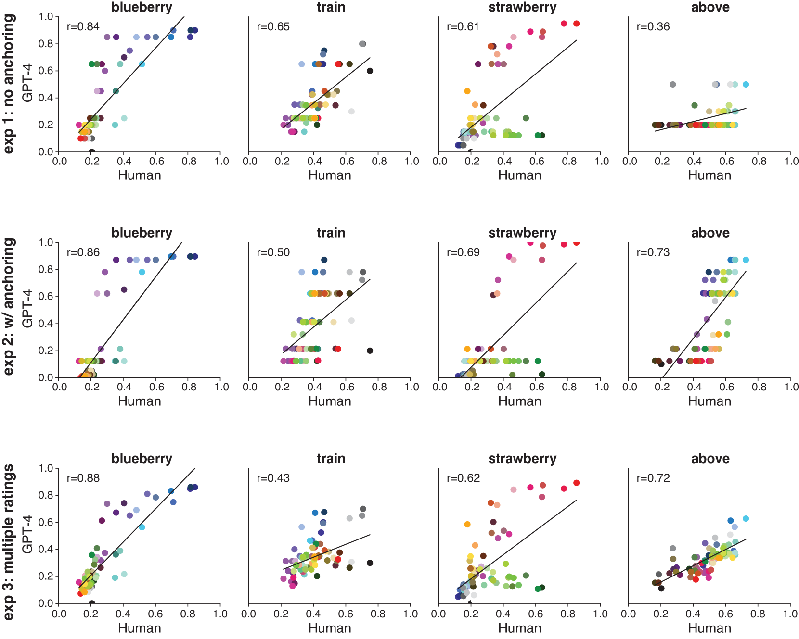

# 大型语言模型精准捕捉人类颜色概念的微妙关联

发布时间：2024年05月04日

`LLM应用

理由：这篇论文主要探讨了多模态大型语言模型GPT-4在模拟人类的颜色-概念关联方面的能力，并展示了其在信息可视化设计中的潜在应用。研究的重点在于GPT-4如何利用其学习到的语言与感知的高阶协方差来估算颜色与概念的关联，这直接关联到LLM的实际应用，特别是在信息可视化领域。因此，这篇论文属于LLM应用分类。` `信息可视化` `认知科学`

> Large Language Models estimate fine-grained human color-concept associations

# 摘要

> 无论是抽象还是具体的概念，都会在色彩感知空间中引发一系列关联强度，影响视觉认知的多个方面，从物体识别到信息可视化的解读。尽管有研究提出颜色与概念的关联可能源自经验的跨模态统计结构，但自然环境是否具备这种结构，以及学习系统能否在无强预设下发现并利用它，仍是未解之谜。我们通过测试多模态大型语言模型GPT-4，探究其能否在不额外训练的情况下，模拟人类的颜色-概念关联。我们选取了涵盖感知色彩空间的71种颜色及不同抽象程度的概念，检验GPT-4的关联评分与人类评分的吻合度。结果显示，GPT-4的评分与人类评分高度相关，性能媲美顶尖的自动颜色-概念关联估算方法。GPT-4在不同概念上的表现差异，可归因于各概念颜色-概念关联分布的独特性。此研究揭示，互联网自然环境中语言与感知的高阶协方差蕴含了足够信息，支持学习人类般的颜色-概念关联，并证明了学习系统能在无初始约束下编码这些关联。此外，GPT-4能高效估算广泛概念的颜色关联分布，有望成为设计直观有效信息可视化的关键工具。

> Concepts, both abstract and concrete, elicit a distribution of association strengths across perceptual color space, which influence aspects of visual cognition ranging from object recognition to interpretation of information visualizations. While prior work has hypothesized that color-concept associations may be learned from the cross-modal statistical structure of experience, it has been unclear whether natural environments possess such structure or, if so, whether learning systems are capable of discovering and exploiting it without strong prior constraints. We addressed these questions by investigating the ability of GPT-4, a multimodal large language model, to estimate human-like color-concept associations without any additional training. Starting with human color-concept association ratings for 71 color set spanning perceptual color space (\texttt{UW-71}) and concepts that varied in abstractness, we assessed how well association ratings generated by GPT-4 could predict human ratings. GPT-4 ratings were correlated with human ratings, with performance comparable to state-of-the-art methods for automatically estimating color-concept associations from images. Variability in GPT-4's performance across concepts could be explained by specificity of the concept's color-concept association distribution. This study suggests that high-order covariances between language and perception, as expressed in the natural environment of the internet, contain sufficient information to support learning of human-like color-concept associations, and provides an existence proof that a learning system can encode such associations without initial constraints. The work further shows that GPT-4 can be used to efficiently estimate distributions of color associations for a broad range of concepts, potentially serving as a critical tool for designing effective and intuitive information visualizations.

[Arxiv](https://arxiv.org/abs/2406.17781)