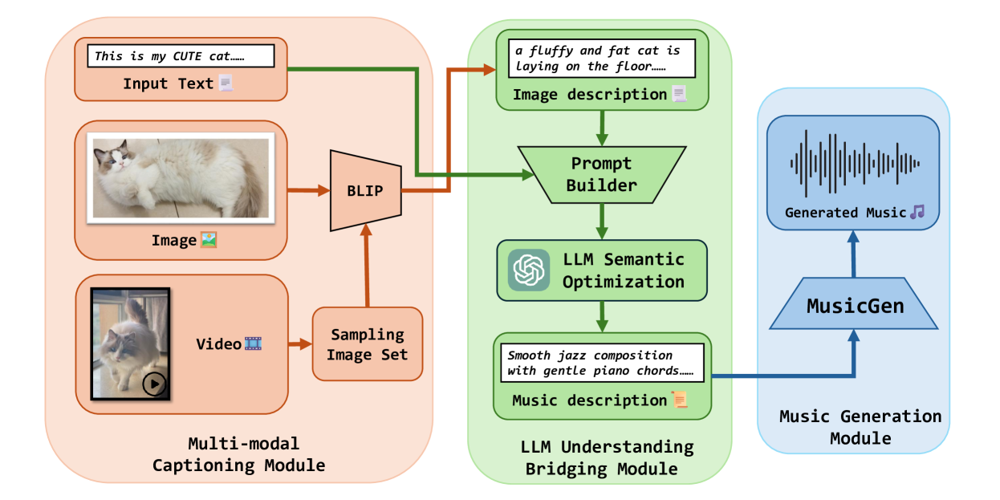

# 《莫扎特之触》：一款轻量级多模态音乐创作框架，依托于预训练的大型语言模型。

发布时间：2024年05月04日

`LLM应用` `艺术创作` `人工智能`

> Mozart's Touch: A Lightweight Multi-modal Music Generation Framework Based on Pre-Trained Large Models

# 摘要

> 近年来，AI创造的内容（AIGC）迅猛发展，推动了音乐、图像等艺术形式在不同行业中的创作。尽管如此，对于能够处理多种模态的通用音乐生成模型的研究仍然不多见。为了解决这一问题，我们设计了一个名为“莫扎特之触”的多模态音乐生成框架，它能够根据图像、视频和文本等跨模态输入生成协调的音乐作品。该框架包括三个核心组件：多模态字幕生成模块、大型语言模型（LLM）理解和桥接模块以及音乐生成模块。与常规方法不同，“莫扎特之触”避免了对预训练模型的训练或微调，通过直观且易于解释的提示，实现了高效率和透明度。此外，我们提出了“LLM-桥接”技术，以解决不同模态描述文本的表示不一致问题。通过一系列客观和主观的评估，我们的模型在性能上超越了现有的顶尖模型。相关代码和示例可以在 https://github.com/WangTooNaive/MozartsTouch 找到。

> In recent years, AI-Generated Content (AIGC) has witnessed rapid advancements, facilitating the generation of music, images, and other forms of artistic expression across various industries. However, researches on general multi-modal music generation model remain scarce. To fill this gap, we propose a multi-modal music generation framework Mozart's Touch. It could generate aligned music with the cross-modality inputs, such as images, videos and text. Mozart's Touch is composed of three main components: Multi-modal Captioning Module, Large Language Model (LLM) Understanding & Bridging Module, and Music Generation Module. Unlike traditional approaches, Mozart's Touch requires no training or fine-tuning pre-trained models, offering efficiency and transparency through clear, interpretable prompts. We also introduce "LLM-Bridge" method to resolve the heterogeneous representation problems between descriptive texts of different modalities. We conduct a series of objective and subjective evaluations on the proposed model, and results indicate that our model surpasses the performance of current state-of-the-art models. Our codes and examples is availble at: https://github.com/WangTooNaive/MozartsTouch

[Arxiv](https://arxiv.org/abs/2405.02801)