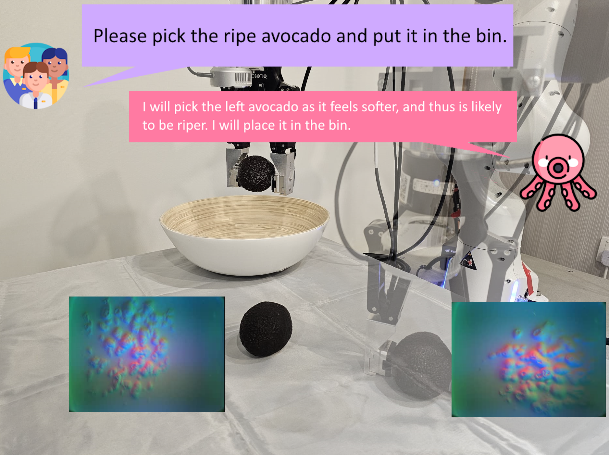
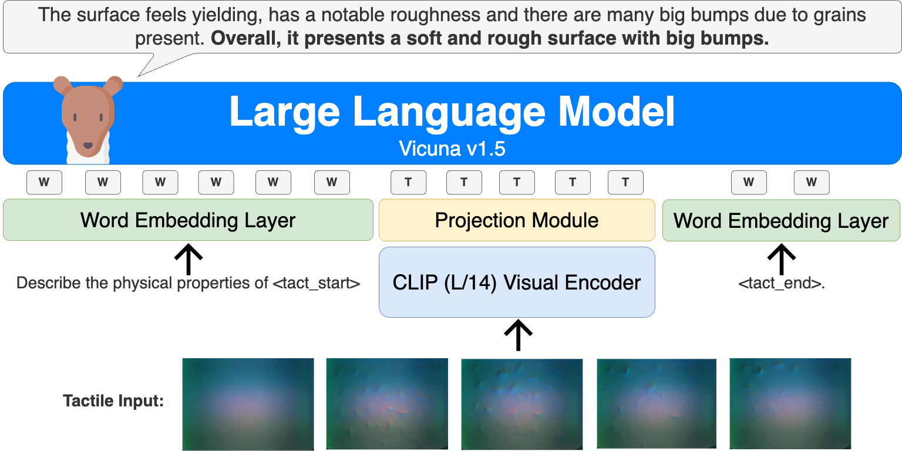
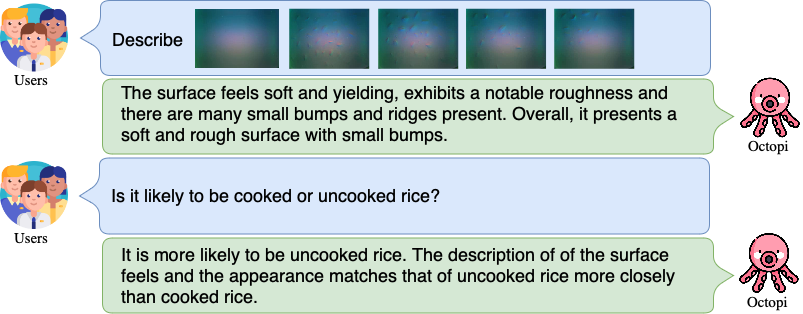
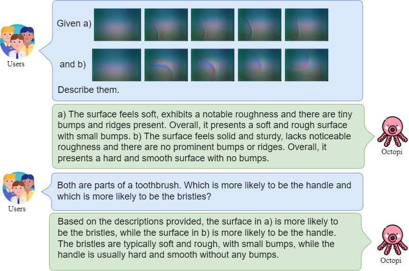
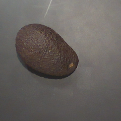

# Octopi：借助大型触觉-语言模型进行物体属性推理

发布时间：2024年05月04日

`Agent` `机器人技术` `人工智能`

> Octopi: Object Property Reasoning with Large Tactile-Language Models

# 摘要

> 物理推理在机器人操控中扮演着关键角色。最新研究通过视觉和语言模态来探索物理推理，视觉能够捕捉环境物体的信息，而语言则作为传递额外上下文的抽象和交流工具。尽管这些研究在物理推理任务上取得了成效，但它们仅局限于通过视觉或语言输入可推断的物理属性。本研究进一步探讨了将触觉感知与语言结合的方法，赋予实体系统通过互动获取物理属性并运用常识推理的能力。我们推出了一个新数据集PhysiCleAR，它不仅包含了物理属性推理任务，还包含了使用GelSight触觉传感器收集的触觉视频。此外，我们开发了Octopi系统，该系统结合触觉表征学习和先进的视觉-语言模型，以最小的语言微调来预测和推理触觉输入。在PhysiCleAR上的测试显示，Octopi能够利用中间物理属性预测，有效提升物理推理能力，无论是在训练任务还是零样本推理中。PhysiCleAR和Octopi的资源可在https://github.com/clear-nus/octopi上获取。

> Physical reasoning is important for effective robot manipulation. Recent work has investigated both vision and language modalities for physical reasoning; vision can reveal information about objects in the environment and language serves as an abstraction and communication medium for additional context. Although these works have demonstrated success on a variety of physical reasoning tasks, they are limited to physical properties that can be inferred from visual or language inputs. In this work, we investigate combining tactile perception with language, which enables embodied systems to obtain physical properties through interaction and apply common-sense reasoning. We contribute a new dataset PhysiCleAR, which comprises both physical/property reasoning tasks and annotated tactile videos obtained using a GelSight tactile sensor. We then introduce Octopi, a system that leverages both tactile representation learning and large vision-language models to predict and reason about tactile inputs with minimal language fine-tuning. Our evaluations on PhysiCleAR show that Octopi is able to effectively use intermediate physical property predictions to improve physical reasoning in both trained tasks and for zero-shot reasoning. PhysiCleAR and Octopi are available on https://github.com/clear-nus/octopi.

[Arxiv](https://arxiv.org/abs/2405.02794)