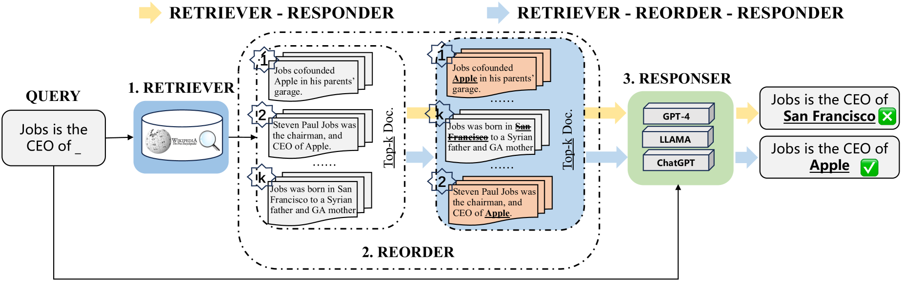
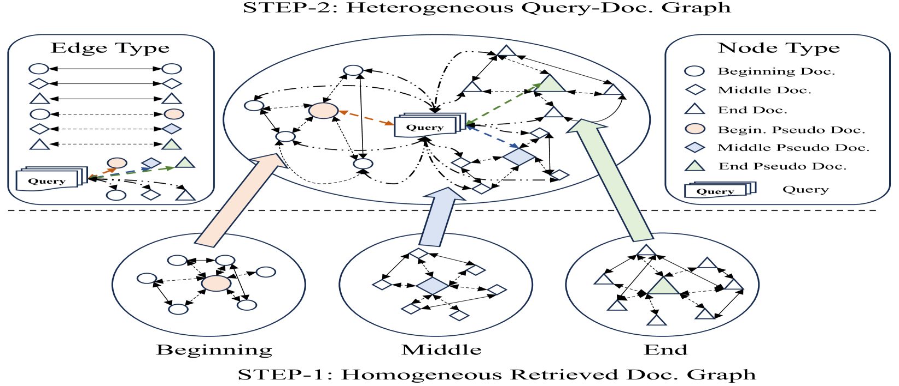
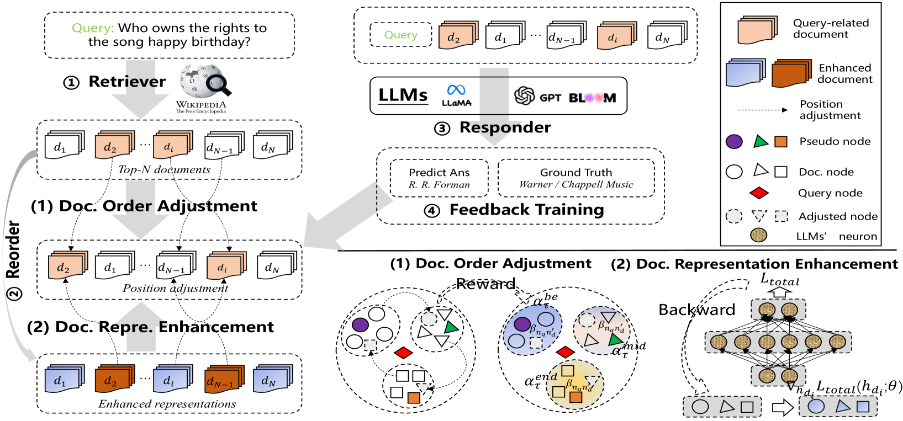
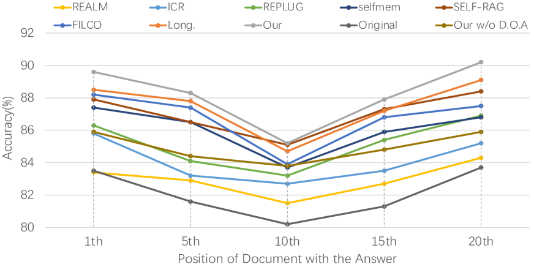
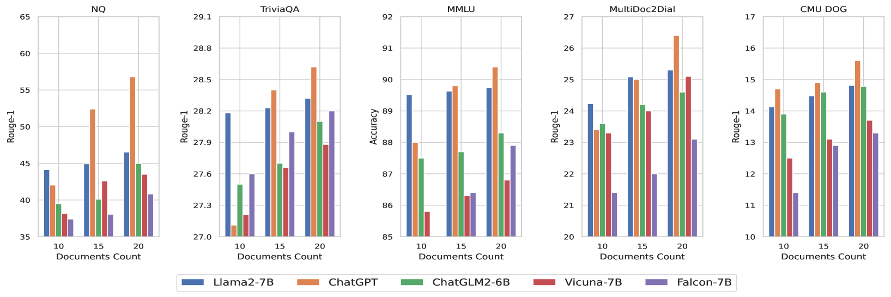

# R4：强化检索-重排-响应框架，专为提升大型语言模型的检索能力而设计。

发布时间：2024年05月04日

`LLM应用` `人工智能`

> R4: Reinforced Retriever-Reorder-Responder for Retrieval-Augmented Large Language Models

# 摘要

> 增强型大型语言模型（LLMs）通过检索系统获取的相关内容来生成准确响应，以解决幻觉问题。然而，现有方法往往忽略了检索文档与LLMs之间细微语义结构的互动，尤其是在处理附加了长篇文档的输入提示时，LLMs常常无法准确生成中间内容。为此，本研究提出了一种新的流程——“增强检索-重排序-响应”（R^4），以优化LLMs的文档排序，提升其文本生成能力，同时保持模型参数不变。该流程包含两个阶段：文档顺序调整和文档表示增强。文档顺序调整通过图注意力学习，根据响应质量的增强奖励，将文档排序优化为最佳顺序。而文档表示增强则利用文档级梯度对抗学习，针对质量不佳的响应进一步细化文档表示。大量实验证明，该流程在知识密集型任务上的事实问答性能优于多个强基线。相关源代码和训练模型将在论文发表后公开。

> Retrieval-augmented large language models (LLMs) leverage relevant content retrieved by information retrieval systems to generate correct responses, aiming to alleviate the hallucination problem. However, existing retriever-responder methods typically append relevant documents to the prompt of LLMs to perform text generation tasks without considering the interaction of fine-grained structural semantics between the retrieved documents and the LLMs. This issue is particularly important for accurate response generation as LLMs tend to ``lose in the middle'' when dealing with input prompts augmented with lengthy documents. In this work, we propose a new pipeline named ``Reinforced Retriever-Reorder-Responder'' (R$^4$) to learn document orderings for retrieval-augmented LLMs, thereby further enhancing their generation abilities while the large numbers of parameters of LLMs remain frozen. The reordering learning process is divided into two steps according to the quality of the generated responses: document order adjustment and document representation enhancement. Specifically, document order adjustment aims to organize retrieved document orderings into beginning, middle, and end positions based on graph attention learning, which maximizes the reinforced reward of response quality. Document representation enhancement further refines the representations of retrieved documents for responses of poor quality via document-level gradient adversarial learning. Extensive experiments demonstrate that our proposed pipeline achieves better factual question-answering performance on knowledge-intensive tasks compared to strong baselines across various public datasets. The source codes and trained models will be released upon paper acceptance.

[Arxiv](https://arxiv.org/abs/2405.02659)