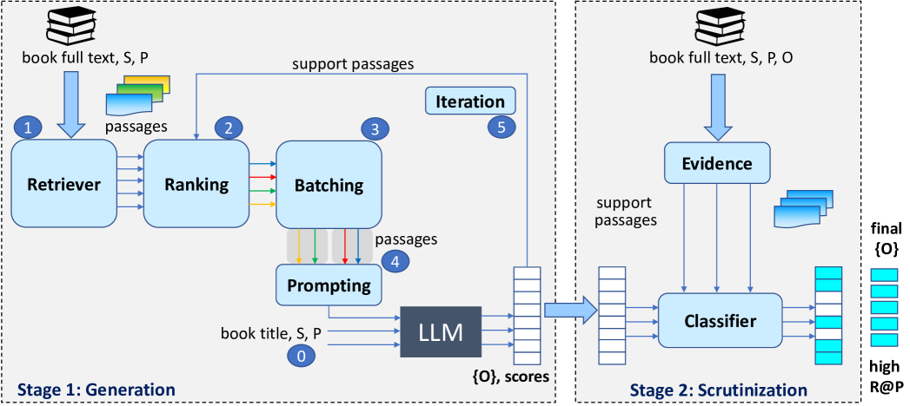

# 全面召回：增强检索的语言模型，专为从长篇文档中抽取长列表对象而设计。

发布时间：2024年05月04日

`LLM应用` `文本分析` `信息检索`

> Recall Them All: Retrieval-Augmented Language Models for Long Object List Extraction from Long Documents

# 摘要

> 文本中的关系提取方法通常追求高精准度，却牺牲了召回率。但要构建与特定主题相关联的长对象实体列表，高召回率是不可或缺的。在长篇文本中，相关对象的提示可能分散于多个段落。这挑战了我们如何从长篇文本中抽取出长列表的能力。我们提出了L3X方法，它通过两个阶段来应对这一问题：首先，利用大型语言模型（LLM）进行以召回率为主导的生成，并巧妙地增强检索技术；其次，进行以精确度为主导的审查，以确认或筛选候选对象。我们的L3X方法在性能上显著超越了仅依赖LLM的生成方法。

> Methods for relation extraction from text mostly focus on high precision, at the cost of limited recall. High recall is crucial, though, to populate long lists of object entities that stand in a specific relation with a given subject. Cues for relevant objects can be spread across many passages in long texts. This poses the challenge of extracting long lists from long texts. We present the L3X method which tackles the problem in two stages: (1) recall-oriented generation using a large language model (LLM) with judicious techniques for retrieval augmentation, and (2) precision-oriented scrutinization to validate or prune candidates. Our L3X method outperforms LLM-only generations by a substantial margin.

[Arxiv](https://arxiv.org/abs/2405.02732)