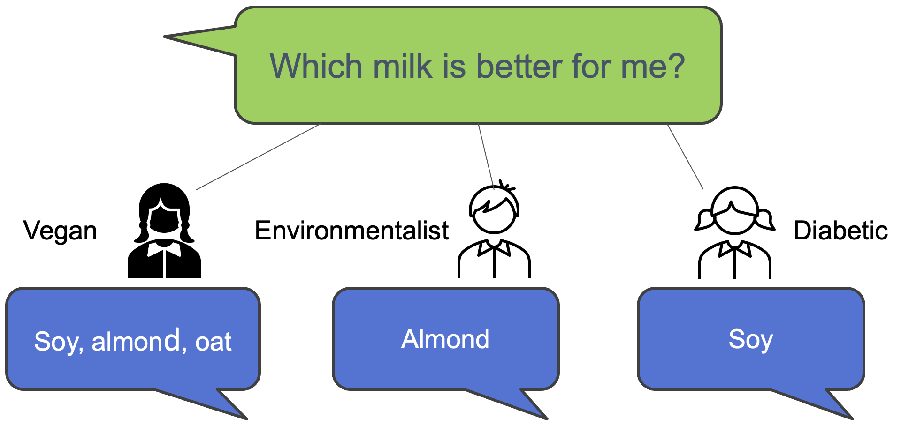
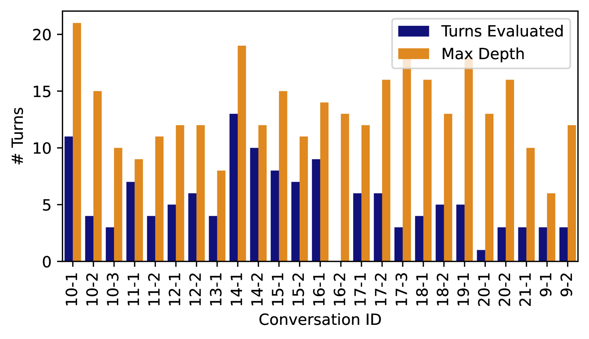
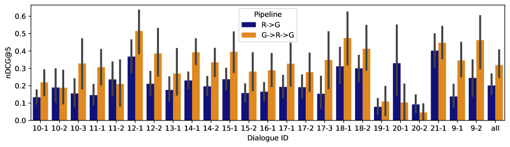
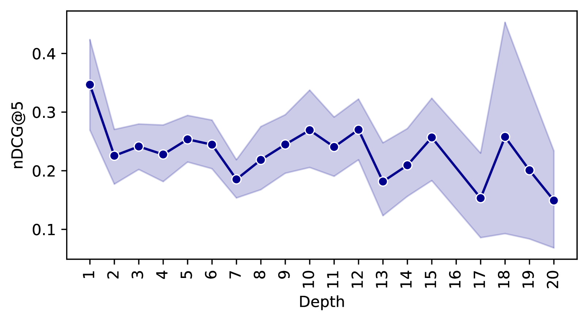
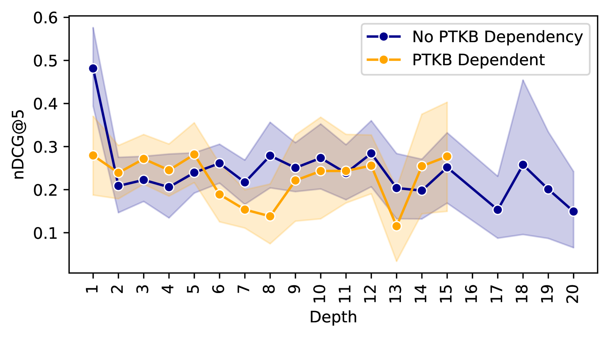
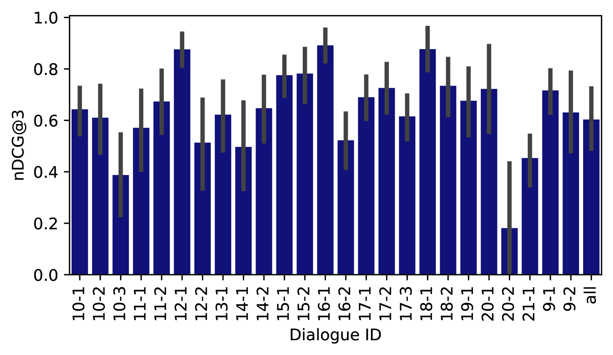

# TREC iKAT 2023：评估对话式和互动式知识助手性能的测试集

发布时间：2024年05月04日

`Agent` `信息检索` `对话系统`

> TREC iKAT 2023: A Test Collection for Evaluating Conversational and Interactive Knowledge Assistants

# 摘要

> 近年来，随着大型语言模型（LLMs）的兴起，会话信息检索领域迅速进步，使得对用户请求的理解和回应更加贴近自然交流。TREC交互式知识辅助赛道（iKAT）的扩展版旨在为研究人员提供一个平台，用以测试和评估他们的会话搜索代理（CSA）。该数据集包含36段个性化对话，覆盖20个不同主题，每个主题都配备了定义个性化用户角色的个人文本知识库（PTKB）。总共提供了344个对话轮次，约26,000个段落，用以评估信息的相关性，以及对生成回应的四个关键维度进行额外评估：相关性、完整性、依据性和自然性。这一数据集要求CSA能够高效地处理多样化的个人情境，挖掘关键的人物信息，并利用这些信息进行恰当的对话。个人文本知识库的融合以及对决策性搜索任务的重视，使得这一测试集合具有独特性，对于推动会话式和交互式知识辅助领域的研究具有重要意义。

> Conversational information seeking has evolved rapidly in the last few years with the development of Large Language Models (LLMs), providing the basis for interpreting and responding in a naturalistic manner to user requests. The extended TREC Interactive Knowledge Assistance Track (iKAT) collection aims to enable researchers to test and evaluate their Conversational Search Agents (CSA). The collection contains a set of 36 personalized dialogues over 20 different topics each coupled with a Personal Text Knowledge Base (PTKB) that defines the bespoke user personas. A total of 344 turns with approximately 26,000 passages are provided as assessments on relevance, as well as additional assessments on generated responses over four key dimensions: relevance, completeness, groundedness, and naturalness. The collection challenges CSA to efficiently navigate diverse personal contexts, elicit pertinent persona information, and employ context for relevant conversations. The integration of a PTKB and the emphasis on decisional search tasks contribute to the uniqueness of this test collection, making it an essential benchmark for advancing research in conversational and interactive knowledge assistants.

[Arxiv](https://arxiv.org/abs/2405.02637)