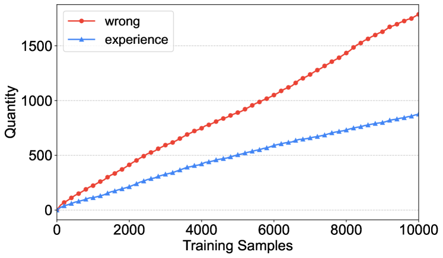

# 《代理医院：一个可进化医疗代理的仿真医院》

发布时间：2024年05月05日

`Agent` `仿真系统`

> Agent Hospital: A Simulacrum of Hospital with Evolvable Medical Agents

# 摘要

> 本文提出了一个名为“代理医院”的仿真系统，旨在模拟疾病的治疗流程。在这个系统中，患者、护士和医生都是由大型语言模型（LLMs）支持的自主智能体。我们的主要目标是训练医生智能体在仿真环境中掌握治疗技能，为此我们设计了一种创新的方法——MedAgent-Zero。该系统能够基于知识库和LLMs模拟疾病的发生和发展，使医生智能体能够从成功与失败的案例中吸取经验。实验结果表明，医生智能体的治疗能力在多项任务上均有显著提升。尤为引人注目的是，这些智能体在“代理医院”中积累的知识能够有效应用于现实世界的医疗评估标准。经过约一万次的治疗实践（相当于现实医生两年的工作量），经过训练的医生智能体在MedQA数据集的一个子集上，针对主要呼吸系统疾病的问题，达到了93.06%的准确率，这一成果处于行业领先水平。本研究为LLM驱动的智能体技术在医疗领域的应用开辟了新的路径。

> In this paper, we introduce a simulacrum of hospital called Agent Hospital that simulates the entire process of treating illness. All patients, nurses, and doctors are autonomous agents powered by large language models (LLMs). Our central goal is to enable a doctor agent to learn how to treat illness within the simulacrum. To do so, we propose a method called MedAgent-Zero. As the simulacrum can simulate disease onset and progression based on knowledge bases and LLMs, doctor agents can keep accumulating experience from both successful and unsuccessful cases. Simulation experiments show that the treatment performance of doctor agents consistently improves on various tasks. More interestingly, the knowledge the doctor agents have acquired in Agent Hospital is applicable to real-world medicare benchmarks. After treating around ten thousand patients (real-world doctors may take over two years), the evolved doctor agent achieves a state-of-the-art accuracy of 93.06% on a subset of the MedQA dataset that covers major respiratory diseases. This work paves the way for advancing the applications of LLM-powered agent techniques in medical scenarios.

[Arxiv](https://arxiv.org/abs/2405.02957)