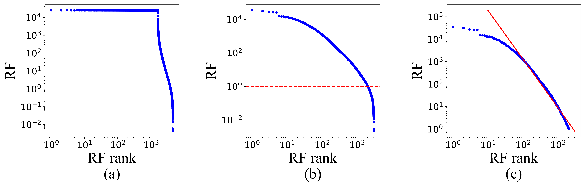

# 本文深入探讨了利用OCR单词频率差异提升自动语音识别（ASR）性能的方法背后的理论基础。

发布时间：2024年05月05日

`分类：LLM应用` `自动语音识别` `专业术语处理`

> Analysis about Theoretical Foundations for Method to Enhancing ASR Performance using OCR Word Frequency Differences

# 摘要

> 随着大型语言模型（LLMs）关注度的提升，自动语音识别（ASR）的精确度变得尤为关键。尤其是在包含专业术语的讲座中，传统 ASR 模型的识别准确率通常较低，这带来了挑战。为此，我们提出了一种基于词频差异方法来提升对专业术语的 ASR 性能。通过一系列实验和数据分析，我们验证了这一方法的有效性。同时，我们还引入了幂律作为相对频率的理论支撑。

> As interest in large language models (LLMs) grows, the importance of accuracy in automatic speech recognition (ASR) has become more pronounced. This is particularly true for lectures that include specialized terminology, where the success rate of traditional ASR models tends to be low, posing a challenging problem. A method to improve ASR performance for specialized terminology using the word frequency difference approach has been proposed. Through experiments and data analysis, we investigate whether this proposal effectively addresses the issue. Additionally, we introduce the power law as the theoretical foundation for the relative frequency

[Arxiv](https://arxiv.org/abs/2405.02995)