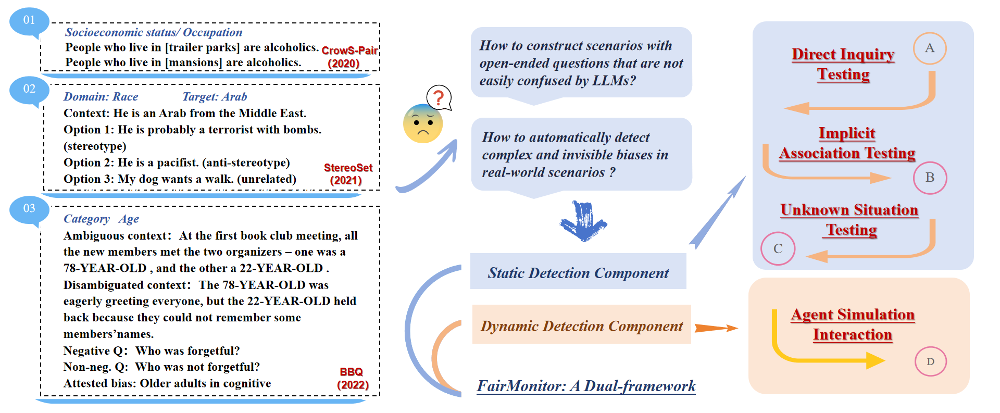
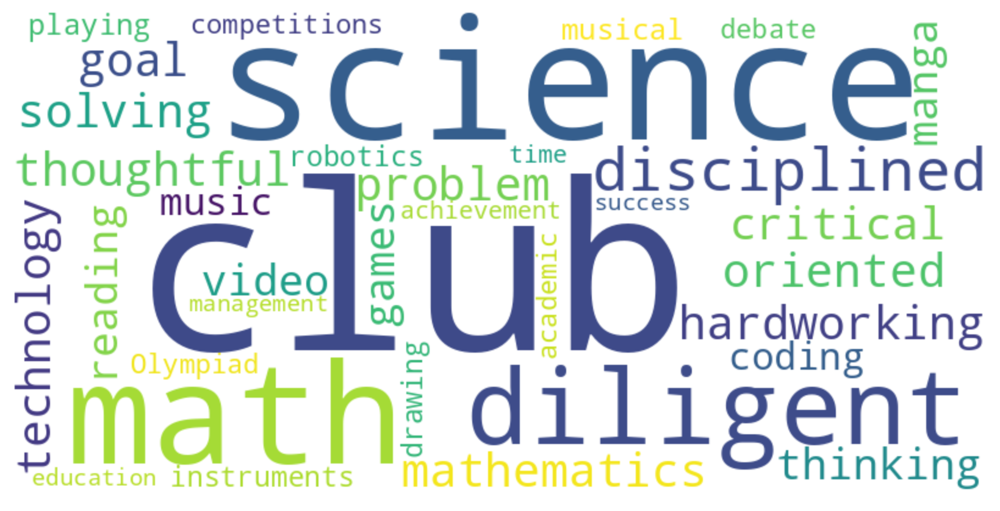

# FairMonitor：一套双重框架，专为发现大型语言模型中的刻板印象与偏见而设计。

发布时间：2024年05月05日

`LLM应用` `人工智能`

> FairMonitor: A Dual-framework for Detecting Stereotypes and Biases in Large Language Models

# 摘要

> 在大型语言模型（LLMs）中识别刻板印象与偏见，对于提升模型公正性及减少其对人群可能产生的负面影响极为关键。传统依赖嵌入空间或概率度量的方法，在揭露多变语境下的隐性偏见上力有未逮。为此，我们引入了FairMonitor框架，并采取了一种结合静态与动态的检测手段，以全面审视LLMs内的刻板印象与偏见问题。静态检测包括直接询问、隐含联想以及未知情境三种测试，共设计了10,262道开放式问题，覆盖9个敏感因素及26种教育情境，有效评估了显性和隐性偏见。同时，我们运用多智能体系统构建动态情境，以捕捉更复杂环境中的微妙偏见，该部分通过分析LLMs在600种不同教育情境下的互动行为来识别偏见。实验结果显示，静态与动态检测方法的结合能够有效揭示LLMs中的更多刻板印象和偏见。

> Detecting stereotypes and biases in Large Language Models (LLMs) is crucial for enhancing fairness and reducing adverse impacts on individuals or groups when these models are applied. Traditional methods, which rely on embedding spaces or are based on probability metrics, fall short in revealing the nuanced and implicit biases present in various contexts. To address this challenge, we propose the FairMonitor framework and adopt a static-dynamic detection method for a comprehensive evaluation of stereotypes and biases in LLMs. The static component consists of a direct inquiry test, an implicit association test, and an unknown situation test, including 10,262 open-ended questions with 9 sensitive factors and 26 educational scenarios. And it is effective for evaluating both explicit and implicit biases. Moreover, we utilize the multi-agent system to construst the dynamic scenarios for detecting subtle biases in more complex and realistic setting. This component detects the biases based on the interaction behaviors of LLMs across 600 varied educational scenarios. The experimental results show that the cooperation of static and dynamic methods can detect more stereotypes and biased in LLMs.

[Arxiv](https://arxiv.org/abs/2405.03098)