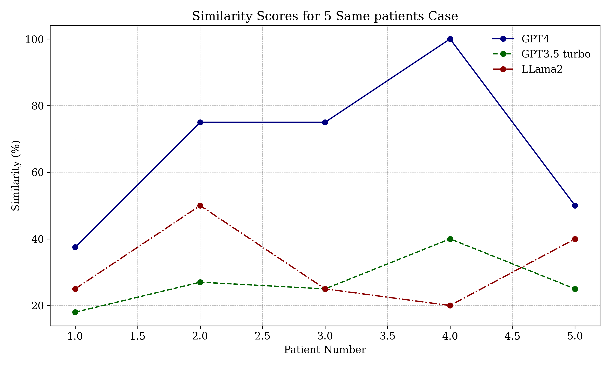

# 在循证医学领域，面对紧急情况下的推荐决策，我们需运用高阶推理技巧。

发布时间：2024年05月05日

`LLM应用` `人工智能`

> High Order Reasoning for Time Critical Recommendation in Evidence-based Medicine

# 摘要

> 在紧急决策时刻，人类决策者能够借助具备人工智能的情境感知软件，迅速评估各种可能情况，快速检索海量信息，并在瞬间基于海量参数预测不同结果。在进行高阶推理时，通过提出“如果……会怎样”、“为什么不”、“那么又如何”和“如何”等问题，可以深入挑战推理的基础假设、方法选择、决策目的及其适用性。这种高阶推理的应用有助于人类在关键时刻做出决策，减少误判。本文介绍了一种高阶推理模型，旨在为ICU中的证据基础医学提供及时的建议。我们的系统采用了大型语言模型（LLM）。实验结果表明，LLM在模拟“如果……会怎样”情况下表现卓越，其提出的治疗方案与医生的计划相似度高达88.52%。在“为什么不”情境下，该模型在70%的案例中为ICU出院后不幸去世的病人提供了替代治疗方案。在探讨“那么又如何”的情境中，该模型深入分析了ICU治疗方案的动机与重要性，其推理与实际诊断信息的相似度达到了55.6%。在“如何”情境下，该模型在设计类似疾病治疗方案时，内容相似度达到了66.5%。此外，LLM还能够以70%的准确率预测ICU病人出院后的生存状况。

> In time-critical decisions, human decision-makers can interact with AI-enabled situation-aware software to evaluate many imminent and possible scenarios, retrieve billions of facts, and estimate different outcomes based on trillions of parameters in a fraction of a second. In high-order reasoning, "what-if" questions can be used to challenge the assumptions or pre-conditions of the reasoning, "why-not" questions can be used to challenge on the method applied in the reasoning, "so-what" questions can be used to challenge the purpose of the decision, and "how-about" questions can be used to challenge the applicability of the method. When above high-order reasoning questions are applied to assist human decision-making, it can help humans to make time-critical decisions and avoid false-negative or false-positive types of errors. In this paper, we present a model of high-order reasoning to offer recommendations in evidence-based medicine in a time-critical fashion for the applications in ICU. The Large Language Model (LLM) is used in our system. The experiments demonstrated the LLM exhibited optimal performance in the "What-if" scenario, achieving a similarity of 88.52% with the treatment plans of human doctors. In the "Why-not" scenario, the best-performing model tended to opt for alternative treatment plans in 70% of cases for patients who died after being discharged from the ICU. In the "So-what" scenario, the optimal model provided a detailed analysis of the motivation and significance of treatment plans for ICU patients, with its reasoning achieving a similarity of 55.6% with actual diagnostic information. In the "How-about" scenario, the top-performing LLM demonstrated a content similarity of 66.5% in designing treatment plans transferring for similar diseases. Meanwhile, LLMs managed to predict the life status of patients after their discharge from the ICU with an accuracy of 70%.

[Arxiv](https://arxiv.org/abs/2405.03010)