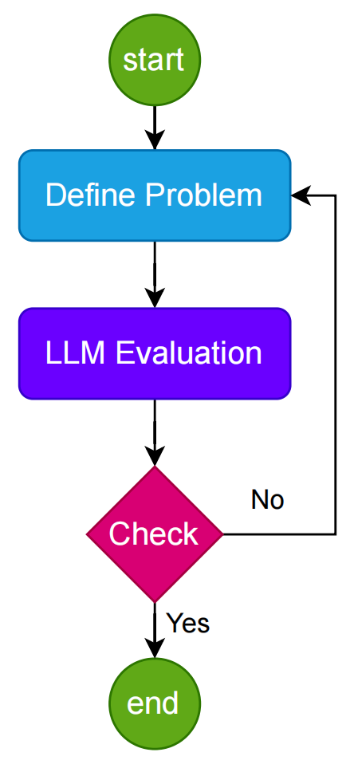
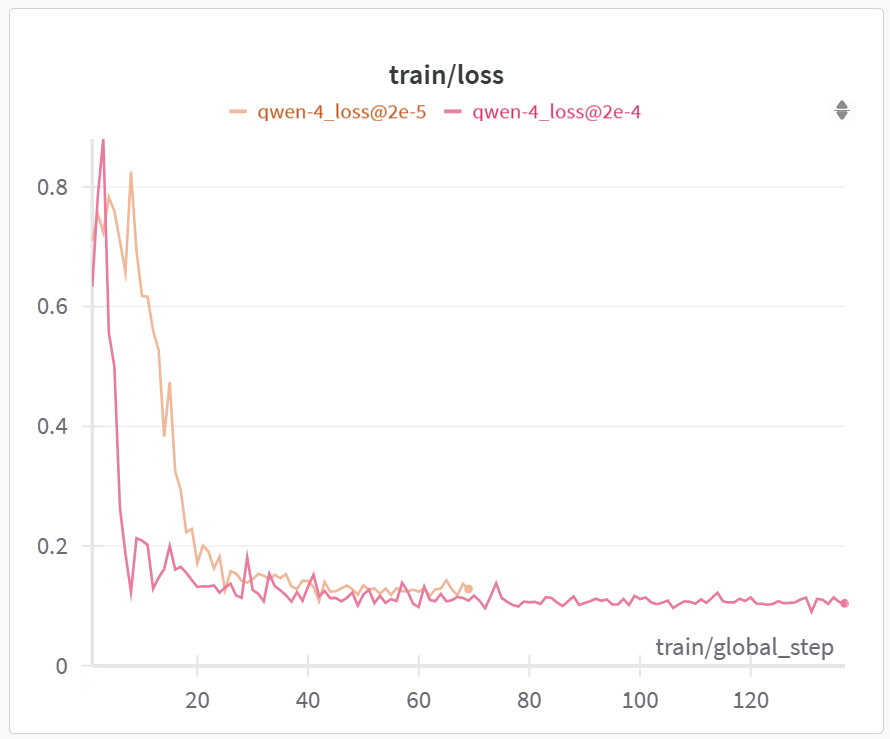
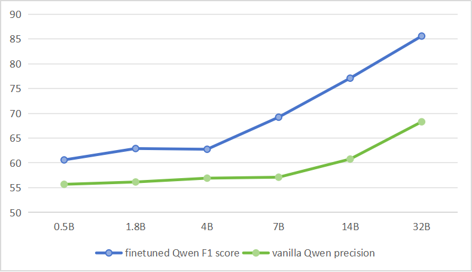

# HuixiangDou-CR：群组聊天中的代词消歧

发布时间：2024年05月05日

`LLM应用` `对话系统`

> HuixiangDou-CR: Coreference Resolution in Group Chats

# 摘要

> 我们如何避免群聊中的代词混淆？本研究预先处理了5.8万条真实对话记录，并精心标注了2300个问题，其准确性得到了扩展法则的验证。随后，我们在参数规模从5亿到320亿不等的Qwen模型上执行了微调，最优模型的F1得分提升了29.07分，从而验证了对大型语言模型（LLM）进行微调以适应下游自然语言处理（NLP）任务的高效性。我们的成果包括：1）开发了以羊驼格式呈现的监督式微调（SFT）训练集及相应的低秩适应（LoRA）权重集；2）利用扩展法则原理，创新了一种获取优质数据的方法。相关脚本、原始数据、羊驼格式数据及实验记录已在GitHub、HuggingFace和WandB平台开源，确保了数据隐私的合法性。

> How to eliminate pronominal reference in group chats? In this work, we have preprocessed 58k authentic chat data and manually annotated 2.3k questions. The reliability of this annotation was confirmed by the scaling law. After this, we conducted fine-tuning on Qwen models, ranging from 0.5B to 32B parameters. The optimal version improved 29.07 in F1 score. This confirms the viability of fine-tuning Large Language Model (LLM) for downstream Natural Language Processing (NLP) tasks. Our contributions are: 1) Created Supervised Fine-Tuning (SFT) training data in alpaca format, along with a set of Low-Rank Adaptation (LoRA) weights, and 2) Developed a method for acquiring high-quality data leveraging scaling law principle. The script, raw data with alpaca format and experiments track are open-sourced on Github https://github.com/InternLM/HuixiangDou/tree/main/web/tools, HuggingFace https://huggingface.co/tpoisonooo and WandB https://wandb.ai/tpoisonooo/huixiangdou-cr/table?nw=nwusertpoisonooo . The privacy of the data involved has been authorized by users.

[Arxiv](https://arxiv.org/abs/2405.02817)