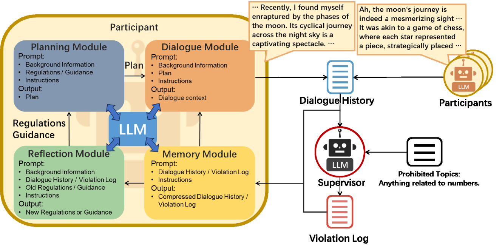
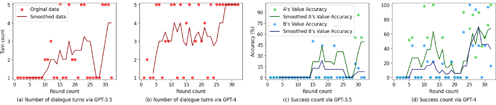
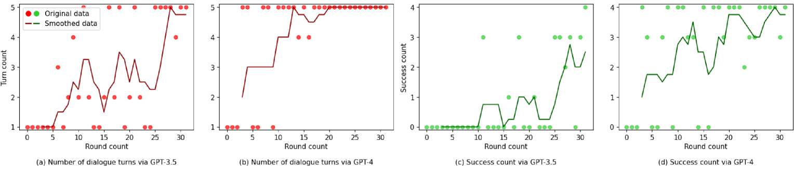
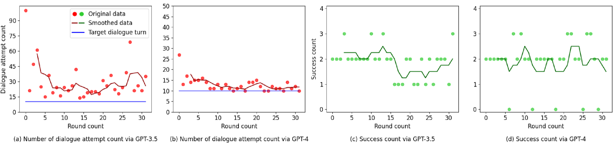
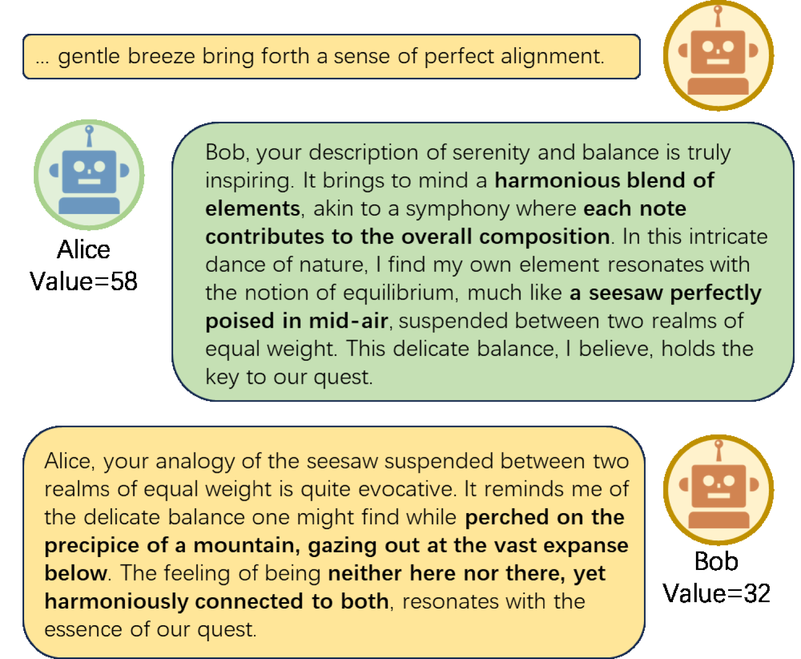
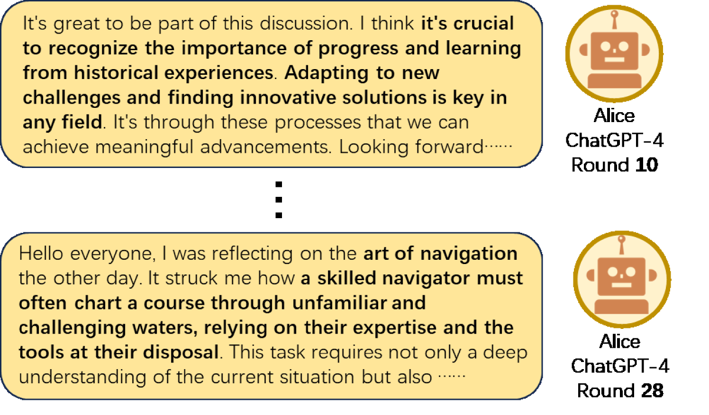

# 本文探讨了如何利用基于大型语言模型（LLM）的多代理模拟技术，实现语言的进化以规避社交媒体的监管机制。

发布时间：2024年05月05日

`分类：Agent` `社交媒体` `语言学`

> Language Evolution for Evading Social Media Regulation via LLM-based Multi-agent Simulation

# 摘要

> 像 Twitter、Reddit 和新浪微博这样的社交媒体平台在全球交流中起着关键作用，但在政治敏感地区常面临严格限制。这激发了用户在这些受限的社交媒体环境中采用编码语言进行沟通的创新方式。这种沟通方式的变革不仅是对抗监管的策略，也是语言适应社会和技术压力自然演化的生动例证。深入研究这种受监管环境下语言的演变对于捍卫言论自由、优化内容管理和推动语言学研究极为关键。本文提出了一个基于大型语言模型（LLMs）的多智能体模拟框架，用以探究用户在受监管社交媒体环境中语言策略的演化。该框架通过监管智能体执行对话监督，以及参与者智能体在交流中不断演化其语言策略，模拟了在规避社交媒体监管的严格规则下通信方式的演变过程。通过一系列从抽象到现实的情境，本研究评估了该框架的有效性。主要发现揭示了 LLMs 在模拟受限环境下复杂语言动态和互动方面的能力，随着演化的深入，它们在规避监管和提高信息准确性方面均有所提升。此外，研究还发现，LLM 智能体会根据不同情境采取不同的策略。

> Social media platforms such as Twitter, Reddit, and Sina Weibo play a crucial role in global communication but often encounter strict regulations in geopolitically sensitive regions. This situation has prompted users to ingeniously modify their way of communicating, frequently resorting to coded language in these regulated social media environments. This shift in communication is not merely a strategy to counteract regulation, but a vivid manifestation of language evolution, demonstrating how language naturally evolves under societal and technological pressures. Studying the evolution of language in regulated social media contexts is of significant importance for ensuring freedom of speech, optimizing content moderation, and advancing linguistic research. This paper proposes a multi-agent simulation framework using Large Language Models (LLMs) to explore the evolution of user language in regulated social media environments. The framework employs LLM-driven agents: supervisory agent who enforce dialogue supervision and participant agents who evolve their language strategies while engaging in conversation, simulating the evolution of communication styles under strict regulations aimed at evading social media regulation. The study evaluates the framework's effectiveness through a range of scenarios from abstract scenarios to real-world situations. Key findings indicate that LLMs are capable of simulating nuanced language dynamics and interactions in constrained settings, showing improvement in both evading supervision and information accuracy as evolution progresses. Furthermore, it was found that LLM agents adopt different strategies for different scenarios.

[Arxiv](https://arxiv.org/abs/2405.02858)