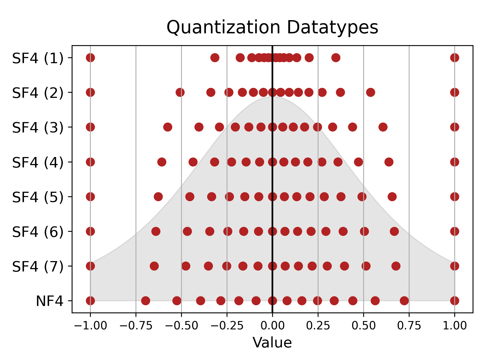

# 借鉴学子智慧：利用 t 分布探求适合大型语言模型的精准高效表达方式。

发布时间：2024年05月05日

`LLM理论` `硬件设计`

> Learning from Students: Applying t-Distributions to Explore Accurate and Efficient Formats for LLMs

# 摘要

> 近期，大型语言模型（LLMs）在多项任务上实现了突破性的性能提升。但这些模型因计算量大而面临严苛的时延和能耗挑战。传统上，深度神经网络（DNN）通过将模型转换为低精度整数格式来进行量化，以缓解这些问题。不过，新兴的格式如正规浮点数（NF4）已展现出在提高模型精度方面的潜力，尽管这会增加芯片的面积。在本研究中，我们首先对30种网络的LLM权重和激活进行了广泛分析，发现大多数数据分布符合学生t分布。基于此发现，我们提出了一种新的理论最优格式——学生浮点数（SF4），它在现代LLMs中相比NF4有显著提升，例如在LLaMA2-7B模型上平均准确度提升了0.76%。以SF4作为高精度基准，我们进一步提出了两种超常数支持变体的E2M1，以进一步提升模型精度。最终，我们评估了11种数据类型，包括非传统格式如二的幂次加法（APoT），在模型精度和硬件复杂性方面的表现，发现了由INT4、E2M1及支持超常数的E2M1构成的帕累托前沿，它提供了在模型精度和芯片面积之间的平衡选择。举例来说，支持超常数的E2M1在Phi-2模型上最高可提升2.19%的准确度，而面积开销仅为1.22%，这为更多基于LLM的应用在四舍五入的精度下运行提供了可能。

> Large language models (LLMs) have recently achieved state-of-the-art performance across various tasks, yet due to their large computational requirements, they struggle with strict latency and power demands. Deep neural network (DNN) quantization has traditionally addressed these limitations by converting models to low-precision integer formats. Yet recently alternative formats, such as Normal Float (NF4), have been shown to consistently increase model accuracy, albeit at the cost of increased chip area. In this work, we first conduct a large-scale analysis of LLM weights and activations across 30 networks to conclude most distributions follow a Student's t-distribution. We then derive a new theoretically optimal format, Student Float (SF4), with respect to this distribution, that improves over NF4 across modern LLMs, for example increasing the average accuracy on LLaMA2-7B by 0.76% across tasks. Using this format as a high-accuracy reference, we then propose augmenting E2M1 with two variants of supernormal support for higher model accuracy. Finally, we explore the quality and performance frontier across 11 datatypes, including non-traditional formats like Additive-Powers-of-Two (APoT), by evaluating their model accuracy and hardware complexity. We discover a Pareto curve composed of INT4, E2M1, and E2M1 with supernormal support, which offers a continuous tradeoff between model accuracy and chip area. For example, E2M1 with supernormal support increases the accuracy of Phi-2 by up to 2.19% with 1.22% area overhead, enabling more LLM-based applications to be run at four bits.

[Arxiv](https://arxiv.org/abs/2405.03103)