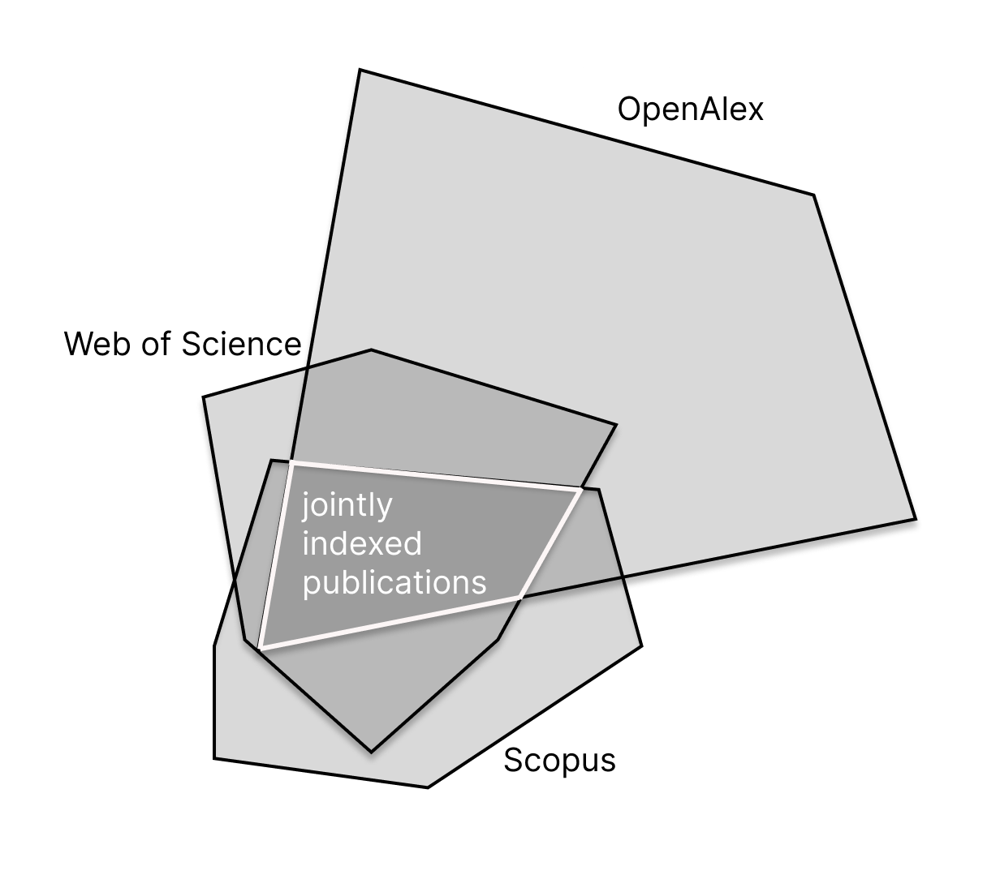

# 在大型文献计量数据库中，对可持续发展目标（SDG）分类的绩效性进行探讨。

发布时间：2024年05月05日

`LLM应用` `科研分析` `可持续发展`

> On the performativity of SDG classifications in large bibliometric databases

# 摘要

> 诸如 Web of Science、Scopus 和 OpenAlex 等大型引文数据库为引文分析提供了便利，但它们的影响力却会影响科研成果的曝光度和相关实体的影响力评估。近期，这些数据库开始将联合国的可持续发展目标（SDGs）纳入其分类体系，而这种多样化的分类方式因其差异性而备受争议。本研究旨在利用大型语言模型（LLMs）的特性，通过研究五个 SDGs 来探究不同 SDG 分类对引文数据造成的“数据偏见”。我们构建了一个根据数据库中不同 SDG 分类并行微调的 LLM。研究发现，模型结构、归类出版物、微调过程以及自然语言生成等方面表现出高度敏感性。不同层级上的广泛任意性引发了对 LLM 在研究实践中应用的担忧。

> Large bibliometric databases, such as Web of Science, Scopus, and OpenAlex, facilitate bibliometric analyses, but are performative, affecting the visibility of scientific outputs and the impact measurement of participating entities. Recently, these databases have taken up the UN's Sustainable Development Goals (SDGs) in their respective classifications, which have been criticised for their diverging nature. This work proposes using the feature of large language models (LLMs) to learn about the "data bias" injected by diverse SDG classifications into bibliometric data by exploring five SDGs. We build a LLM that is fine-tuned in parallel by the diverse SDG classifications inscribed into the databases' SDG classifications. Our results show high sensitivity in model architecture, classified publications, fine-tuning process, and natural language generation. The wide arbitrariness at different levels raises concerns about using LLM in research practice.

[Arxiv](https://arxiv.org/abs/2405.03007)