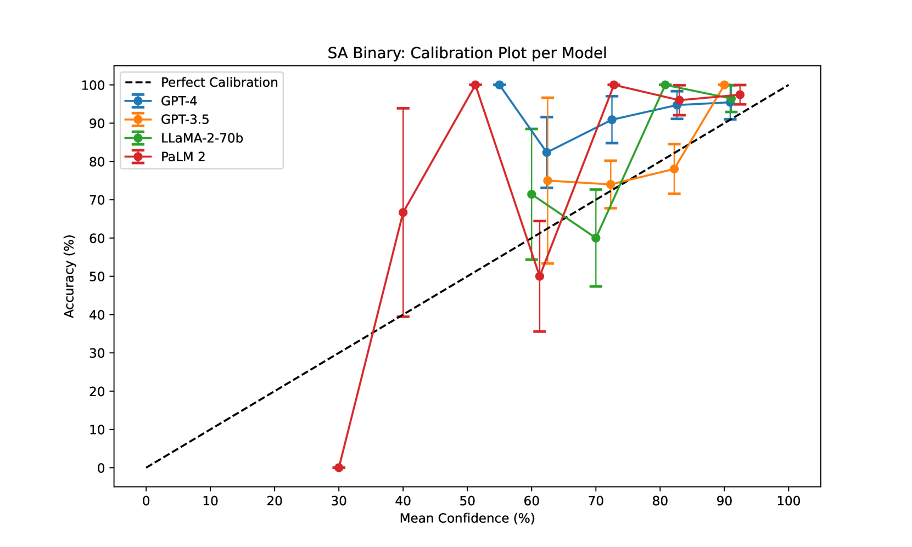

# 自信过度，关键所在：探究大型语言及视觉-语言模型中的口头不确定性评估。

发布时间：2024年05月05日

`LLM应用` `人工智能`

> Overconfidence is Key: Verbalized Uncertainty Evaluation in Large Language and Vision-Language Models

# 摘要

> 语言与视觉-语言模型（LLMs/VLMs）以其生成类人文本和图像理解能力，引领了人工智能领域的革新，但其可靠性的确保尤为关键。本研究旨在评估包括GPT4、GPT-3.5、LLaMA2、PaLM 2在内的LLMs，以及GPT4V和Gemini Pro Vision在内的VLMs，通过提示来估计其口头不确定性的能力。我们引入了新的日本不确定性场景（JUS）数据集，用以通过复杂查询和对象计数来测试VLMs的性能，并采用网络校准误差（NCE）来衡量校准误差的方向。研究结果表明，无论是LLMs还是VLMs，都存在较高的校准误差，且多数情况下过于自信，这反映出它们在不确定性估计上的能力不足。此外，我们还为回归任务设计了提示，并发现VLMs在生成均值/标准差和95%置信区间时的校准表现不佳。

> Language and Vision-Language Models (LLMs/VLMs) have revolutionized the field of AI by their ability to generate human-like text and understand images, but ensuring their reliability is crucial. This paper aims to evaluate the ability of LLMs (GPT4, GPT-3.5, LLaMA2, and PaLM 2) and VLMs (GPT4V and Gemini Pro Vision) to estimate their verbalized uncertainty via prompting. We propose the new Japanese Uncertain Scenes (JUS) dataset, aimed at testing VLM capabilities via difficult queries and object counting, and the Net Calibration Error (NCE) to measure direction of miscalibration. Results show that both LLMs and VLMs have a high calibration error and are overconfident most of the time, indicating a poor capability for uncertainty estimation. Additionally we develop prompts for regression tasks, and we show that VLMs have poor calibration when producing mean/standard deviation and 95% confidence intervals.

[Arxiv](https://arxiv.org/abs/2405.02917)