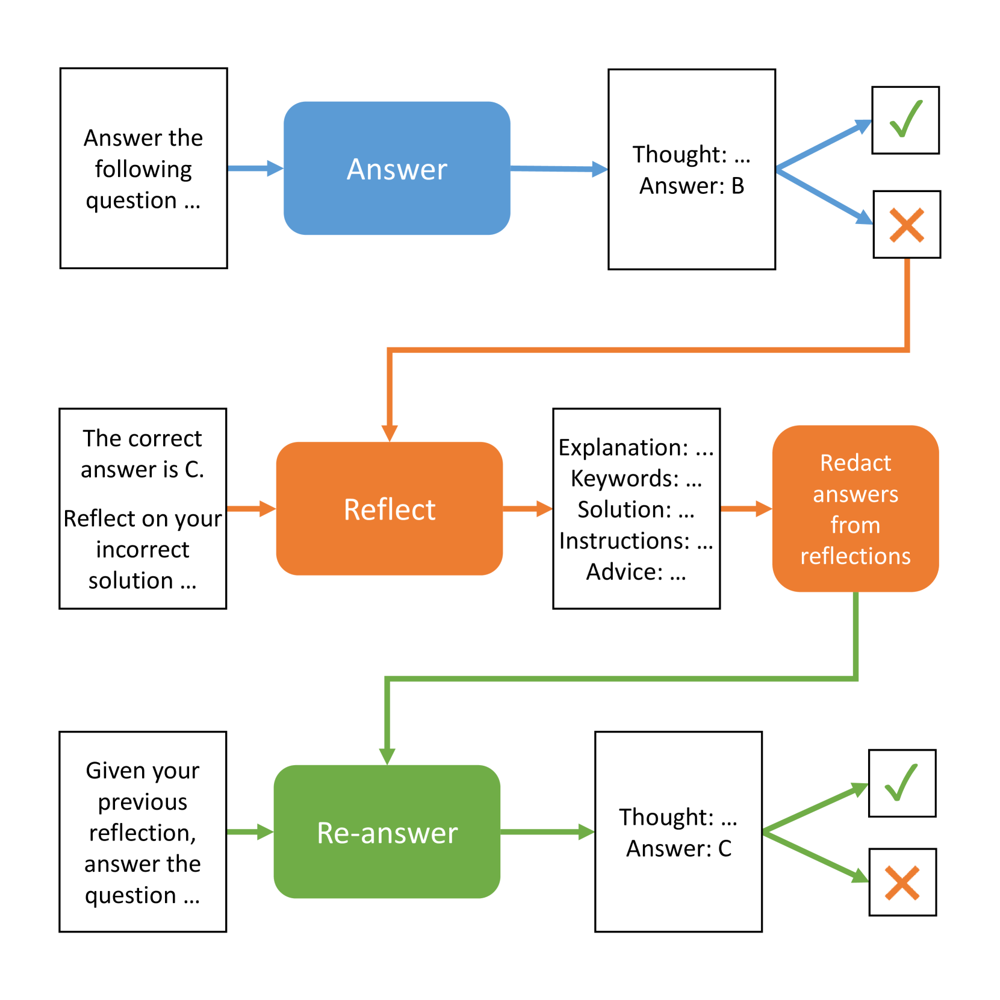
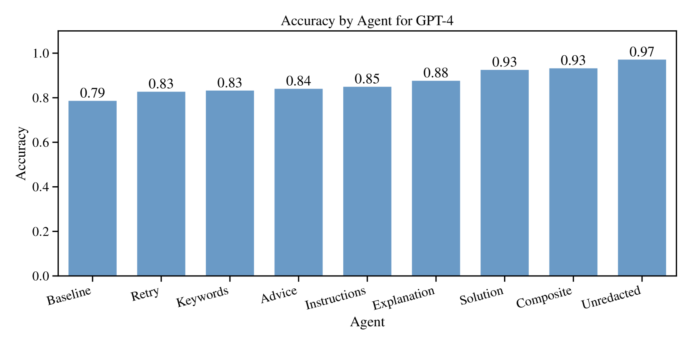
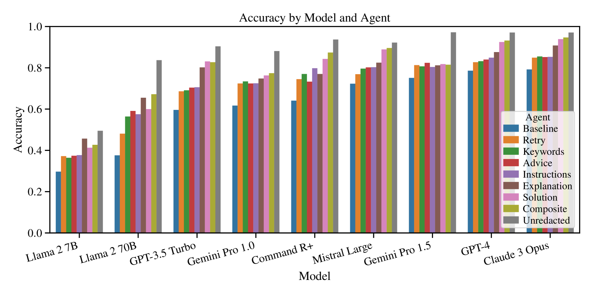
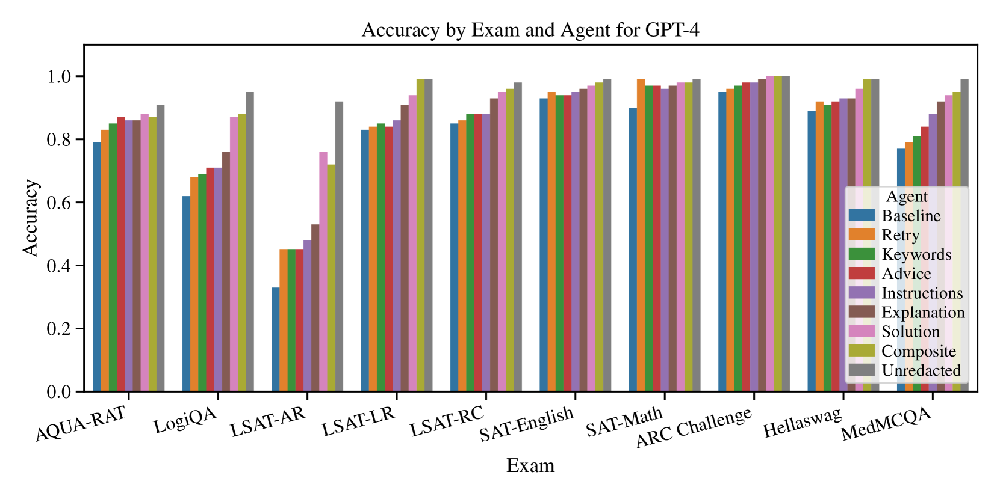

# 大型语言模型代理的自我审视：探索其对问题解决能力的提升作用

发布时间：2024年05月05日

`Agent

这篇论文探讨了大型语言模型（LLM）中的自我反思机制如何通过代理（Agent）的方式提升问题解决能力。研究中使用了九款知名的LLM，并通过引导它们进行自我反思来改进错误答案，从而提高了解决问题的能力。这种方法涉及到了代理的概念，即LLM作为能够进行自我反思和改进的智能体，因此将其归类为Agent。同时，这项研究也展示了LLM在实际应用中的性能提升，但主要关注的是模型内部的自我反思机制，而不是LLM在特定应用场景下的表现，因此不归类为LLM应用。此外，虽然研究涉及LLM的性能提升，但重点在于自我反思这一机制的实证分析，而非LLM的理论基础，因此也不归类为LLM理论。最后，由于研究内容不涉及检索增强生成（RAG）技术，因此也不归类为RAG。` `人工智能` `教育技术`

> Self-Reflection in LLM Agents: Effects on Problem-Solving Performance

# 摘要

> 本研究探讨了大型语言模型中的自我反思如何提升问题解决能力。我们让九款知名LLM回答一系列选择题，以此作为性能的起点。每当答案出错，我们便引导八种不同的自我反思型LLM代理，反思其错误并给出改进建议。随后，这些代理依据建议再次尝试解答，结果显示，通过自我反思，LLM代理的问题解决能力有了显著提升（$p < 0.001$）。我们还分析了不同自我反思方式对性能的具体影响。研究中使用的所有代码和数据已公开在GitHub上，链接为https://github.com/matthewrenze/self-reflection。

> In this study, we investigated the effects of self-reflection in large language models (LLMs) on problem-solving performance. We instructed nine popular LLMs to answer a series of multiple-choice questions to provide a performance baseline. For each incorrectly answered question, we instructed eight types of self-reflecting LLM agents to reflect on their mistakes and provide themselves with guidance to improve problem-solving. Then, using this guidance, each self-reflecting agent attempted to re-answer the same questions. Our results indicate that LLM agents are able to significantly improve their problem-solving performance through self-reflection ($p < 0.001$). In addition, we compared the various types of self-reflection to determine their individual contribution to performance. All code and data are available on GitHub at https://github.com/matthewrenze/self-reflection

[Arxiv](https://arxiv.org/abs/2405.06682)