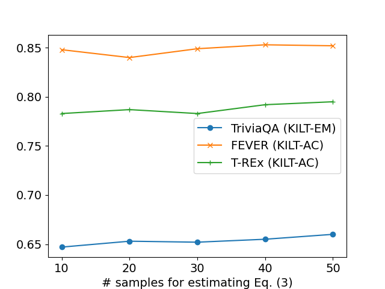

# 随机化 RAG：通过最大化期望效用实现检索增强的端到端生成。

发布时间：2024年05月05日

`RAG` `问答系统` `对话系统`

> Stochastic RAG: End-to-End Retrieval-Augmented Generation through Expected Utility Maximization

# 摘要

> 本文提出了一种创新的随机RAG方法，用以端到端地优化检索增强生成（RAG）模型，这种方法不再囿于以往研究中常见的边缘化和文档独立性假设。随机RAG将RAG模型中的检索视为一种无放回的随机抽样过程，并通过直通Gumbel-top-k技术，为无放回抽样提供了一种可微的近似方法，从而实现了RAG模型的有效端到端优化。我们在七个多样化的数据集上进行了广泛的实验，覆盖了从开放域问答、事实验证、关系抽取的槽填充到对话系统等多种任务。将这种优化技术应用于一种高效RAG模型，我们在七个数据集中的六个上取得了突破性的最佳成绩。

> This paper introduces Stochastic RAG--a novel approach for end-to-end optimization of retrieval-augmented generation (RAG) models that relaxes the simplifying assumptions of marginalization and document independence, made in most prior work. Stochastic RAG casts the retrieval process in RAG as a stochastic sampling without replacement process. Through this formulation, we employ straight-through Gumbel-top-k that provides a differentiable approximation for sampling without replacement and enables effective end-to-end optimization for RAG. We conduct extensive experiments on seven diverse datasets on a wide range of tasks, from open-domain question answering to fact verification to slot-filling for relation extraction and to dialogue systems. By applying this optimization method to a recent and effective RAG model, we advance state-of-the-art results on six out of seven datasets.

[Arxiv](https://arxiv.org/abs/2405.02816)